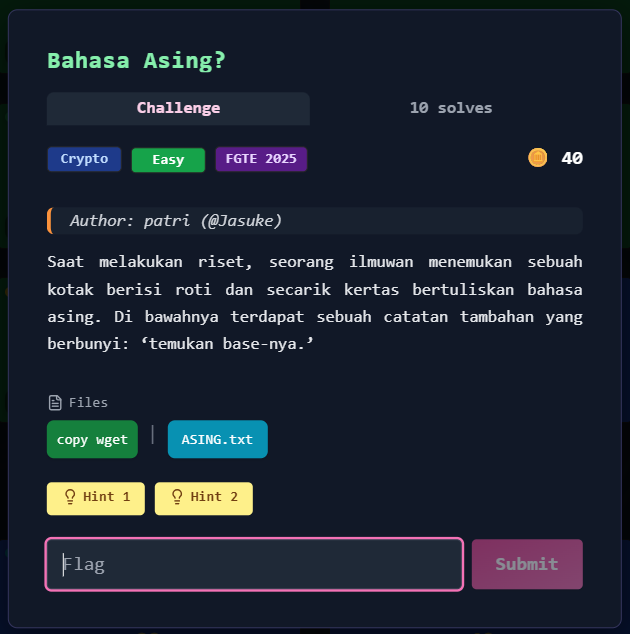
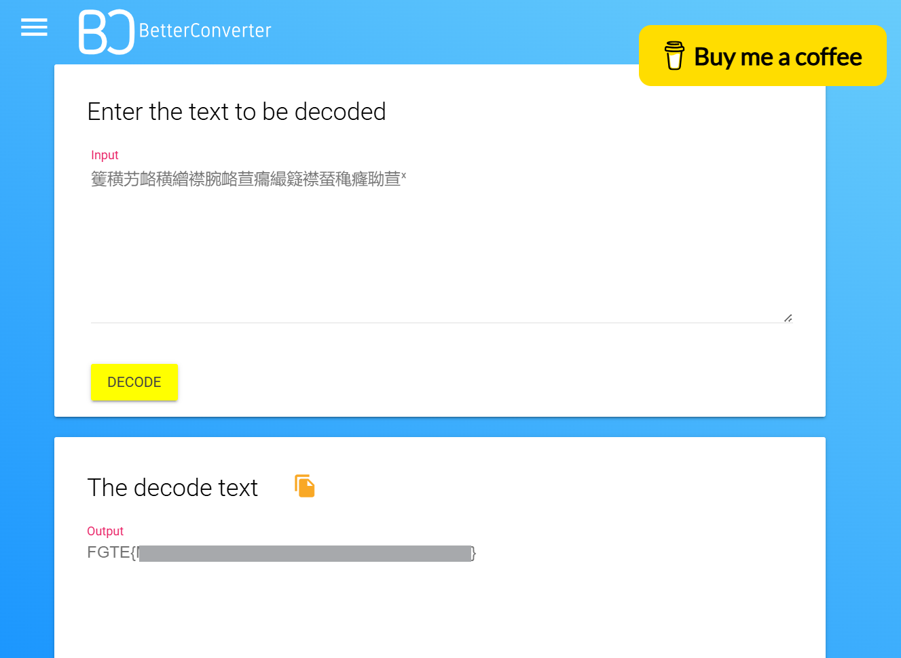

# Bahasa Asing?



## Deskripsi Challenge

Seorang ilmuwan menemukan sebuah kotak berisi roti dan secarik kertas bertuliskan sesuatu yang tampak seperti bahasa asing. Di bawahnya terdapat catatan:

> **“Temukan base-nya.”**

### Hint

1. *“Yakin itu benar-benar bahasa asing? Coba perhatikan detail kecilnya.”*
2. *“Pernah lihat encoding yang memanfaatkan seluruh rentang Unicode untuk menyimpan data? Mirip seperti yang menghasilkan karakter Cina besar-besar itu…”*

Diberikan string berikut:

```
=︪ڔౢ︪ɫ൸ծౢݚ卑ɬE൸୞︦神ѡݚ酤
```

---

## Step 1 — Observasi Awal

Sekilas string tersebut terlihat seperti campuran karakter:

* Simbol Unicode
* Karakter mirip aksara Tiongkok
* Huruf Latin
* Karakter non-ASCII lainnya

Dari hint kedua, disebutkan encoding yang:

> “memanfaatkan seluruh rentang Unicode”

Ini merupakan petunjuk kuat menuju **Base65536**, yaitu skema encoding yang menggunakan karakter Unicode (umumnya karakter CJK) untuk merepresentasikan data biner.

---

## Step 2 — Identifikasi Base65536

Mengacu pada petunjuk *“temukan base-nya”*, diasumsikan bahwa string tersebut merupakan hasil encoding berbasis angka (base encoding).

Setelah melakukan riset, ditemukan bahwa pola karakter yang digunakan konsisten dengan **Base65536**.

Namun, ketika langsung melakukan decode Base65536, tidak diperoleh flag yang valid. Output masih berupa karakter aneh dan tidak terbaca.

Hal ini menunjukkan bahwa Base65536 bukanlah lapisan pertama.

---

## Step 3 — Analisis Lapisan Tambahan

Petunjuk penting lainnya terdapat pada narasi:

> “kotak berisi roti”

Kata *roti* dapat diasosiasikan dengan kata **“rot”** , yang mengarah pada kemungkinan penggunaan **ROT cipher**.

Dalam konteks Unicode, terdapat varian ROT yang bekerja pada rentang karakter luas, yaitu:

* **ROT8000**

ROT8000 dikenal menghasilkan karakter CJK/Unicode besar-besar, sesuai dengan hint:

> “karakter Cina besar-besar itu…”

---

## Step 4 — Dekode ROT8000 Terlebih Dahulu

Langkah yang benar adalah:

1. **Decode ROT8000**
2. Kemudian **Decode Base65536**

Setelah melakukan ROT8000 terlebih dahulu, output menjadi representasi Base65536 yang valid.

```
籆穔艻衉穔繒襟腕衉荁癟繓籎襟蝅穐癃聈荁ᕽ
```

Kemudian dilakukan decoding Base65536.



Flag didapatkan setelah kedua lapisan berhasil didekode dengan urutan yang benar

---

## Flag

```
FGTE{Redacted}
```
