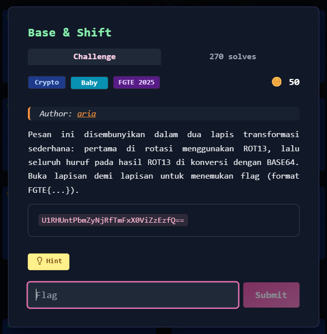

# Base & Shift



## Deskripsi Challenge

Challenge memberikan sebuah ciphertext Base64:

```
U1RHUntPbmZyNjRfTmFxX0ViZzEzfQ==
````

Berdasarkan deskripsi, pesan disembunyikan dalam **dua lapis transformasi**:

1. Hasil plaintext di-**ROT13**
2. Output ROT13 tersebut kemudian di-**Base64**

Targetnya adalah membalik proses ini untuk mendapatkan flag dengan format `FGTE{...}`.

---

## Langkah Penyelesaian

### 1. Decode Base64

Karena lapisan terakhir adalah Base64, langkah pertama adalah melakukan decode Base64:

```bash
echo "U1RHUntPbmZyNjRfTmFxX0ViZzEzfQ==" | base64 -d
````

Output yang didapat masih belum dalam bentuk flag final (karena masih terkena ROT13).

---

### 2. Decode ROT13

Selanjutnya, hasil dari Base64 perlu di-ROT13 untuk mengembalikan plaintext asli.

Di Linux, ROT13 dapat dilakukan menggunakan `tr`:

```bash
echo "U1RHUntPbmZyNjRfTmFxX0ViZzEzfQ==" | base64 -d | tr 'A-Za-z' 'N-ZA-Mn-za-m'
```

---

## Flag

```
FGTE{Redacted}
```
