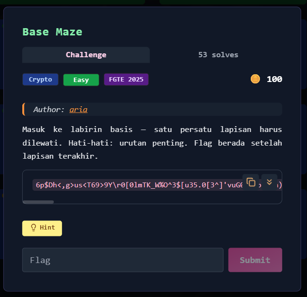
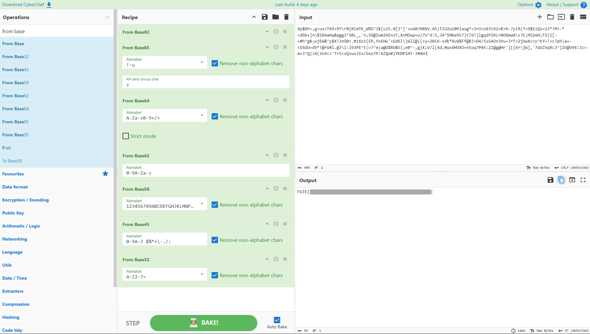

# Base Maze



---

## Deskripsi Challenge

Challenge ini memberi sebuah ciphertext panjang berisi simbol, angka, dan huruf acak.

Clue utama:

> "Masuk ke labirin basis — satu persatu lapisan harus dilewati.  
> Hati-hati: urutan penting. Flag berada setelah lapisan terakhir."

Dari clue tersebut, kita bisa menyimpulkan bahwa ciphertext telah melalui **banyak encoding berbasis “Base-X”** , dan kita harus membuka lapisan-lapisannya **dengan urutan yang benar**.

---

## langkah penyelesaian

### 1. Identifikasi pola

Ciphertext mengandung banyak karakter non-alfabet (simbol), sehingga besar kemungkinan encoding terakhir adalah base yang mendukung banyak karakter seperti:

- Base85
- Base92

Karena clue menyebut "labirin basis", maka langkah terbaik adalah mencoba decode berlapis dari base terbesar ke base terkecil.

---

### 2. Decode lapisan terakhir (Base92)

Di CyberChef gunakan:

- **From Base92**

Hasilnya masih belum menjadi plaintext, tetapi berubah menjadi format yang cocok untuk base berikutnya.

---

### 3. Decode Base85

Tambahkan operasi:

- **From Base85**

Karena Base85 memakai alfabet simbol yang lebih kompleks, pastikan opsi **Remove non-alphabet chars** aktif.

---

### 4. Decode Base64

Tambahkan operasi:

- **From Base64**

Output mulai terlihat lebih “rapi” dan semakin mendekati format base yang lebih kecil.

---

### 5. Decode Base62

Tambahkan operasi:

- **From Base62**

Base62 hanya memakai karakter:

- `0-9`
- `A-Z`
- `a-z`

---

### 6. Decode Base58

Tambahkan operasi:

- **From Base58**

Base58 umum dipakai di crypto dan menghilangkan karakter ambigu seperti `0 O I l`.

---

### 7. Decode Base45

Tambahkan operasi:

- **From Base45**

Base45 biasanya muncul pada QR / encoding modern (contoh: EU Digital Certificate).

---

### 8. Decode Base32 (lapisan terakhir)

Tambahkan operasi:

- **From Base32**

Pada tahap ini plaintext flag akhirnya muncul.

---

## Hasil

Setelah seluruh urutan decoding dijalankan sesuai clue:

**Base92 → Base85 → Base64 → Base62 → Base58 → Base45 → Base32**

Didapatkan flag:  
  



---

## Flag

```
FGTE{Redacted}
```
