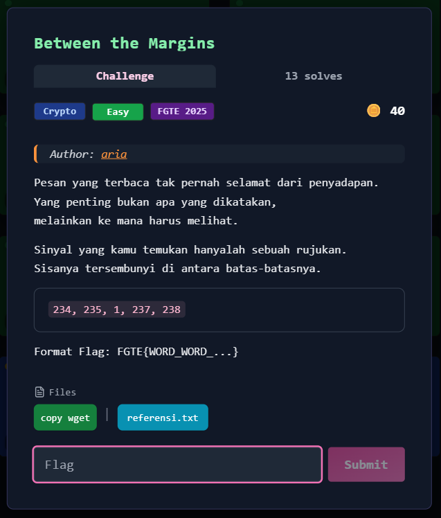
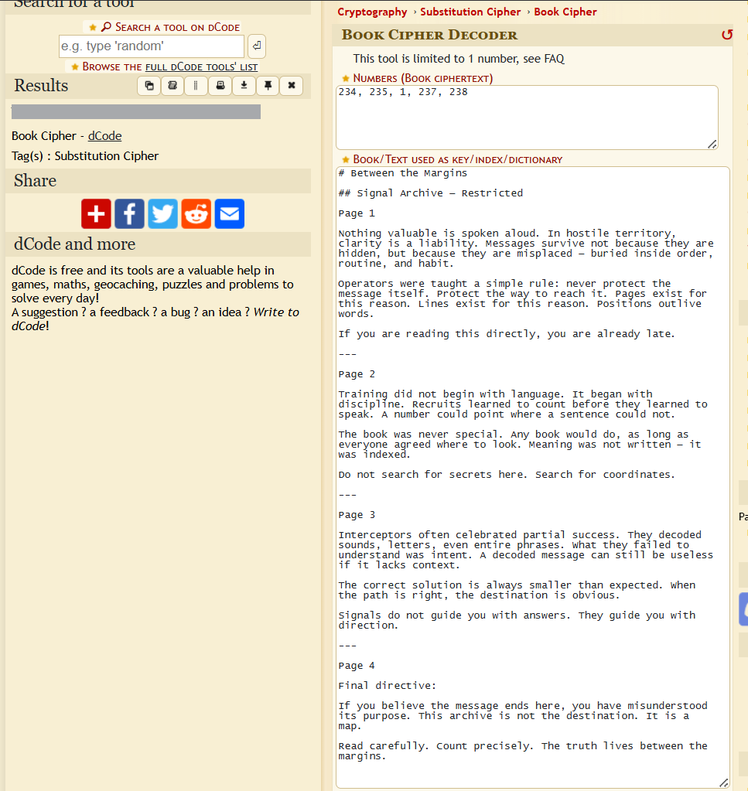

# Between the Margins



## Deskripsi Tantangan

Diberikan:

* Deretan angka:

  ```
  234, 235, 1, 237, 238
  ```
* Format flag:

  ```
  FGTE{WORD_WORD_...}
  ```
* File referensi: `referensi.txt`

Isi `referensi.txt` terdiri dari empat halaman teks berjudul:

```md
# Between the Margins

## Signal Archive — Restricted

Page 1

Nothing valuable is spoken aloud. In hostile territory, clarity is a liability. Messages survive not because they are hidden, but because they are misplaced — buried inside order, routine, and habit.

Operators were taught a simple rule: never protect the message itself. Protect the way to reach it. Pages exist for this reason. Lines exist for this reason. Positions outlive words.

If you are reading this directly, you are already late.

---

Page 2

Training did not begin with language. It began with discipline. Recruits learned to count before they learned to speak. A number could point where a sentence could not.

The book was never special. Any book would do, as long as everyone agreed where to look. Meaning was not written — it was indexed.

Do not search for secrets here. Search for coordinates.

---

Page 3

Interceptors often celebrated partial success. They decoded sounds, letters, even entire phrases. What they failed to understand was intent. A decoded message can still be useless if it lacks context.

The correct solution is always smaller than expected. When the path is right, the destination is obvious.

Signals do not guide you with answers. They guide you with direction.

---

Page 4

Final directive:

If you believe the message ends here, you have misunderstood its purpose. This archive is not the destination. It is a map.

Read carefully. Count precisely. The truth lives between the margins.
```

Struktur dokumen dibagi menjadi:

* Page 1
* Page 2
* Page 3
* Page 4

---

## Analisis Konseptual

Narasi awal memberikan petunjuk penting:

> "Yang penting bukan apa yang dikatakan, melainkan ke mana harus melihat."
> "Sinyal yang kamu temukan hanyalah sebuah rujukan."
> "Search for coordinates."
> "Meaning was not written — it was indexed."

Kata-kata seperti:

* Pages
* Lines
* Positions
* Coordinates
* Indexed

merujuk secara eksplisit pada **book cipher**.

Dalam book cipher, angka tidak merepresentasikan huruf secara langsung, melainkan menunjuk ke posisi tertentu dalam sebuah teks referensi (buku/dokumen).

---

## Identifikasi Metode

Struktur `referensi.txt` yang dibagi menjadi beberapa halaman memperkuat indikasi bahwa:

* Angka-angka tersebut adalah indeks
* Dokumen tersebut berfungsi sebagai “buku” dalam book cipher

Deretan angka yang diberikan:

```
234, 235, 1, 237, 238
```

Kemungkinan besar menunjuk ke kata atau posisi tertentu dalam teks referensi.

---

## Proses Dekode

Menggunakan metode book cipher (misalnya melalui dcode.fr atau parsing manual dengan indexing terhadap referensi.txt), angka-angka tersebut dipetakan terhadap kata dalam dokumen.

Hasil decoding:  
  


---

## Penyusunan Flag

Format flag yang diminta:

```
FGTE{WORD_WORD_...}
```

Maka frasa hasil decoding disesuaikan dengan format tersebut:

---

## Flag

```
FGTE{Redacted}
```
