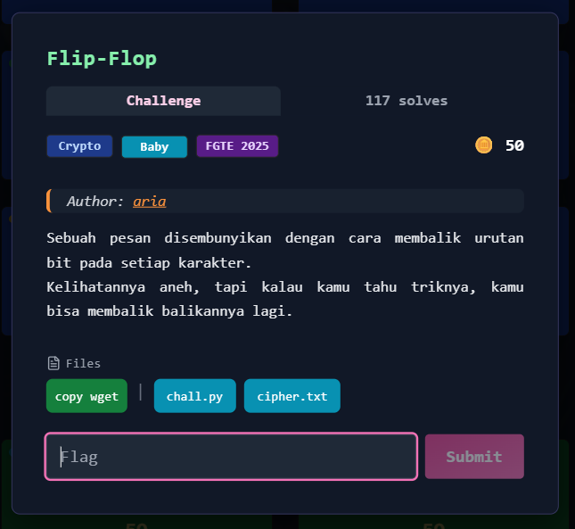
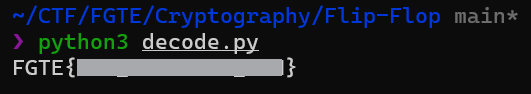

# Flip-Flop



## Deskripsi Challenge

Challenge menyediakan file:

- `cipher.txt` (berisi ciphertext dalam bentuk byte / karakter non-printable)
- `chall.py` (script enkripsi)

Dari `chall.py`, diketahui bahwa ciphertext dibuat dengan cara memproses setiap karakter plaintext menjadi biner 8-bit, lalu **membalik urutan bitnya** (bit-reversal).

---

## Langkah Penyelesaian

### 1. Analisis Algoritma Enkripsi

Isi utama fungsi `encode()`:

```python
bits = f"{ord(c):08b}"   # ubah char ke biner 8-bit
rev = bits[::-1]         # balik urutan bit
out.append(chr(int(rev, 2)))
````

Artinya:

* setiap karakter → 8-bit binary
* bit dibalik (contoh `01000001` → `10000010`)
* hasilnya dikonversi kembali menjadi byte/char

Karena operasi bit-reversal bersifat **involutif** (dibalik dua kali kembali ke bentuk awal), maka fungsi decode sama persis dengan encode.

---

### 2. Membuat Script Dekripsi

Untuk mengembalikan plaintext:

1. Baca `cipher.txt` dalam mode binary
2. Decode menggunakan `latin-1` agar byte 0–255 tidak rusak
3. Jalankan proses bit-reversal yang sama

Script:

```python
def decode(text: str) -> str:
    out = []
    for c in text:
        bits = f"{ord(c):08b}"
        rev = bits[::-1]
        out.append(chr(int(rev, 2)))
    return "".join(out)

if __name__ == "__main__":
    with open("cipher.txt", "rb") as f:
        cipher = f.read().decode("latin-1")

    plain = decode(cipher)
    print(plain)
```

---

### 3. Menjalankan Solver

```bash
python3 decode.py
```
  


---

## Flag

```
FGTE{Redacted}
```
