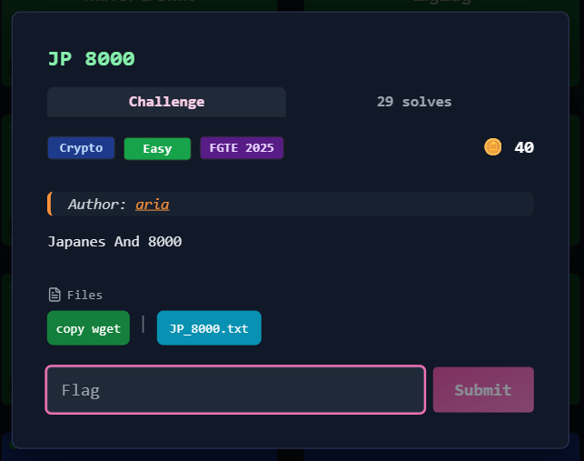
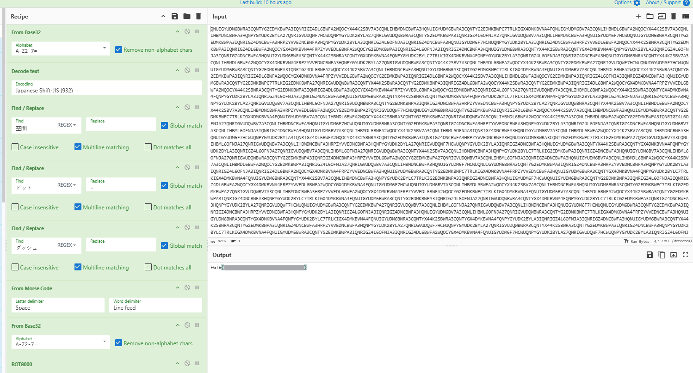

# JP 8000



## Deskripsi Challenge

Diberikan sebuah file bernama `JP_8000.txt`. Berdasarkan nama challenge dan hint pada deskripsi (kata **Japanese** dan angka **8000**), kemungkinan besar challenge ini melibatkan encoding berlapis, decoding Shift-JIS, serta ROT8000.

---

## 1. Initial Analysis

Pertama, isi file dicek menggunakan `cat`:

```bash
cat JP_8000.txt
```

Output yang terlihat adalah string panjang dengan karakter hasil enkode Base32:

```
QNUIGYUDM6BWRA3CQNTYG2EDMKBWPA3IQNRIGZ4DL6BWFA2WQOCYX44K2SBV7A3CQNLIHBMDNCBWFA3HQNUIGYUDM6BWRA3CQNTYG2EDMKBWPC7TRLKIGX4DMKBVNA4FQNUIGYUDM6BV7A3CQNLIHBMDL6BWFA2WQOCYX44K2SBV7A3CQNLIHBMDNCBWFA3HQNPYGYUDK2BYLA27QNRIGVUDQWF7HCWUQNPYGYUDK2BYLA27QNRIGVUDQWBWRA3CQNTYG2EDMKBWPA3IQNRIGZ4L6OFNJA27QNRIGVUDQWBV7A3CQNLIHBMDNCBWFA3HQNUIGYUDM6F7HCWUQNUIGYUDM6BWRA3CQNTYG2EDMKBWPA3IQNRIGZ4DNCBWFA3HRPZYVVEDNCBWFA3HQNPYGYUDK2BYLA3IQNRIGZ4L6OFNJA3IQNRIGZ4DNCBWFA3HQNUIGYUDM6F7HCWUQNPYGYUDK2BYLA3IQNRIGZ4DNCBWFA3HRPZYVVEDL6BWFA2WQOCYX44K2SBWRA3CQNTYG2EDMKBWPA3IQNRIGZ4DL6BWFA2WQOCYGX4DMKBVNA4FRPZYVVEDL6BWFA2WQOCYG2EDMKBWPA3IQNRIGZ4L6OFNJA3IQNRIGZ4DNCBWFA3HQNUIGYUDM6BWRA3CQNTYX44K2SBWRA3CQNTYGX4DMKBVNA4FQNPYGYUDK2BYLA3IQNRIGZ4L6OFNJA3IQNRIGZ4DNCBWFA3HQNUIGYUDM6BWRA3CQNTYX44K2SBWRA3CQNTYGX4DMKBVNA4FQNPYGYUDK2BYLC7TRLKIGX4DMKBVNA4FQNPYGYUDK2BYLA3IQNRIGZ4L6OFNJA3IQNRIGZ4DNCBWFA3HQNUIGYUDM6BWRA3CQNTYX44K2SBV7A3CQNLIHBMDL6BWFA2WQOCYGX4DMKBVNA4FRPZYVVEDNCBWFA3HQNPYGYUDK2BYLA27QNRIGVUDQWBWRA3CQNTYX44K2SBV7A3CQNLIHBMDL6BWFA2WQOCYX44K2SBWRA3CQNTYG2EDMKBWPA27QNRIGVUDQWF7HCWUQNUIGYUDM6F7HCWUQNUIGYUDM6BWRA3CQNTYG2EDMKBWPA3IQNRIGZ4DL6BWFA2WQOCYX44K2SBV7A3CQNLIHBMDNCBWFA3HQNUIGYUDM6BWRA3CQNTYG2EDMKBWPC7TRLKIGX4DMKBVNA4FQNUIGYUDM6BV7A3CQNLIHBMDL6BWFA2WQOCYX44K2SBWRA3CQNTYG2EDMKBWPA3IQNRIGZ4DL6BWFA2WQOCYGX4DMKBVNA4FRPZYVVEDL6BWFA2WQOCYG2EDMKBWPA3IQNRIGZ4DL6BWFA2WQOCYX44K2SBV7A3CQNLIHBMDL6BWFA2WQOCYG2EDMKBWPA3IQNRIGZ4L6OFNJA3IQNRIGZ4DNCBWFA3HQNUIGYUDM6BWRA3CQNTYG2EDMKBWPC7TRLKIG2EDMKBWPA27QNRIGVUDQWBWRA3CQNTYX44K2SBWRA3CQNTYG2EDMKBWPA3IQNRIGZ4DL6BWFA2WQOCYX44K2SBWRA3CQNTYG2EDMKBWPA3IQNRIGZ4DL6BWFA2WQOCYGX4DMKBVNA4FRPZYVVEDL6BWFA2WQOCYX44K2SBWRA3CQNTYG2EDMKBWPA3IQNRIGZ4DL6BWFA2WQOCYGX4DMKBVNA4FRPZYVVEDL6BWFA2WQOCYG2EDMKBWPA3IQNRIGZ4L6OFNJA27QNRIGVUDQWBV7A3CQNLIHBMDL6BWFA2WQOCYX44K2SBWRA3CQNTYGX4DMKBVNA4FQNPYGYUDK2BYLA3IQNRIGZ4L6OFNJA3IQNRIGZ4DNCBWFA3HQNUIGYUDM6BWRA3CQNTYX44K2SBWRA3CQNTYGX4DMKBVNA4FQNPYGYUDK2BYLC7TRLKIGX4DMKBVNA4FQNPYGYUDK2BYLA3IQNRIGZ4L6OFNJA3IQNRIGZ4DNCBWFA3HQNPYGYUDK2BYLA27QNRIGVUDQWBV7A3CQNLIHBML6OFNJA27QNRIGVUDQWBWRA3CQNTYG2EDMKBWPA3IQNRIGZ4DNCBWFA3HRPZYVVEDNCBWFA3HQNPYGYUDK2BYLA27QNRIGVUDQWBWRA3CQNTYX44K2SBV7A3CQNLIHBMDL6BWFA2WQOCYX44K2SBV7A3CQNLIHBMDNCBWFA3HRPZYVVEDL6BWFA2WQOCYG2EDMKBWPA27QNRIGVUDQWF7HCWUQNUIGYUDM6BWRA3CQNTYG2EDMKBWPA3IQNRIGZ4DL6BWFA2WQOCYX44K2SBV7A3CQNLIHBMDNCBWFA3HQNUIGYUDM6BWRA3CQNTYG2EDMKBWPC7TRLKIGX4DMKBVNA4FQNUIGYUDM6BV7A3CQNLIHBMDL6BWFA2WQOCYX44K2SBWRA3CQNTYG2EDMKBWPA27QNRIGVUDQWBV7A3CQNLIHBMDL6BWFA2WQOCYX44K2SBV7A3CQNLIHBMDL6BWFA2WQOCYG2EDMKBWPA3IQNRIGZ4L6OFNJA27QNRIGVUDQWBV7A3CQNLIHBMDNCBWFA3HQNUIGYUDM6F7HCWUQNUIGYUDM6BWRA3CQNTYG2EDMKBWPA3IQNRIGZ4DNCBWFA3HRPZYVVEDNCBWFA3HQNPYGYUDK2BYLA3IQNRIGZ4L6OFNJA3IQNRIGZ4DNCBWFA3HQNUIGYUDM6BV7A3CQNLIHBML6OFNJA3IQNRIGZ4DNCBWFA3HQNUIGYUDM6BV7A3CQNLIHBMDL6BWFA2WQOCYX44K2SBV7A3CQNLIHBML6OFNJA3IQNRIGZ4DNCBWFA3HQNUIGYUDM6BV7A3CQNLIHBMDL6BWFA2WQOCYX44K2SBV7A3CQNLIHBMDNCBWFA3HQNUIGYUDM6F7HCWUQNPYGYUDK2BYLA3IQNRIGZ4DL6BWFA2WQOCYX44K2SBWRA3CQNTYG2EDMKBWPA3IQNRIGZ4DNCBWFA3HRPZYVVEDNCBWFA3HQNUIGYUDM6BWRA3CQNTYG2EDMKBWPC7TRLKIG2EDMKBWPA27QNRIGVUDQWBV7A3CQNLIHBML6OFNJA27QNRIGVUDQWBV7A3CQNLIHBMDNCBWFA3HRPZYVVEDNCBWFA3HQNPYGYUDK2BYLA27QNRIGVUDQWF7HCWUQNPYGYUDK2BYLA3IQNRIGZ4DNCBWFA3HQNUIGYUDM6BWRA3CQNTYX44K2SBWRA3CQNTYGX4DMKBVNA4FQNPYGYUDK2BYLA3IQNRIGZ4L6OFNJA27QNRIGVUDQWBV7A3CQNLIHBML6OFNJA27QNRIGVUDQWBWRA3CQNTYX44K2SBV7A3CQNLIHBMDNCBWFA3HQNPYGYUDK2BYLC7TRLKIG2EDMKBWPA3IQNRIGZ4DNCBWFA3HQNUIGYUDM6BV7A3CQNLIHBML6OFNJA27QNRIGVUDQWBWRA3CQNTYG2EDMKBWPA3IQNRIGZ4DNCBWFA3HRPZYVVEDL6BWFA2WQOCYG2EDMKBWPA27QNRIGVUDQWBV7A3CQNLIHBML6OFNJA3IQNRIGZ4DNCBWFA3HQNUIGYUDM6BV7A3CQNLIHBMDL6BWFA2WQOCYX44K2SBV7A3CQNLIHBMDL6BWFA2WQOCYG2EDMKBWPA3IQNRIGZ4L6OFNJA27QNRIGVUDQWBV7A3CQNLIHBMDNCBWFA3HQNUIGYUDM6F7HCWUQNUIGYUDM6BWRA3CQNTYG2EDMKBWPA3IQNRIGZ4DNCBWFA3HRPZYVVEDNCBWFA3HQNPYGYUDK2BYLA3IQNRIGZ4L6OFNJA3IQNRIGZ4DL6BWFA2WQOCYGX4DMKBVNA4FRPZYVVEDNCBWFA3HQNUIGYUDM6BWRA3CQNTYG2EDMKBWPC7TRLKIGX4DMKBVNA4FRPZYVVEDNCBWFA3HQNUIGYUDM6BWRA3CQNTYGX4DMKBVNA4FQNPYGYUDK2BYLC7TRLKIGX4DMKBVNA4FQNUIGYUDM6BWRA3CQNTYX44K2SBV7A3CQNLIHBMDNCBWFA3HQNPYGYUDK2BYLC7TRLKIG2EDMKBWPA3IQNRIGZ4DNCBWFA3HQNUIGYUDM6F7HCWUQNUIGYUDM6BWRA3CQNTYG2EDMKBWPA3IQNRIGZ4L6OFNJA3IQNRIGZ4DL6BWFA2WQOCYGX4DMKBVNA4FRPZYVVEDL6BWFA2WQOCYGX4DMKBVNA4FQNUIGYUDM6F7HCWUQNUIGYUDM6BV7A3CQNLIHBMDL6BWFA2WQOCYX44K2SBV7A3CQNLIHBMDNCBWFA3HQNUIGYUDM6BWRA3CQNTYG2EDMKBWPC7TRLKIG2EDMKBWPA27QNRIGVUDQWBV7A3CQNLIHBMDNCBWFA3HRPZYVVEDL6BWFA2WQOCYGX4DMKBVNA4FRPZYVVEDL6BWFA2WQOCYG2EDMKBWPC7TRLKIGX4DMKBVNA4FQNUIGYUDM6BV7A3CQNLIHBMDL6BWFA2WQOCYX44K2SBWRA3CQNTYG2EDMKBWPA3IQNRIGZ4DNCBWFA3HQNPYGYUDK2BYLC7TRLKIGX4DMKBVNA4FQNUIGYUDM6BWRA3CQNTYG2EDMKBWPA3IQNRIGZ4L6OFNJA27QNRIGVUDQWBWRA3CQNTYGX4DMKBVNA4FQNPYGYUDK2BYLC7TRLKIG2EDMKBWPA3IQNRIGZ4DNCBWFA3HQNPYGYUDK2BYLA27QNRIGVUDQWF7HCWUQNUIGYUDM6BWRA3CQNTYG2EDMKBWPA27QNRIGVUDQWBV7A3CQNLIHBML6OFNJA27QNRIGVUDQWBV7A3CQNLIHBMDNCBWFA3HQNUIGYUDM6F7HCWUQNUIGYUDM6BWRA3CQNTYG2EDMKBWPA3IQNRIGZ4DNCBWFA3HRPZYVVEDNCBWFA3HQNPYGYUDK2BYLA3IQNRIGZ4L6OFNJA3IQNRIGZ4DNCBWFA3HQNUIGYUDM6BV7A3CQNLIHBML6OFNJA27QNRIGVUDQWBWRA3CQNTYG2EDMKBWPC7TRLKIGX4DMKBVNA4FRPZYVVEDNCBWFA3HQNUIGYUDM6BWRA3CQNTYGX4DMKBVNA4FQNPYGYUDK2BYLC7TRLKIGX4DMKBVNA4FQNUIGYUDM6BWRA3CQNTYX44K2SBWRA3CQNTYGX4DMKBVNA4FQNPYGYUDK2BYLA3IQNRIGZ4L6OFNJA3IQNRIGZ4DNCBWFA3HQNUIGYUDM6BWRA3CQNTYX44K2SBWRA3CQNTYG2EDMKBWPA3IQNRIGZ4DNCBWFA3HRPZYVVEDNCBWFA3HQNPYGYUDK2BYLA27QNRIGVUDQWF7HCWUQNPYGYUDK2BYLA27QNRIGVUDQWBWRA3CQNTYX44K2SBWRA3CQNTYG2EDMKBWPA3IQNRIGZ4DNCBWFA3HQNPYGYUDK2BYLC7TRLKIGX4DMKBVNA4FQNUIGYUDM6BWRA3CQNTYG2EDMKBWPA3IQNRIGZ4L6OFNJA3IQNRIGZ4DL6BWFA2WQOCYGX4DMKBVNA4FQNUIGYUDM6F7HCWUQNPYGYUDK2BYLA27QNRIGVUDQWF7HCWUQNPYGYUDK2BYLA3IQNRIGZ4L6OFNJA27QNRIGVUDQWBWRA3CQNTYGX4DMKBVNA4FRPZYVVEDNCBWFA3HQNUIGYUDM6BWRA3CQNTYG2EDMKBWPA27QNRIGVUDQWF7HCWUQNPYGYUDK2BYLA3IQNRIGZ4DNCBWFA3HQNUIGYUDM6BWRA3CQNTYX44K2SBV7A3CQNLIHBMDNCBWFA3HQNPYGYUDK2BYLA27QNRIGVUDQWF7HCWUQNUIGYUDM6BWRA3CQNTYGX4DMKBVNA4FQNPYGYUDK2BYLA27QNRIGVUDQWF7HCWUQNPYGYUDK2BYLA27QNRIGVUDQWBWRA3CQNTYG2EDMKBWPC7TRLKIGX4DMKBVNA4FQNPYGYUDK2BYLA3IQNRIGZ4DNCBWFA3HRPZYVVEDNCBWFA3HQNUIGYUDM6BWRA3CQNTYG2EDMKBWPA3IQNRIGZ4L6OFNJA3IQNRIGZ4DL6BWFA2WQOCYG2EDMKBWPC7TRLKIG2EDMKBWPA3IQNRIGZ4DNCBWFA3HQNPYGYUDK2BYLC7TRLKIG2EDMKBWPA3IQNRIGZ4DNCBWFA3HQNPYGYUDK2BYLA27QNRIGVUDQWF7HCWUQNPYGYUDK2BYLC7TRLKIG2EDMKBWPA3IQNRIGZ4DNCBWFA3HQNPYGYUDK2BYLA27QNRIGVUDQWF7HCWUQNPYGYUDK2BYLA3IQNRIGZ4DNCBWFA3HRPZYVVEDL6BWFA2WQOCYG2EDMKBWPA27QNRIGVUDQWF7HCWUQNUIGYUDM6BWRA3CQNTYG2EDMKBWPA3IQNRIGZ4L6OFNJA3IQNRIGZ4DNCBWFA3HQNUIGYUDM6BWRA3CQNTYX44K2SBWRA3CQNTYGX4DMKBVNA4FQNPYGYUDK2BYLC7TRLKIGX4DMKBVNA4FQNPYGYUDK2BYLA3IQNRIGZ4L6OFNJA27QNRIGVUDQWBV7A3CQNLIHBMDNCBWFA3HQNUIGYUDM6F7HCWUQNPYGYUDK2BYLA3IQNRIGZ4DNCBWFA3HQNUIGYUDM6BWRA3CQNTYX44K2SBWRA3CQNTYGX4DMKBVNA4FQNPYGYUDK2BYLA3IQNRIGZ4L6OFNJA27QNRIGVUDQWBV7A3CQNLIHBML6OFNJA27QNRIGVUDQWBWRA3CQNTYX44K2SBV7A3CQNLIHBMDNCBWFA3HQNPYGYUDK2BYLC7TRLKIG2EDMKBWPA3IQNRIGZ4DNCBWFA3HQNUIGYUDM6BV7A3CQNLIHBML6OFNJA27QNRIGVUDQWBWRA3CQNTYG2EDMKBWPA3IQNRIGZ4DNCBWFA3HRPZYVVEDL6BWFA2WQOCYG2EDMKBWPA27QNRIGVUDQWBV7A3CQNLIHBML6OFNJA3IQNRIGZ4DNCBWFA3HQNUIGYUDM6BV7A3CQNLIHBMDL6BWFA2WQOCYX44K2SBV7A3CQNLIHBML6OFNJA27QNRIGVUDQWBV7A3CQNLIHBMDNCBWFA3HQNUIGYUDM6F7HCWUQNUIGYUDM6BWRA3CQNTYG2EDMKBWPA3IQNRIGZ4DNCBWFA3HRPZYVVEDNCBWFA3HQNPYGYUDK2BYLA3IQNRIGZ4L6OFNJA3IQNRIGZ4DNCBWFA3HQNUIGYUDM6BV7A3CQNLIHBML6OFNJA3IQNRIGZ4DL6BWFA2WQOCYG2EDMKBWPA3IQNRIGZ4L6OFNJA27QNRIGVUDQWF7HCWUQNUIGYUDM6BWRA3CQNTYG2EDMKBWPA27QNRIGVUDQWBV7A3CQNLIHBML6OFNJA27QNRIGVUDQWBWRA3CQNTYG2EDMKBWPC7TRLKIGX4DMKBVNA4FQNUIGYUDM6F7HCWUQNPYGYUDK2BYLA27QNRIGVUDQWBWRA3CQNTYG2EDMKBWPA3IQNRIGZ4L6OFNJA3IQNRIGZ4DNCBWFA3HQNUIGYUDM6BWRA3CQNTYX44K2SBWRA3CQNTYGX4DMKBVNA4FQNPYGYUDK2BYLC7TRLKIGX4DMKBVNA4FQNPYGYUDK2BYLA3IQNRIGZ4L6OFNJA27QNRIGVUDQWBWRA3CQNTYG2EDMKBWPA27QNRIGVUDQWF7HCWUQNPYGYUDK2BYLA27QNRIGVUDQWBV7A3CQNLIHBML6OFNJA3IQNRIGZ4DL6BWFA2WQOCYGX4DMKBVNA4FQNUIGYUDM6F7HCWUQNPYGYUDK2BYLA27QNRIGVUDQWF7HCWUQNPYGYUDK2BYLA3IQNRIGZ4L6OFNJA3IQNRIGZ4DNCBWFA3HQNUIGYUDM6BWRA3CQNTYGX4DMKBVNA4FRPZYVVEDNCBWFA3HQNUIGYUDM6BWRA3CQNTYG2EDMKBWPA27QNRIGVUDQWF7HCWUQNPYGYUDK2BYLA3IQNRIGZ4DNCBWFA3HQNUIGYUDM6BWRA3CQNTYX44K2SBV7A3CQNLIHBMDL6BWFA2WQOCYG2EDMKBWPA3IQNRIGZ4L6OFNJA3IQNRIGZ4DNCBWFA3HRPZYVVEDL6BWFA2WQOCYGX4DMKBVNA4FRPZYVVEDL6BWFA2WQOCYG2EDMKBWPA3IQNRIGZ4DNCBWFA3HQNPYGYUDK2BYLC7TRLKIGX4DMKBVNA4FQNUIGYUDM6BWRA3CQNTYG2EDMKBWPA27QNRIGVUDQWF7HCWUQNPYGYUDK2BYLA3IQNRIGZ4DNCBWFA3HQNUIGYUDM6BV7A3CQNLIHBI=
```

Karena formatnya sangat mirip Base32, langkah pertama adalah melakukan decoding Base32.

---

## 2. Base32 Decode (Layer 1)

Decode dilakukan dengan tool CLI:

```bash
cat JP_8000.txt | base32 -d
```

Namun hasilnya mengandung banyak karakter non-printable.  
Ini menandakan output Base32 kemungkinan bukan plaintext ASCII, melainkan encoded dengan charset lain.

---

## 3. Decode sebagai Japanese Shift-JIS (CP932)

Karena ada hint “Japanese”, saya mencoba mendekode hasil Base32 tadi menggunakan encoding **Shift-JIS (CP932)**.

Di **CyberChef**, saya gunakan recipe:

1. **From Base32**
2. **Decode Text** → `Japanese Shift-JIS (932)`

Hasilnya menjadi teks Jepang berulang:

```
ドットドットドットドットダッシュ空間ダッシュドットドットドットドット空間ダッシュドットダッシュダッシュ空間ダッシュドットダッシュダッシュ空間ダッシュダッシュドットドットドット空間ダッシュダッシュドットドット空間ドットドットドットドットドット空間ドットダッシュドット空間ドットドットドット空間ダッシュドットドット空間ダッシュ空間ドットドットドットダッシュダッシュ空間ダッシュドットドット空間ドットドットドットドット空間ドットダッシュダッシュドット空間ドットドットドットドット空間ドットダッシュダッシュ空間ダッシュダッシュドット空間ドットドットドットドット空間ダッシュダッシュダッシュ空間ドットダッシュダッシュドット空間ダッシュダッシュ空間ドットドットダッシュ空間ドット空間ドットドットドットドットダッシュ空間ダッシュドットドットドットドット空間ダッシュドットダッシュダッシュ空間ドットドットドットダッシュダッシュ空間ダッシュドットドットダッシュ空間ダッシュダッシュドットドット空間ドットドットドットドットドット空間ドットダッシュドット空間ドットドットドットダッシュ空間ドットドットドットダッシュダッシュ空間ダッシュ空間ドットドットドットダッシュダッシュ空間ダッシュドットドット空間ダッシュダッシュダッシュ空間ドットダッシュダッシュドット空間ドットドットドットドット空間ドットダッシュダッシュ空間ダッシュダッシュドット空間ドットドットダッシュダッシュダッシュ空間ダッシュドットドットドットドット空間ドットダッシュダッシュドット空間ダッシュダッシュ空間ダッシュドット空間ダッシュドットダッシュ空間ドットドットドットドットダッシュ空間ダッシュドットドットドットドット空間ダッシュドットダッシュダッシュ空間ドットドットダッシュダッシュダッシュ空間ダッシュダッシュドットドット空間ダッシュダッシュドットドット空間ドットドットドットドットドット空間ドットダッシュドット空間ドットドットドットダッシュ空間ドットドットドットダッシュダッシュ空間ダッシュ空間ドットドットドットダッシュダッシュ空間ダッシュドットドット空間ダッシュドットダッシュ空間ドットドットドットドット空間ドットドットドットドット空間ドットダッシュダッシュ空間ダッシュダッシュドット空間ドットダッシュダッシュ空間ダッシュドットドットドットドット空間ドットダッシュダッシュドット空間ダッシュダッシュ空間ダッシュドット空間ダッシュドットダッシュ空間ドットドットドットドットダッシュ空間ダッシュドットドットドットドット空間ダッシュドットダッシュダッシュ空間ドットドットドットダッシュダッシュ空間ダッシュダッシュドットドット空間ダッシュダッシュドットドット空間ドットドットドットドットドット空間ドットダッシュドット空間ドットダッシュダッシュ空間ドットドットドットドット空間ダッシュ空間ドットドットドットダッシュダッシュ空間ダッシュドットドット空間ダッシュドットダッシュ空間ドットドットドットドット空間ドットドットドットドット空間ドットダッシュダッシュ空間ダッシュダッシュドット空間ドットダッシュダッシュ空間ダッシュドットドットドットドット空間ドットダッシュダッシュドット空間ダッシュダッシュ空間ダッシュドット空間ダッシュドットダッシュダッシュ空間ドットドットドットドットダッシュ空間ダッシュドットドットドットドット空間ダッシュドットダッシュダッシュ空間ドットドットドットダッシュダッシュ空間ドットドットドットダッシュダッシュ空間ダッシュダッシュドットドット空間ドットドットドットドットドット空間ドットダッシュドット空間ドットドットドットダッシュ空間ダッシュドットドット空間ダッシュ空間ドットドットドットダッシュダッシュ空間ダッシュドットドット空間ドットダッシュダッシュドット空間ドットドットドットドット空間ドットドットドットドット空間ドットダッシュダッシュ空間ダッシュダッシュドット空間ドットドットドットドットダッシュ空間ダッシュドットドットドットドット空間ドットダッシュダッシュドット空間ダッシュダッシュ空間ダッシュドット空間ダッシュドットダッシュ空間ドットドットドットドットダッシュ空間ダッシュドットドットドットドット空間ダッシュドットダッシュダッシュ空間ドットドットダッシュダッシュダッシュ空間ダッシュダッシュドットドット空間ダッシュダッシュドットドット空間ドットドットドットドットドット空間ドットダッシュドット空間ドットドットドットダッシュ空間ドットドットドットダッシュダッシュ空間ダッシュ空間ドットドットドットダッシュダッシュ空間ダッシュドットドット空間ダッシュドットダッシュ空間ドットドットドットドット空間ドットドットドットドット空間ドットダッシュダッシュ空間ダッシュダッシュドット空間ダッシュダッシュドットドット空間ダッシュドットドットドットドット空間ドットダッシュダッシュドット空間ダッシュダッシュ空間ダッシュドット空間ダッシュドットダッシュ空間ドットドットドットドットダッシュ空間ダッシュドットドットドットドット空間ダッシュドットダッシュダッシュ空間ドットドットドットダッシュダッシュ空間ダッシュ空間ダッシュダッシュドットドット空間ドットドットドットドットドット空間ドットダッシュドット空間ドットドットドットダッシュ空間ドットダッシュドットドット空間ダッシュ空間ドットドットドットダッシュダッシュ空間ダッシュドットドット空間ダッシュドット空間ダッシュダッシュドットドットドット空間ドットドットドットドット空間ドットダッシュダッシュ空間ダッシュダッシュドット空間ダッシュドットドットダッシュ空間ダッシュダッシュダッシュ空間ドットダッシュダッシュドット空間ダッシュダッシュ空間ダッシュドット空間ドットドットドットドットダッシュ空間ドットドットドットドットダッシュ空間ダッシュドットドットドットドット空間ダッシュダッシュドットドット空間ドットドット空間ダッシュダッシュ空間ダッシュドットドットドットダッシュ空間ダッシュドットドットドットダッシュ空間ダッシュドットドットドットダッシュ
```

---

## 4. Identifikasi Morse Code

String Jepang tersebut ternyata merepresentasikan simbol Morse, dengan mapping:

* `ドット` = `.`
* `ダッシュ` = `-`
* `空間` = spasi

Setelah mapping, diperoleh string Morse:

```
....- -.... -.-- -.-- --... --.. ..... .-. ... -.. - ...-- -.. .... .--. .... .-- --. .... --- .--. -- ..- . ....- -.... -.-- ...-- -..- --.. ..... .-. ...- ...-- - ...-- -.. --- .--. .... .-- --. ..--- -.... .--. -- -. -.- ....- -.... -.-- ..--- --.. --.. ..... .-. ...- ...-- - ...-- -.. -.- .... .... .-- --. .-- -.... .--. -- -. -.- ....- -.... -.-- ...-- --.. --.. ..... .-. .-- .... - ...-- -.. -.- .... .... .-- --. .-- -.... .--. -- -. -.-- ....- -.... -.-- ...-- ...-- --.. ..... .-. ...- -.. - ...-- -.. .--. .... .... .-- --. ....- -.... .--. -- -. -.- ....- -.... -.-- ..--- --.. --.. ..... .-. ...- ...-- - ...-- -.. -.- .... .... .-- --. --.. -.... .--. -- -. -.- ....- -.... -.-- ...-- - --.. ..... .-. ...- .-.. - ...-- -.. -. --... .... .-- --. -..- --- .--. -- -. ....- ....- -.... --.. .. -- -...- -...- -...-
```

---

## 5. Decode Morse Code

Di CyberChef, saya gunakan operasi:

* **From Morse Code**

Hasil decoding Morse menghasilkan string berikut:

```
46YY7Z5RSDT3DHPHWGHOPMUE46Y3XZ5RV3T3DOPHWG26PMNK46Y2ZZ5RV3T3DKHHWGW6PMNK46Y3ZZ5RWHT3DKHHWGW6PMNY46Y33Z5RVDT3DPHHWG46PMNK46Y2ZZ5RV3T3DKHHWGZ6PMNK46Y3TZ5RVLT3DN7HWGXOPMN446ZIM===
```

String ini kembali terlihat seperti Base32.

---

## 6. Base32 Decode (Layer 2)

Decode Base32 dilakukan lagi.

```
籏籐籝籎粄类籮籹籵籪籬籮籨籭籪籼籱籨籭籸籽籨籼籹籪籬籮籨米籪籹籪籷籮籼粆
```

Hasilnya berupa karakter non-latin (aksara China), sehingga jelas ini masih terenkripsi/obfuscated.

---

## 7. ROT8000

Berdasarkan nama challenge **JP 8000**, saya mencoba melakukan ROT8000 terhadap hasil sebelumnya.

Di CyberChef, gunakan operasi:

* **ROT8000**

Setelah decoding ROT8000, akhirnya diperoleh flag  
  


---

## Flag

```text
FGTE{Redacted}
```
