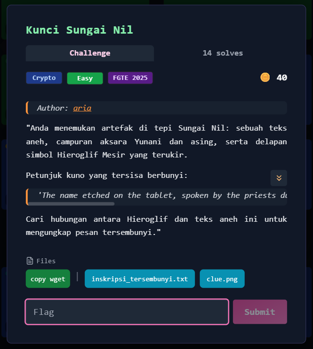
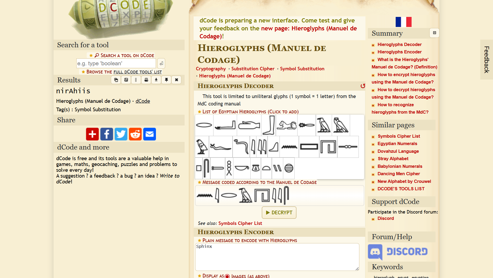
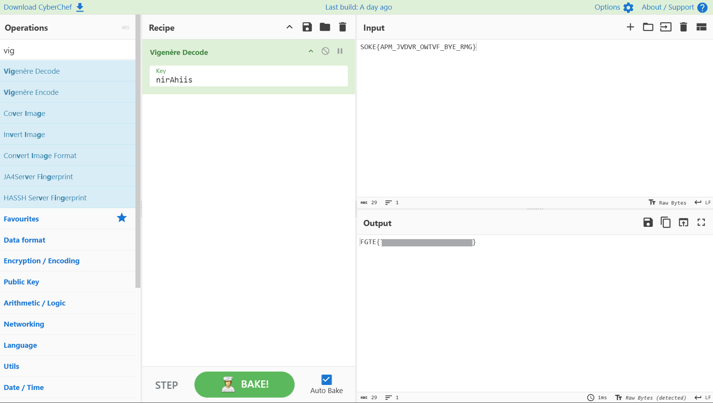

# Kunci Sungai Nil



## Deskripsi Tantangan

Diberikan dua file:

* `clue.png`
* `inskripsi_tersembunyi.txt`

Deskripsi menyebutkan bahwa artefak berisi campuran aksara Yunani dan simbol Hieroglif Mesir, serta sebuah petunjuk:

> "The name etched on the tablet, spoken by the priests during the inundation, unlocks the cryptic symbols. This name must be continuously repeated over the coded message."

Tujuan: menemukan pesan tersembunyi dengan menghubungkan hieroglif dan teks terenkripsi.

---

## 1. Ekstraksi Key dari Hieroglif

File `clue.png` berisi simbol Hieroglif dalam format Manuel de Codage.

Simbol tersebut didekodekan menggunakan alat seperti dcode.fr dan menghasilkan string:

```
nirAhiis
```
  


Petunjuk menyatakan bahwa nama tersebut harus “continuously repeated over the coded message”, yang secara kriptografi merujuk pada cipher dengan kunci berulang, yaitu **Vigenère cipher**.

Dengan demikian, `nirAhiis` diidentifikasi sebagai kunci enkripsi.

---

## 2. Analisis Ciphertext

Isi file `inskripsi_tersembunyi.txt`:

```
zqPOn86azpV7zpHOoM6cX0pWRFZSX86fV1RWRl/OklnOlV/Ooc6czpN9
```

Struktur karakter (`A–Z`, `a–z`, `0–9`, `+`, `/`) menunjukkan bahwa string tersebut merupakan **Base64**.

---

## 3. Decoding Base64

Setelah dilakukan decoding Base64, diperoleh:

```
ΣΟΚΕ{ΑΠΜ_JVDVR_ΟWTVF_ΒYΕ_ΡΜΓ}
```

Hasil ini menunjukkan campuran huruf Yunani dan Latin.

---

## 4. Transliteration Greek ke Latin

Huruf Yunani yang muncul ditransliterasikan ke alfabet Latin:

* Σ → S
* Ο → O
* Κ → K
* Ε → E
* Α → A
* Π → P
* Μ → M
* Β → B
* Ρ → R
* Γ → G

Sehingga teks menjadi:

```
SOKE{APM_JVDVR_OWTVF_BYE_RMG}
```

Struktur ini menyerupai format flag CTF, namun masih dalam bentuk terenkripsi.

---

## 5. Dekripsi dengan Vigenère Cipher

Menggunakan key:

```
nirAhiis
```

Dilakukan dekripsi Vigenère terhadap teks:

```
SOKE{APM_JVDVR_OWTVF_BYE_RMG}
```

Hasil dekripsi:



---

## Flag

```
FGTE{Redacted}
```
