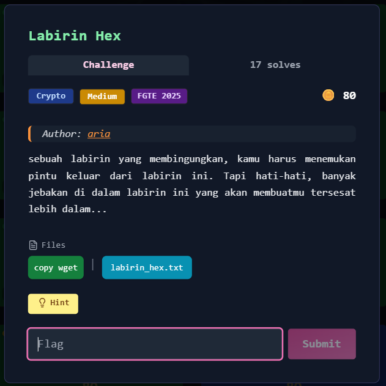
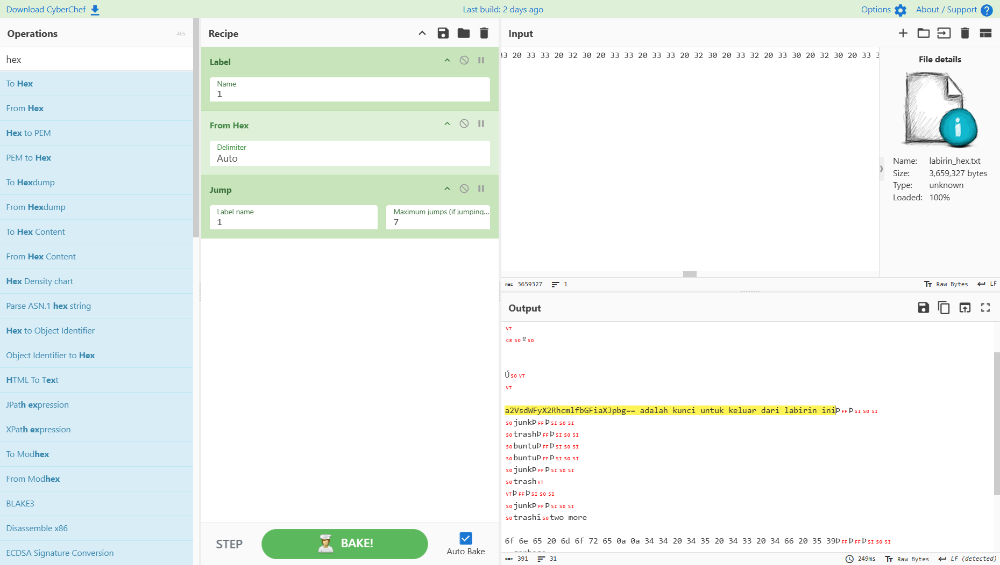
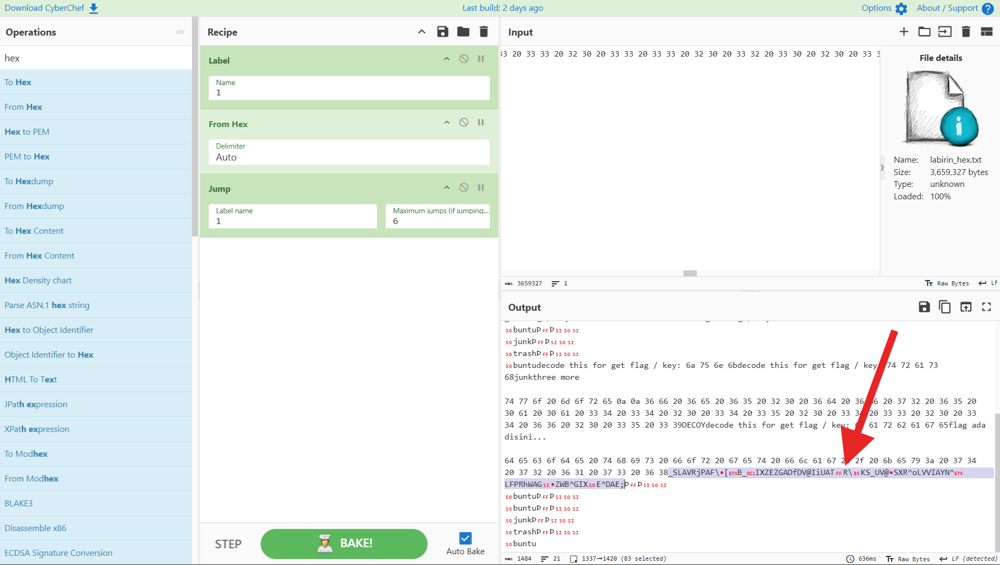
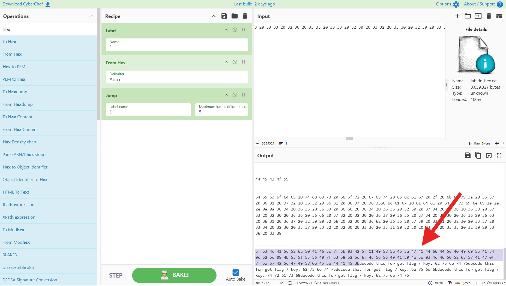
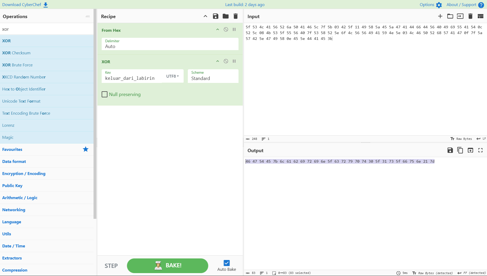
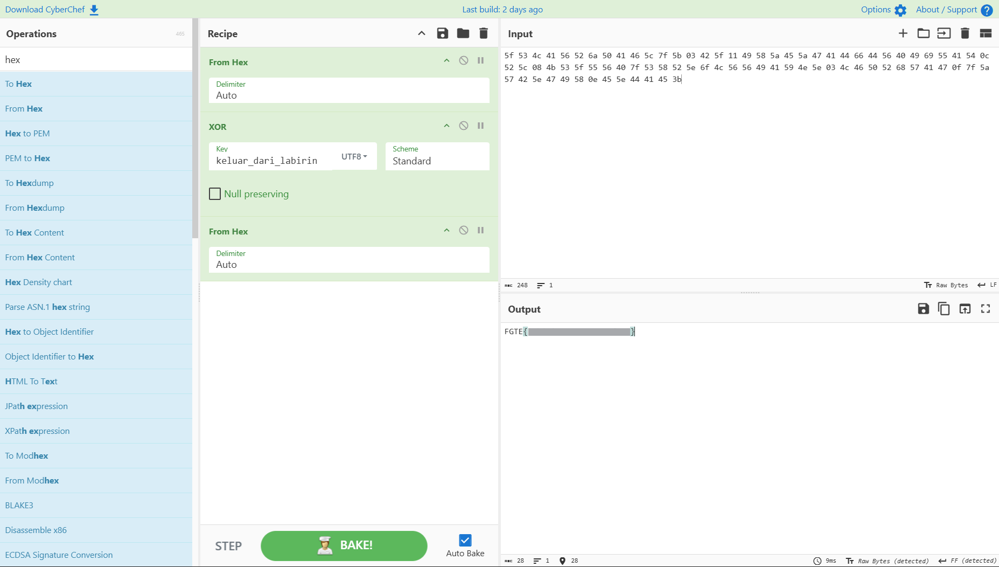

# Labirin Hex



---

## Deskripsi Challenge

Diberikan sebuah file `labirin_hex.txt` yang berisi rangkaian string **hexadecimal** panjang dengan banyak lapisan encoding.

Tujuan dari challenge ini adalah menemukan sebuah **key** , yang nantinya digunakan sebagai kunci **XOR** untuk memperoleh flag.

---

## Analisis dan Penyelesaian

### 1. Dekode Hex Berlapis

Langkah pertama adalah mencoba mendekode isi file dari format hex.

Setelah melakukan **decode hex sebanyak 7 kali** menggunakan CyberChef, diperoleh hasil:



```
a2VsdWFyX2RhcmlfbGFiaXJpbg== adalah kunci untuk keluar dari labirin ini
```

Bagian yang menarik adalah string:

```
a2VsdWFyX2RhcmlfbGFiaXJpbg==
```

String tersebut jelas merupakan **Base64**.

---

### 2. Decode Base64

Melakukan decode Base64 menghasilkan:

```
keluar_dari_labirin
```

Berdasarkan kalimat sebelumnya:

> “... adalah kunci untuk keluar dari labirin ini”

Dapat disimpulkan bahwa:

```
keluar_dari_labirin
```

adalah **key XOR** yang harus digunakan.

---

### 3. Mencari Ciphertext yang Relevan

Ketika jumlah decode hex dikurangi menjadi **6 kali**, muncul string aneh yang terlihat mencurigakan:



```
_SLAVRjPAF\[B_IXZEZGADfDV@IiUATR\KS_UV@SXR^oLVVIAYN^LFPRhWAGZWB^GIXE^DAE;
```

String tersebut mengandung banyak karakter non-printable dan simbol aneh, yang biasanya merupakan indikasi hasil XOR dengan key yang belum diketahui.

Jika ditelusuri lebih lanjut (dengan 5 kali decode hex), ditemukan bahwa string tersebut berasal dari representasi hex berikut:



```
5f 53 4c 41 56 52 6a 50 41 46 5c 7f 5b 03 42 5f 11 49 58 5a 45 5a 47 41 44 66 44 56 40 49 69 55 41 54 0c 52 5c 08 4b 53 5f 55 56 40 7f 53 58 52 5e 6f 4c 56 56 49 41 59 4e 5e 03 4c 46 50 52 68 57 41 47 0f 7f 5a 57 42 5e 47 49 58 0e 45 5e 44 41 45 3b
```

Ini sangat kuat indikasinya sebagai **ciphertext XOR**.

---

### 4. Melakukan XOR dengan Key

Key yang telah ditemukan sebelumnya:

```
keluar_dari_labirin
```

Kemudian dilakukan XOR antara ciphertext dan key tersebut.

Hasil XOR menghasilkan representasi hex berikut:



```
46 47 54 45 7b 6c 61 62 69 72 69 6e 5f 63 72 79 70 74 30 5f 31 73 5f 66 75 6e 21 7d
```

---

### 5. Decode Hex ke ASCII

Melakukan decode hex terakhir menghasilkan:



---

## Flag

```
FGTE{Redacted}
```
