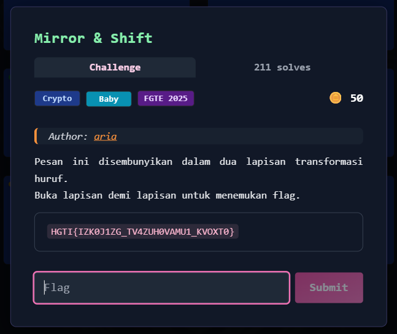
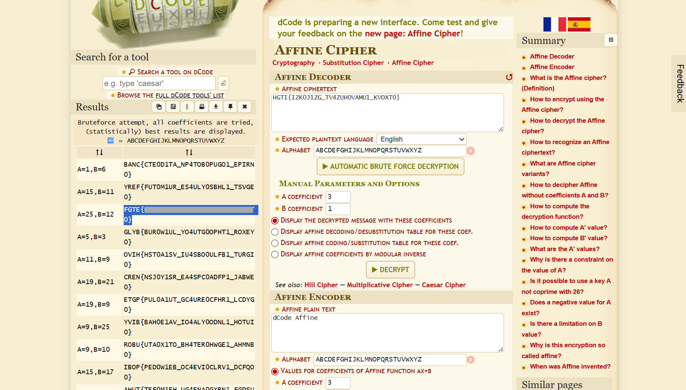

# Mirror & Shift



## Deskripsi Challenge

Challenge memberikan sebuah ciphertext:

```
HGTI{IZK0J1ZG_TV4ZUH0VAMU1_KVOXT0}
```

Hint menyebutkan pesan disembunyikan dalam **dua lapisan transformasi huruf**.  
Targetnya adalah menemukan flag dengan format `FGTE{...}`.

---

## Langkah Penyelesaian

### 1. Identifikasi Jenis Cipher

Langkah pertama adalah mencoba mengidentifikasi cipher yang digunakan.

Ciphertext dimasukkan ke fitur **Cipher Identifier** pada `dcode.fr`.  
Dari hasil identifikasi, cipher dengan probabilitas tertinggi adalah:

- **Affine Cipher**

---

### 2. Dekripsi Menggunakan Affine Cipher (Bruteforce)

Setelah memilih menu **Affine Cipher** di dcode, ciphertext dimasukkan lalu dilakukan dekripsi dengan fitur:

- **Decrypt (Bruteforce)**

Dari hasil bruteforce, ditemukan kombinasi parameter yang menghasilkan plaintext valid:

- `A = 25`
- `B = 12`



---

## Flag

```
FGTE{Redacted}
```
