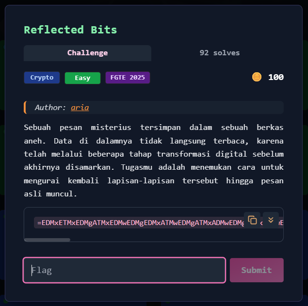
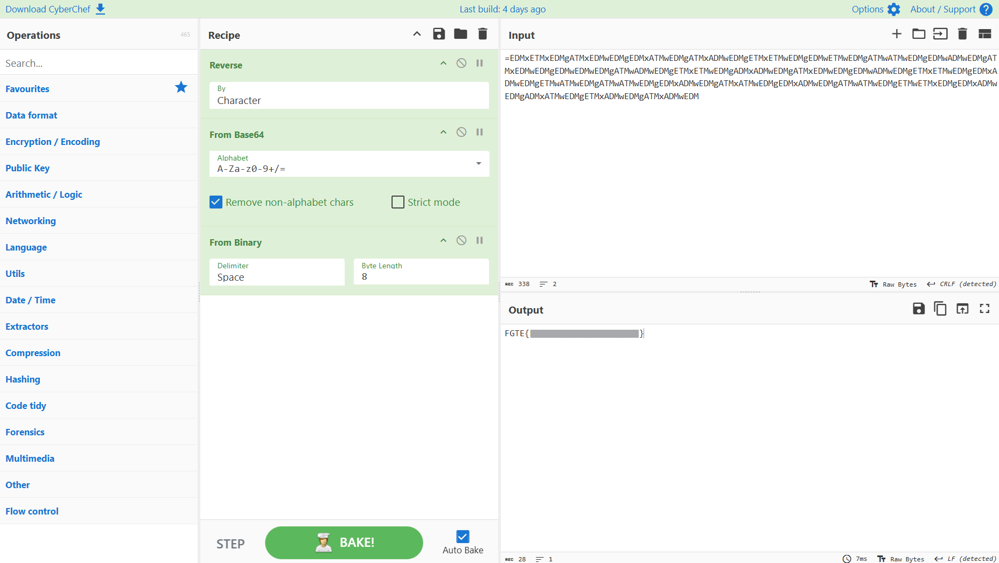

# Reverse & Binary (Cryptography) — Writeup



---

## Deskripsi Challenge

Challenge memberikan sebuah ciphertext yang terlihat seperti hasil encoding, namun formatnya tidak valid karena karakter padding `=` berada di **awal** string.

Hal ini mengindikasikan bahwa data kemungkinan besar telah **dibalik (reverse)**.

Ciphertext:

```
=EDMxETMxEDMgATMxEDMwEDMgEDMxATMwEDMgATMxADMwEDMgETMxETMwEDMgEDMwETMwEDMgATMwATMwEDMgEDMwADMwEDMgATMxEDMwEDMgEDMwEDMwEDMgATMwADMwEDMgETMxETMwEDMgADMxADMwEDMgATMxEDMwEDMgEDMwADMwEDMgETMxETMwEDMgEDMxADMwEDMgETMwATMwEDMgATMwATMwEDMgEDMxADMwEDMgATMxATMwEDMgEDMxADMwEDMgATMwATMwEDMgETMwETMxEDMgEDMxADMwEDMgADMxATMwEDMgETMxADMwEDMgATMxADMwEDM
```

---

## Langkah Penyelesaian

### 1. Reverse Ciphertext

Karena Base64 normal selalu meletakkan `=` di bagian akhir, maka langkah pertama adalah membalik string terlebih dahulu.

Di CyberChef:
- **Reverse** (By Character)

Setelah direverse, formatnya menjadi Base64 yang valid.

---

### 2. Decode Base64

Setelah urutan benar, langkah berikutnya adalah membuka lapisan pertama:

- **From Base64**

Hasilnya berupa kumpulan angka biner yang dipisahkan spasi.

---

### 3. Decode Binary ke ASCII

Karena output berbentuk biner, langkah terakhir adalah:

- **From Binary**
  - Delimiter: `Space`
  - Byte length: `8`

Hasil akhirnya adalah plaintext flag.  
  


---

## Flag

```
FGTE{Redacted}
```
