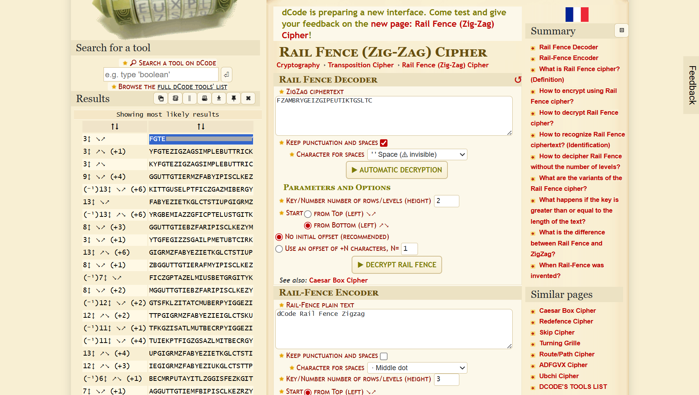

# ZigZag


## Deskripsi Challenge

Challenge memberikan sebuah ciphertext:

```
FZAMBRYGEIZGIPEUTIKTGSLTC
```

Judul soal adalah **ZigZag**, dan format flag diminta:

```
FGTE{WORD_WORD_WORD_WORD}
```

---

## Langkah Penyelesaian

### 1. Identifikasi Cipher

Dari judul challenge **ZigZag**, metode yang paling umum digunakan adalah:

- **Rail Fence Cipher** (Zig-Zag Cipher)

Rail Fence bekerja dengan cara menulis plaintext secara zig-zag ke beberapa baris (rail), lalu membaca per baris untuk membentuk ciphertext.

---

### 2. Dekripsi Rail Fence

Ciphertext didekripsi menggunakan tool Rail Fence di:

- https://www.dcode.fr/rail-fence-cipher

Setelah mencoba beberapa jumlah rail, ditemukan plaintext yang valid:  
  
  

---

### 3. Menyesuaikan Format Flag

Plaintext sudah mengandung kata-kata yang sesuai, hanya perlu disusun ke format flag `FGTE{...}` dengan separator `_`.

---

## Flag

```
FGTE{Redacted}
```
