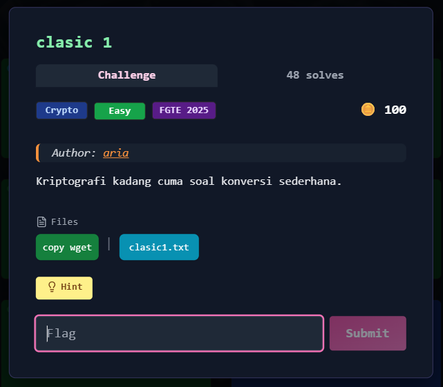
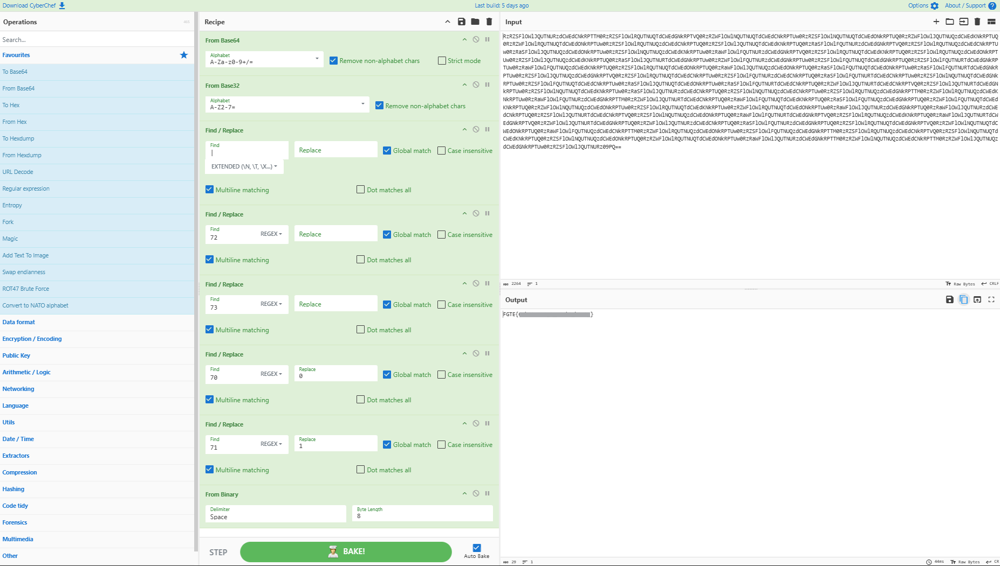

# clasic 1



---

## Deskripsi Challenge

Diberikan sebuah ciphertext panjang yang terlihat seperti Base64.
Di dalam soal juga diberikan hint penting:

* `70 -> 0`
* `71 -> 1`

Artinya pada lapisan akhir nanti kita akan berurusan dengan data biner yang disamarkan dalam bentuk angka ASCII.

---

## Langkah Penyelesaian

### 1. Decode Base64

Pertama kita decode ciphertext dari Base64.

```bash
cat clasic1.txt | base64 -d
```

Outputnya masih terlihat seperti teks acak, namun bentuknya sudah berubah dan ada pola karakter yang mirip Base32.

---

### 2. Decode Base32

Karena hasil Base64 terlihat seperti alfabet Base32, kita lanjut decode Base32.

```bash
cat clasic1.txt | base64 -d | base32 -d
```

Hasilnya menjadi deretan angka seperti berikut:

```
70|71|73|70|73|70|.. .
```

---

### 3. Ambil hanya nilai 70 dan 71

Dari hint, hanya angka 70 dan 71 yang penting:

* `70` merepresentasikan bit `0`
* `71` merepresentasikan bit `1`

Sedangkan angka lain seperti `72` dan `73` hanya noise (pengganggu).

Jadi langkahnya:

1. Hapus semua karakter `|`
2. Buang semua angka `72` dan `73`
3. Ganti:

   * `70` → `0`
   * `71` → `1`

---

### 4. Decode hasil biner menjadi plaintext

Setelah berubah menjadi deretan bit `0` dan `1`, kita decode sebagai biner (8-bit per byte).

Di CyberChef bisa memakai langkah:

* **Find/Replace** untuk mapping angka → bit
* **From Binary** (byte length 8)

Setelah didecode, muncul flag.  
  
  

---

## Flag

```
FGTE{Redacted}
```
