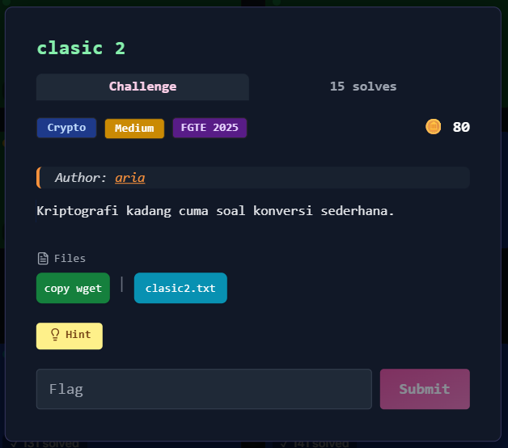
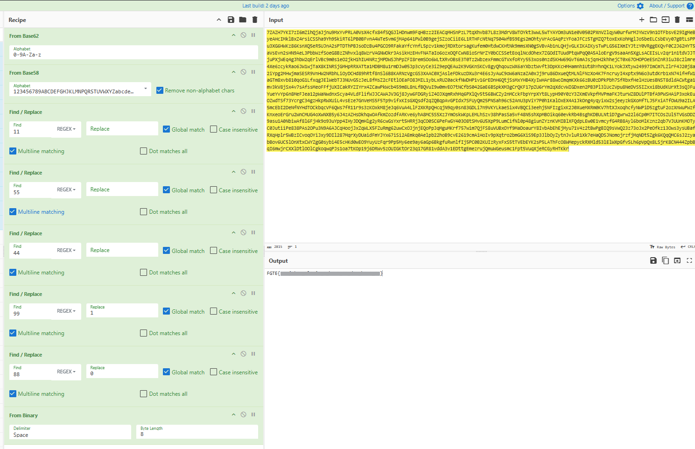

# Classic 2



## Deskripsi Challenge

Diberikan sebuah file `classic2.txt`. Ketika ditampilkan menggunakan `cat`, isinya berupa string panjang yang terlihat seperti **Base62 encoded text**.

```
7ZAZH7YKI7zI6mZihQjaJjnu9MxYvPRLA0VsX4cfx84fSQGJlHDnwm9FqHBzz2IEACqMHSnPzL7tqXhvb87L8z3MdrV8WTOYkt3wwL5wTYAYOm3uN1e0V0502PXnVZlqyW0urfwrMJYWzV9n1OTFbsvE29IgMeByeAHcIMklBxZ4rsiCSSha9Yh95kiRT6lPB0BFvnA4WTe5vm6jMAp641PWl0B9gejSZzoCiiE6L1RTHFcNtNq7504WfB59Egs2mOhtyVrAcGAqPzYFoaJFCz5TgMZQ7toxExKohMglJo5beELCsbEVy07gBtLsPPu3XG6HWKz86KsnXQ5eR5UJnA2sPTDThPBJsoDzBu4PGCO9RFakaYfcYnfL5pzv1kmojRDXtorsagKufem0HtdwCKHtNk9mmsXN0gSVBvAb1nLQHjvGLKIKAIKysTwPLG56IXmIYJtzY0VRggEKQvF0C2J62HYT5aVsEvn2sHN9AeL3PbbWzfSoeG8BzZNhvxlq8WzrVAGNWOkr3AsikHzEHvFNATaIo6ozxOQFCwN8ioSrNrZY0bCCSSetEoqlNcdOhex7ZGOdITUudPtqWPqQ0A5AloErgV9saaAn5XgLsACEIsLv2qr1n1tdVJJTjuPXjWEq4gJhbW2qErlVBc9m0s1eO2jkH1hIU4NRzjMPDWSJhPpZFI8remSOo6WLtXRvOBsE3T0Tz2WbzexFmmcGTVxfoRYy553xos0nzdSKHW69GvT6mAJsjqnH2khhejCT0x67OHOPOeESnZnR3iuJ8c2lmre4Xe6zcykRao6JW1wjTaX8KINRSjGMHpRRXATta1MDBM8u1rmDJw05Jp3cVyCe3iZ9epQEAu2K9VGKnSKCv8gyQhqouzWX6aYXbztWvft3DpKKcHMHamnh1Ut8hYhnQK1LYokJXtyw24997ImCm7LZlrF4J20j8a2iYpg2MHwjmaSESR9VnHW2NRbhLiOyDCHd89hRtf8nSl6B8KARNzVgcGS3XAAC0XjAsleFDkuzDXu3r4E6sJyAuC9oW6aNzaZA0xJj9ru86DxueQtMLNlFNzXo4K7FncruyI4xptx9N6o3utdKrb1xN74ifHfW1aGTm8xvb810qoG1LfxqgJElWebTJ3NUvG5zJeL8fMsZ2cFEtlOEaFO8JMIL1ybLxRUZ0ackfNWDHP1v16rEDnH6QtjSsMxYHB4XyIwHAr88woImqmKXk66zBU0zDPkPbh7SfRbxfHelHzUesBNST8dldACWtga1mv3kV8jSx4v7sAfssMeoFFfjUXICakRYZIYrx4ZCawPkWcb459m8L8nLfBQVuI9w0mvEO7tNCfbS042GaE6BSpkXM3gCrQKF17pZU6rYm2qXdcvWIGDxen2PB3Pl3lUcZVpu8NeDVS5IZxxi8bUdKUrXt3sQJFuYueYvYp6n8MeFJea12pWaNwdnxScya4VLdFlifWJJCAWAJV3Gj8Jyw6FDGRyiZ4OJXqmRxhMq6PXlQv5t56BWCZy2nMCckFbpYrpXYt8LypH90Y0zY3ZKmEVkpfMVPmaFKJturWZ8DUlPTBfA9PWSHAiP3xokEuOZwdTSf73YcrgC34gzHkpRWXUiL4vsEze7GnVeMS5F5Tp9vifxKIsGXQsdf2qZQBqpAvGPIdx7SFUyQm25PNSah96c52AnU3pViY7P0h1KalOxEX4A1JkOng4yqyixW2sjeeyzkGXoMfTLJ5FxiATfOWU9a2ILA5mcEbI2DeNfNYHdTOCkbqcVF6QWs7fR11r9s3zKOxkM8jeJq6VuA4LlF2XKRpQHcqjN9qy0sn83GDLi7n9VKYLkaeSix4VBQCi3eehj5NFIzgixK2J0XueMXRm0KV7htXJxoqhcfyNWPiD5zgtuF2ozXnWuPWzfKnxeoErGru2WnCMUG4oXwNXB5y6J4zAZHsDkhqwOAfkmZozdfARKve6yhA8MC5S5XzJYmOskWKpLEMLhSzv38hPasSa5vF48N5shXpMBOikq60evkRb4BsghKDBULNtiD7gwrw22l6Cp0M7ITCOsZUl5TVGsDDZ9asu1A0NbiwAf8l6FjHk9o93uYpp4IHyJDQmHlg2yR6cwGsYxrt5HRRj3qCO0SC6PeFwGY403O8tSMv6U5XpP9LumCifNl0p48giunZYznKVMIBlXFQdpLEw0E1vmcyfG4RB8Ayl6boMlKznz2qb7VJUUnKMOTyC0JutiiPe838PAs2OPu3N9A6AJCqHoojJxZqWLX5FZuRmg62uwCxOJjnjEQoPpJqMguMKrf757wim7QjFS8uVUBxOYf9MaDoaurY8IvbAbEhEjMyu71V4z2tBwPgBIQ9sVwQ23z73oJx2PeOfkz13Ows3ysUBafRXqHplr5WBzICvoqOYiJxy9DIl287MqrXyDUaidFmYJYx67iSi2AEmkq0Aelpb22hoB9cvE2619cmAiHoIv9pXqtro2bmG6XiS9Ep3JlbOyZytnJvluR1Xk7eHaQDSJNomojrzfjMqNDt5Zgk6KQqQMC6sJ2zyabBov6UC5lOnXtxCWYZgG0sybi4E5cHKd0wEO9YuyUzFqr9Pp5My6ee9ay6aGp6BkgfuRwnlfIj5PC0B2KUIzRyxFxS5tTVEbEYK2sP5LAThFcO8WMepyckRXMld53lElWXpGfvSLh6pVpQx8LSjrK8CN444ZpbBqI6mwjrCXXlDtlOOlCgkoqwqPJs1oa7tKOp19j6DRWv5zOUIGKtOr23q17GR81vddA3v1EDttgEmezrujQmuWGeusmc1Fpt5VuqXjeRCGyRHTKkr
```

---

## Step 1 — Decode Base62

Karakter yang digunakan sesuai dengan charset **Base62** (`0-9A-Za-z`), sehingga langkah pertama adalah melakukan decoding Base62.

Menggunakan **CyberChef**:

```
From Base62 (0-9A-Za-z)
```

Hasil decoding menghasilkan string baru yang masih terenkripsi, kali ini terlihat menggunakan karakter khas **Base58**.

```
ACHotys4aspPEzrfe82p4QueN7pHhXC44Wyv13bppAJA6UeACyizNzEtZYv8gvWVLCFgr6hg6tQvA464goh4f2DB45Ghq1kxKrCmvndw7h9jomezPS8fhABa3981eLou2pFUYHMuxsYwStNdwaHYLdPxE9qEajiqjdMUjVXaNZLdJrsdsMzv95mUE7PSLo9gu7t8d2sWV9UMczCchA8zfHJYxCAcaZ5pCeop5KDcn55UsmAU9gGed2F5tgoCY59sSagg3mp4scyfYsZsuJhtFdisc4NPjd274mAQNJDgwjcEYewTzvsFAFHjtZ12ymxJSBPjMBGhbzXesbNf31fd4uje25CR8fGsQ5XV88qBa2QYZcUD43X3ikZqeJwbUSxageFnwbGEDQK3Zr8uXCoHgRaCcFcHM8HxzPWe7ECYB6HQYN9c1FyE6Lr3kPv6b2KvSw8bjxB3XNcTA5cksRpwKLgAbDkCrvA5os7FX32mRuYVVm8UF28ALVwzz8jTRJefsnLjoNAjwAwuBwTuPt9EYyBWpW61rLxYxkbPZ4NvWiQReS8G3t8Hr6e6BykDgQF2hpEg1fHFs9Pjdp1NLzYRwoj5dC9LWTg51gSfKFKwmtxEtFvYPeyvSZYkCTLdenty73uGnNFsTAu6JD2MMwGZKJRfwdPrWaDsbxRLNdTWFcNkKoMVNExQy3SJjR9rYeBBDTafPUbh99mmPXkJBG9tyBbeu9q9S5efjdbGP6rmTGrthpiZnikqS6WmKRrNiYhgAhgF1aJLUPWMd2Ftdu6EaK1TgWEoc275Mcc9U4xnWAHD8knSpEU3vff2orpG6ngqniomZZdXWJyvwMRVJKgf7SFfHL4hRE9N8vhjCqHtaREZqVT6rToLnFek2pQoS9MT6ZvZH3eJNeJiTwEYSeettJUtPsSefnUwd2MtGTooU4PRvK4vamPL3GiPPJoXBT8z6R8bZrkkKeoKuNe8KMQYL4tBU7wUMWPswHz2xXKjcExfzYpTvBeKh9W4PwCkttheqAtRKTxUz9hjheLbJCeg2C1wKv5CesYqNqHKv5erpfb5r6UAFKKBcSCnu7PwhX53hYS5mw1KRSdhvDtDsEdXHkRDtjQkBC64HbUskEaxGLEDDsY4F2XuKcrZUr8LDjYc5cced242tnm7ArbVLFbqq4BMiaQ8PU8eeBvwLdi7P7apdNq88k7dGLtmNnj7qMjfNN4oFyzg2p85mhHbcn9zRDxDxZ2JoNtVAy8JSt9VpLdfuWgPrHi6k9nvtcJXeMZgD8Ax4pX3MnyWEq6oYbMgc2uHeNNbSSX6Ys1QkefB2vWGRQCYEkUisKaWLAGGyzbapSW4KWR4XkaZa5ndNqLJGXiMYVmaQFh2GPs1MQdJF7QntxKindoohM9GHzwoAK1Ef8wjtq6aTQM5f74ZjDukMBdiHim3cJhQfgMkVTaeR58SxwEqHojMb4q7gcBMH85ZLtywGZrZ8rs4dTjjQUcWm5yMmhJ4sqeGTF7Bk4esyVGgLVCzNkAu3PsTXDpji948UJ6FXmMQooNtr3WFJjdeCCSCD4yP7bPjvSqDzq3FjdW7g2DqA5XmqhtgL8oFAWZYBprHLr451gQjpiW3rn9CoXJinU91Y5PVVFfCUX45iYFD2UxAxYmNFwgk9TsRJosBSnNHTWL2TcZa6o11VTGqJxDUySqXBBuyd4Bf4yYpXttv9Zhu7VMwGuhgzmFQgsNnMDe1oS3zvKo1smyNbm4QS8NzuwGc5MLVhAKb3u43ovDpKsi1GffRGNLH8LmBnxdB64hW928b1AY3PBvxxaSTeqqWoaiSmQ9cN9eyR6Q2aiqrPdy8bj4iL5deceunaxWD7CpP41DZW2winLeoQg5RjfHAVoYdvK8m2UJj9LN73EsnSTCGHpFhGEVFo6QhWBaPmBH9Q6mBAXwg87UJJ7swbWsWvzKRzc9JxzwYZZNjjhVTJ5Ei5uqZEd9q7QbTKBYYHToFxZiTPy4gru62Ln2PcCHbc7PBtw47jcyCcRmnt8c2oaUDZjnXJP6Vr78FWGfY7RkyFyez6YBpDpzTGBSFpdm4dYmWftnsr1hrmiaXSThLrdq
```

---

## Step 2 — Decode Base58

Karena output hanya mengandung karakter Base58 (tanpa `0`, `O`, `I`, `l` ambigu), maka dilakukan decoding kembali:

```
From Base58
```

Hasilnya bukan teks ASCII, melainkan deretan angka panjang:

```
8811991188118811881199119911881188119911881188118811991199119911881199118811991188119911881144118811881199118811881188119911441188119911881199119911991199118811991199115511881155119911881188119911991155118811881188118811991199118811991188118811881199119911881199119911991188118811991199118811991188114411991188118811991199119911881199118811991188119911991199118811991188118811881188119911991188119911881188118811991199118811991199119911881188119911881144119911991199119911991188119911881188118811881199119911881199119911881199119911881188118811441188119911441199118811991188114411881188119911991199118811551188119911991188119911991188119911881188119911881144119911991188115511881188119911991188119911881199119911991144119911991188114411881199119911551188118811991188118811991188119911991199119911991188119911991188118811881199118811881188114411991199118811991188118811881199119911991188114411881199119911881188119911991188118811991199114411881199118811991199114411991199119911881188119911991188119911881199118811881199119911991188118811881188119911881199119911991199119911441188119911991188118811991188118811441188118811991199118811991188118811441188119911551199118811991199119911881155118811991188115511991199119911991199118811441199114411991188118811881199118811881188119911991188114411991188118811881199119911991188118811991199115511881188119911551199118811551188119911551199114411881199118811991199115511991199119911881188119911991188119911991188118811881199119911441188118811991188114411881199119911991199114411991155118811991144
```

---

## Step 3 — Identifikasi Pola Angka

Angka yang muncul hanya kombinasi tertentu, terutama:

* `88`
* `99`
* `44`
* `55`
* dll.

Terlihat jelas bahwa:

* `88`
* `99`

muncul paling dominan dan kemungkinan merepresentasikan nilai biner.

Dari pengamatan pola, dilakukan mapping berikut:

```
88 = 0
99 = 1
```

Angka lain seperti `44`, `55`, dll diabaikan (noise).

---

## Step 4 — Konversi ke Binary

Setelah mengganti:

* `88 → 0`
* `99 → 1`
* Menghapus angka lainnya

Diperoleh string biner panjang.

```
01000110010001110101010001000101011110110100110000110100011011100110101001110101011101000011010001101110010111110100001101101100001101000111001101101001011000110101111100110010010111110110001000110100011100110011001101011111001101010011100001011111011001000011010001101110010111110110001000110100011100110011001101011111001101100011001001111101
```

---

## Step 5 — Binary to ASCII

Langkah terakhir adalah mengonversi biner ke ASCII menggunakan:

```
From Binary (8-bit)
```

Hasil akhir berupa flag.  
  


---

## Flag

```
FGTE{Redacted}
```
