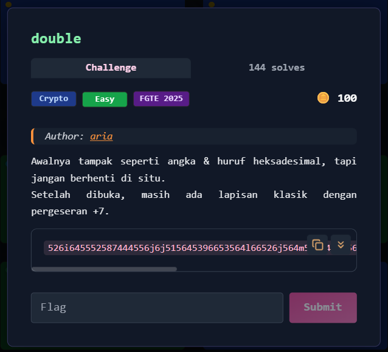

# double



---

## Deskripsi Challenge

Challenge memberikan sebuah ciphertext yang tampak seperti gabungan angka dan huruf, dengan hint:

- “Awalnya tampak seperti angka & huruf heksadesimal…”
- “Setelah dibuka, masih ada lapisan klasik dengan pergeseran +7.”

Dari deskripsi ini dapat disimpulkan bahwa pesan menggunakan **dua lapisan encoding**:

1. Data disamarkan dalam bentuk yang menyerupai **hex**
2. Setelah dibuka, hasilnya masih terenkripsi dengan **Caesar/ROT shift +7**

---

## Langkah Penyelesaian

### 1. Identifikasi Lapisan Pertama (Hex)

Ciphertext:

```
526i645552587444556j6j515645396653564l66526j564m58304h565646394451553566516i566656464h4h5130745h587h49774k6h55774m54493166513k3k0h
```

Sekilas terlihat seperti hex, namun terdapat karakter non-hex seperti:

- `i j k l m h`

Ini mengindikasikan bahwa ciphertext sebenarnya adalah **hex yang sudah digeser** sehingga huruf `a-f` berubah menjadi huruf lain.

---

### 2. Decode Menggunakan CyberChef

Agar proses cepat dan konsisten, decoding dilakukan menggunakan **CyberChef**.

Recipe yang digunakan:

1. `ROT13` (dengan amount negatif untuk menggeser huruf kembali)
2. `From Hex`
3. `From Base64`

Pada challenge ini digunakan konfigurasi:

- ROT13 amount: `-7`
- From Hex: delimiter `Auto`
- From Base64: default alphabet

Hasil akhirnya langsung menghasilkan plaintext flag.  
  


---

## Flag

```
FGTE{Redacted}
```

