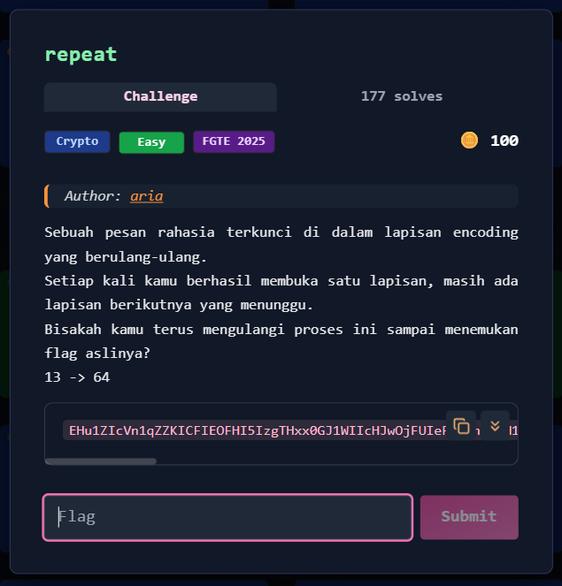
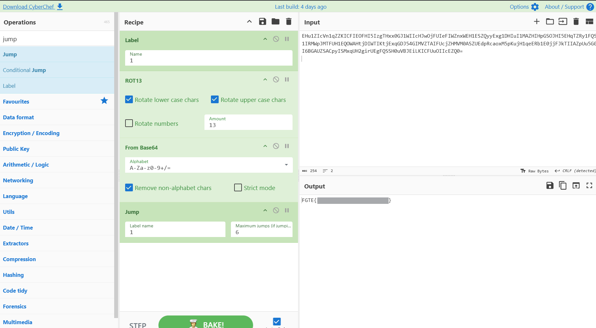

# repeat



---

## Deskripsi Challenge

Challenge memberikan sebuah ciphertext panjang, dengan hint:

- `13 -> 64`

Deskripsi soal juga menjelaskan bahwa pesan disembunyikan dalam **lapisan encoding berulang**, sehingga setelah satu lapisan dibuka, masih ada lapisan berikutnya.

Dari hint tersebut dapat disimpulkan bahwa setiap lapisan menggunakan kombinasi:

- **ROT13**
- **Base64**

yang harus diulang terus sampai plaintext final muncul.

---

## Langkah Penyelesaian

### 1. Identifikasi Pola Transformasi

Ciphertext yang diberikan masih berbentuk karakter Base64 (`A–Z a–z 0–9 + / =`), namun hasil akhirnya belum bisa langsung terbaca.

Hint `13 -> 64` mengarah ke urutan proses:

1. ROT13 (`13`)
2. Base64 decode (`64`)

Karena lapisan dilakukan berulang, maka pipeline ini harus diulang beberapa kali sampai hasilnya sudah tidak lagi berbentuk Base64.

---

### 2. Dekripsi Menggunakan CyberChef (Recursive)

Cara termudah untuk melakukan decode berulang adalah memakai **CyberChef** , karena menyediakan fitur *Jump* untuk mengulang recipe.

Recipe yang digunakan:

1. `Label` (sebagai target jump)
2. `ROT13`
3. `From Base64`
4. `Jump` (kembali ke label untuk mengulang)

Dengan konfigurasi:

- ROT13: `Amount = 13`
- From Base64: default alphabet, non-alphabet chars dihapus
- Jump: `Maximum jumps` dinaikkan agar proses bisa berulang beberapa kali

---

### 3. Menjalankan Decode Berulang

Setelah recipe dijalankan, output berubah lapis demi lapis hingga akhirnya menghasilkan string yang sudah sesuai format flag.  
  


---

## Flag

```
FGTE{Redacted}
```
