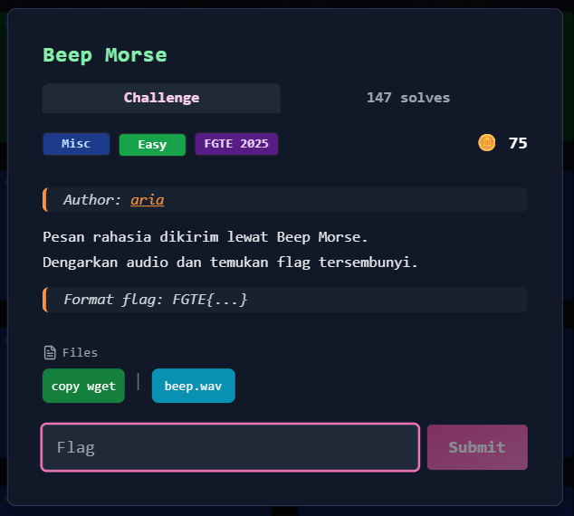

# Writeup — FGTE CTF: Beep Morse (Miscellaneous)



---

## Deskripsi Challenge
Challenge ini memberikan sebuah file audio bernama `beep.wav`. Berdasarkan deskripsi, audio tersebut merupakan **kode morse**, sehingga tugas utama adalah mendekode sinyal morse untuk memperoleh flag.

---

## Langkah Penyelesaian

### 1. Decode Audio Morse
Langkah pertama adalah mendekode isi dari file `beep.wav` menggunakan decoder morse berbasis web di `morsefm.com`.

Setelah audio diproses, didapatkan hasil decoding berupa teks:

```

FOXTROT GOLF TANGO ECHO OPENBRACE PAPA UNIFORM LIMA THEN SIERRA ECHO CLOSEBRACE

```

---

### 2. Identifikasi Encoding Lanjutan (NATO Phonetic Alphabet)
Hasil tersebut bukan flag langsung, melainkan menggunakan format **NATO Phonetic Alphabet**.

Untuk mendekodenya, diambil **huruf pertama** dari setiap kata:

- FOXTROT → F  
- GOLF → G  
- TANGO → T  
- ECHO → E  
- PAPA → P  
- UNIFORM → U  
- LIMA → L  
- SIERRA → S  
- ECHO → E  

Selain itu:
- `OPENBRACE` merepresentasikan `{`
- `CLOSEBRACE` merepresentasikan `}`
- `THEN` digunakan sebagai pemisah antar bagian

---

### 3. Rekonstruksi Flag
Dengan menyusun hasil decoding, diperoleh:

```

FGTE{REDACTED}

```

---

## Flag

```
FGTE{REDACTED}
```
