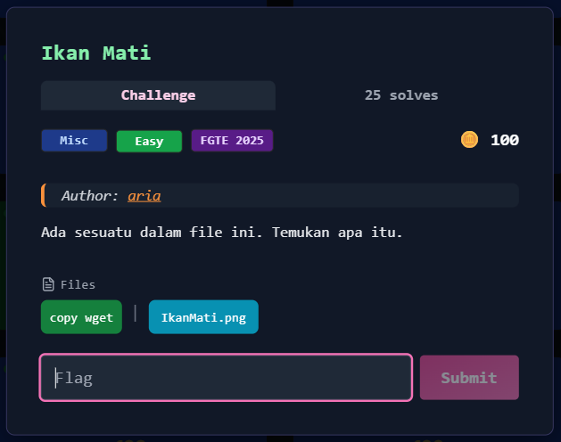

# Brain Dead



## Deskripsi Challenge
File `brain_dead.bf` berisi teks aneh yang hanya terdiri dari karakter:

- `.`
- `?`
- `!`

dan dipisahkan spasi seperti:

```
.?... ..... ..!.? ..... ..!?! ...
```

Format ini terlihat seperti **Ook!** , yaitu variasi dari **Brainfuck**.

---

## Step 1 — Identifikasi Format Ook! (Versi Simbol)
Ook! biasanya ditulis seperti:

- `Ook. Ook?`
- `Ook? Ook!`

Tapi pada challenge ini, formatnya sudah dikompresi menjadi **2 simbol** dari `{'.','?','!'}`.

Contoh:
- `.?`
- `!!`
- `?!`

Setiap **2 simbol** merepresentasikan 1 instruksi Brainfuck.

---

## Step 2 — Mapping Ook! ke Brainfuck
Mapping standar Ook!:

| Ook Pair | Brainfuck |
|----------|-----------|
|   `. ?`  |    `>`    |
|   `? .`  |    `<`    |
|   `. .`  |    `+`    |
|   `! !`  |    `-`    |
|   `! .`  |    `.`    |
|   `. !`  |    `,`    |
|   `! ?`  |    `[`    |
|   `? !`  |    `]`    |

Maka langkahnya:
1. Ambil semua karakter `.?!`
2. Gabungkan jadi stream
3. Potong per 2
4. Convert ke Brainfuck

---

## Step 3 — Jalankan Brainfuck (Stage 1)
Setelah didecode, Brainfuck stage 1 dijalankan.

Outputnya ternyata bukan flag, melainkan string panjang seperti ini:

```
plusplusplusplusplusplusplusplusplusplusspaceleft_bracketspacegreater_thanspaceplusspacegreater_thanspaceplusplusplusspacegreater_thanspaceplusplusplusplusplusplusplusspacegreater_thanspaceplusplusplusplusplusplusplusplusplusplusspaceless_thanless_thanless_thanless_thanspaceminusspaceright_bracketspacegreater_thangreater_thangreater_thanspaceminusminusminusminusminusminusminusminusminusminusminusminusminusminusminusspacedotspaceminusminusminusminusminusminusminusspacedotspaceless_thanspaceplusplusspacedotspacegreater_thanspaceplusplusplusplusplusplusplusspacedotspaceminusminusminusminusminusminusspacedotspaceless_thanspacedotspacegreater_thanspaceplusplusplusplusplusplusplusspacedotspaceminusminusminusminusspacedotspaceless_thanspacedotspacegreater_thanspaceplusplusspacedotspaceplusplusplusspacedotspaceless_thanspacedotspacegreater_thanspaceminusminusminusminusminusminusminusminusspacedotspaceplusspacedotspaceplusspacedotspaceless_thanspacedotspacegreater_thanspaceplusplusplusspacedotdotspaceless_thanspacedotspacegreater_thanspaceplusplusspacedotspaceminusminusminusminusminusminusspacedotspaceless_thanspacedotspacegreater_thanspaceplusplusplusplusspacedotspaceminusspacedotspaceless_thanspacedotspacegreater_thanspaceplusplusspacedotspaceminusminusminusminusspacedotspaceless_thanspacedotspacegreater_thanspaceplusplusplusplusspacedotspaceplusspacedotspaceless_thanspacedotspacegreater_thanspaceplusspacedotspaceminusminusminusminusspacedotspaceless_thanspacedotspacegreater_thanspaceplusplusspacedotspaceminusminusminusminusminusminusspacedotspaceless_thanspacedotspacegreater_thanspaceplusplusplusplusplusplusspacedotspaceplusplusspacedotspaceless_thanspacedotspacegreater_thanspacedotspaceminusminusminusminusspacedotspaceless_thanspacedotspacegreater_thanspaceplusspacedotdotspaceless_thanspacedotspacegreater_thanspaceplusplusspacedotspaceminusminusminusminusminusminusspacedotspaceless_thanspacedotspacegreater_thanspaceplusplusplusplusplusplusspacedotspaceminusminusminusminusminusminusspacedotspaceless_thanspacedotspacegreater_thanspaceplusplusplusplusplusplusspacedotspaceminusminusminusminusminusminusspacedotspaceless_thanspacedotspacegreater_thanspaceminusspacedotspaceplusspacedotspaceplusplusplusspacedotspaceless_thanspacedot
```

Ini adalah **Brainfuck yang ditulis dalam bentuk token**.

---

## Step 4 — Convert Token ke Brainfuck (Stage 2)
Token yang muncul:

- `plus` → `+`
- `minus` → `-`
- `greater_than` → `>`
- `less_than` → `<`
- `dot` → `.`
- `comma` → `,`
- `left_bracket` → `[`
- `right_bracket` → `]`
- `space` → (dibuang)

Masalahnya: token ini **nempel semua tanpa separator**.
Contoh:

```
plusplusplusplusspaceleft_bracketspacegreater_than...
```

Jadi parsing harus dilakukan dengan cara scanning string dari kiri ke kanan,
mencocokkan prefix token-token valid.

---

## Step 5 — Jalankan Brainfuck Stage 2
Setelah token berhasil diubah ke Brainfuck asli, hasil BF stage 2:

```
++++++++++[>+>+++>+++++++>++++++++++<<<<-]>>>---------------.-------.<++.>+++++++.------.<.>+++++++.----.<.>++.+++.<.>--------.+.+.<.>+++..<.>++.------.<.>++++.-.<.>++.----.<.>++++.+.<.>+.----.<.>++.------.<.>++++++.++.<.>.----.<.>+..<.>++.------.<.>++++++.------.<.>++++++.------.<.>-.+.+++.<.
```

Output dari stage 2 adalah angka-angka:

```
70 71 84 69 123 66 82 65 73 78 95 71 79 95 66 82 82 82 125
```

---

## Step 6 — Decode Angka ke ASCII
Angka tersebut adalah **ASCII desimal**.

Contoh:
- 70 = `F`
- 71 = `G`
- 84 = `T`
- 69 = `E`
- 123 = `{`

Jika dikonversi semuanya:

```
FGTE{REDACTED}
```

---

## Flag
```
FGTE{REDACTED}
````

---

## Script Solver (Full Pipeline)
Script berikut melakukan semua tahap:
Ook simbol → BF1 → token → BF2 → angka → ASCII

```python
import re

OOK = {
    (".", "?"): ">", ("?", "."): "<", (".", "."): "+", ("!", "!"): "-",
    ("!", "."): ".", (".", "!"): ",", ("!", "?"): "[", ("?", "!"): "]",
}

TOK = {
    "greater_than": ">", "less_than": "<", "plus": "+", "minus": "-",
    "dot": ".", "comma": ",", "left_bracket": "[", "right_bracket": "]",
    "space": "",
}

TOKS = sorted(TOK, key=len, reverse=True)

def bf_run(code, inp=""):
    tape, ptr, ip, in_i, out = [0]*30000, 0, 0, 0, []
    st, j = [], {}
    for i, c in enumerate(code):
        if c == "[": st.append(i)
        elif c == "]":
            a = st.pop()
            j[i] = a
            j[a] = i
    while ip < len(code):
        c = code[ip]
        if c == ">": ptr += 1
        elif c == "<": ptr -= 1
        elif c == "+": tape[ptr] = (tape[ptr] + 1) & 255
        elif c == "-": tape[ptr] = (tape[ptr] - 1) & 255
        elif c == ".": out.append(chr(tape[ptr]))
        elif c == ",":
            tape[ptr] = ord(inp[in_i]) & 255 if in_i < len(inp) else 0
            in_i += 1
        elif c == "[" and tape[ptr] == 0: ip = j[ip]
        elif c == "]" and tape[ptr] != 0: ip = j[ip]
        ip += 1
    return "".join(out)

def ook_to_bf(s):
    x = re.findall(r"[.?!]", s)
    return "".join(OOK[(x[i], x[i+1])] for i in range(0, len(x), 2))

def tok_to_bf(s):
    s, i, out = s.lower(), 0, []
    while i < len(s):
        for t in TOKS:
            if s.startswith(t, i):
                out.append(TOK[t])
                i += len(t)
                break
        else:
            i += 1
    return "".join(out)

def nums_to_ascii(s):
    nums = list(map(int, re.findall(r"\d+", s)))
    return "".join(map(chr, nums))

if __name__ == "__main__":
    data = open("brain_dead.bf", "r", encoding="utf-8").read()
    stage1 = bf_run(ook_to_bf(data))
    stage2 = bf_run(tok_to_bf(stage1))
    print(nums_to_ascii(stage2))
````

Jalankan:

```bash
python3 decode.py
```
