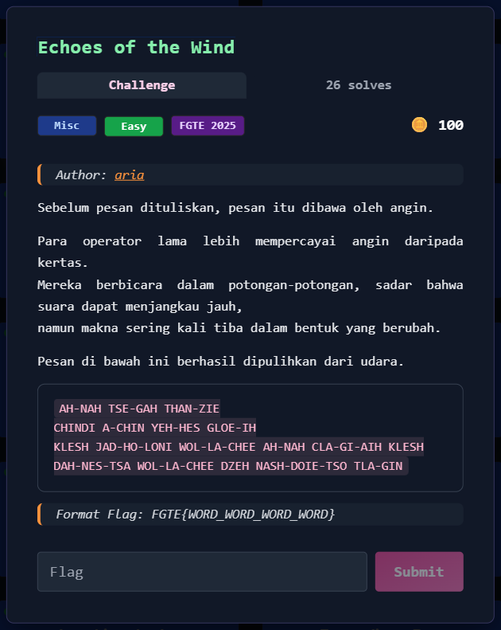
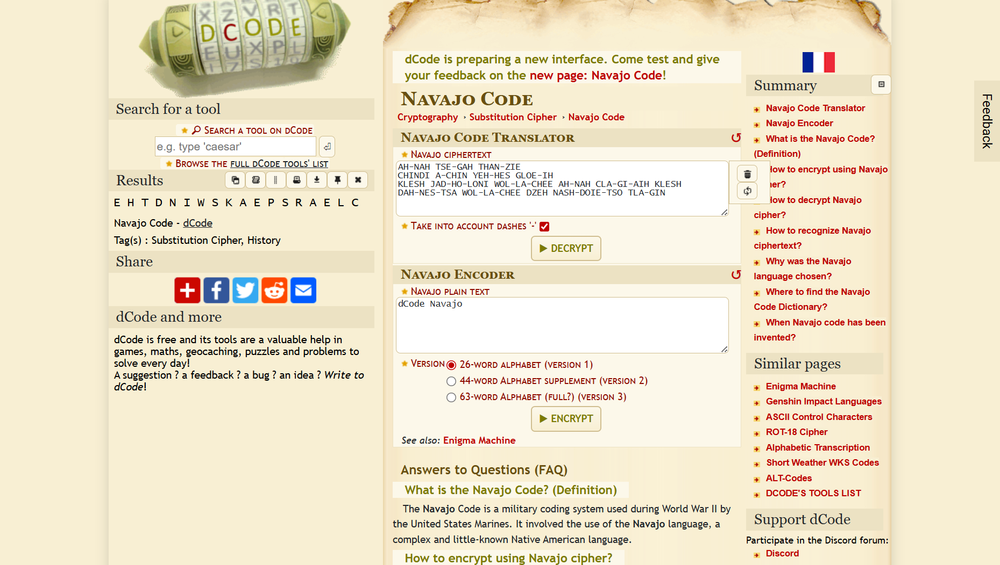

# Echoes of the Wind



---

## Deskripsi Challenge
Diberikan sebuah ciphertext yang ditulis menggunakan **Navajo Code** (kode komunikasi Perang Dunia II).
Tugas kita adalah mendekode pesan tersebut hingga mendapatkan flag.

Format flag:

```
FGTE{WORD_WORD_WORD_WORD}
```

---

## Analisis
Ciphertext yang diberikan:

```
AH-NAH TSE-GAH THAN-ZIE
CHINDI A-CHIN YEH-HES GLOE-IH
KLESH JAD-HO-LONI WOL-LA-CHEE AH-NAH CLA-GI-AIH KLESH
DAH-NES-TSA WOL-LA-CHEE DZEH NASH-DOIE-TSO TLA-GIN
```

Navajo Code biasanya memetakan kata-kata tertentu ke huruf alfabet, angka, atau kata militer.
Karena itu, langkah pertama adalah melakukan decoding menggunakan tabel Navajo Code.

---

## Penyelesaian

### 1. Decode Navajo Code
Ciphertext didecode menggunakan tools online:

- https://www.dcode.fr/navajo-code  
  
  
  
Hasil decoding:

```
E H T D N I W S K A E P S R A E L C
```

Namun plaintext ini masih terlihat acak dan tidak membentuk kalimat.

---

### 2. Analisis Pola (Mirror / Reverse)
Jika huruf-huruf tersebut digabung, didapatkan:

```
EHTDNIWSKAEPSRAELC
```

Ternyata hasilnya merupakan teks yang **dibalik (mirror / reverse)** per kata.
Karena format flag meminta 4 kata, maka susun sesuai bentuk yang masuk akal, dan flag berhasil didapatkan.

---

## Flag

```
FGTE{REDACTED}
```
