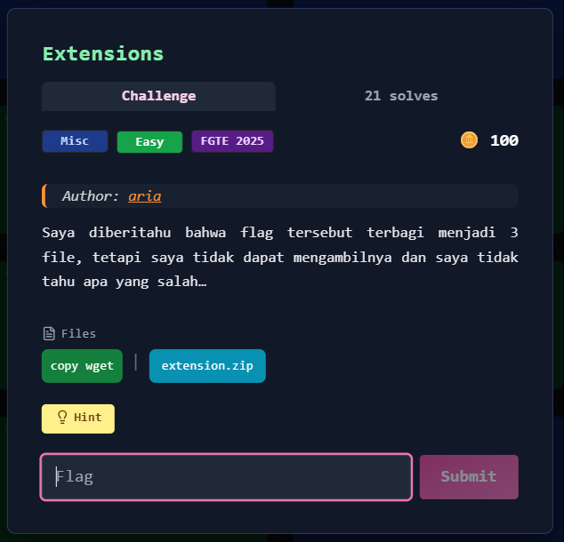
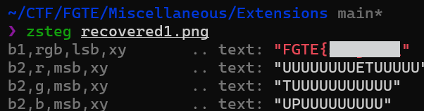
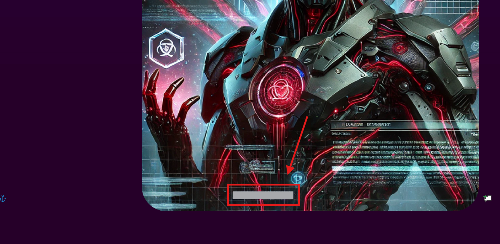

# Extensions



---

## Deskripsi Challenge
Challenge menyediakan sebuah file ZIP berisi beberapa file dengan **ekstensi yang sengaja disamarkan**.  
Tujuan challenge adalah mengidentifikasi format asli dari masing-masing file, memperbaiki ekstensi, lalu mengambil potongan flag yang tersembunyi di dalamnya.

---

## Langkah Penyelesaian

### 1. Ekstrak file ZIP
Pertama, ekstrak arsip yang diberikan:

```bash
unzip extension.zip
````

Hasil ekstraksi:

* `file1.csv`
* `file2.go`
* `file3.sh`

---

### 2. Identifikasi format file dengan `file`

Karena ekstensi terlihat tidak sesuai, lakukan pengecekan signature file:

```bash
file file1.csv file2.go file3.sh
```

Dari output terlihat:

* `file1.csv` sebenarnya adalah **PNG**
* `file2.go` sebenarnya adalah **PDF**
* `file3.sh` sebenarnya adalah **GIF**

---

### 3. Ambil potongan flag dari file pertama (PNG)

Karena file pertama adalah PNG, potongan flag dapat dicari menggunakan `zsteg`:

```bash
zsteg file1.csv
```

Output menunjukkan plaintext pada bit-plane:



---

### 4. Ambil potongan flag dari file kedua (PDF)

File kedua terdeteksi sebagai PDF, sehingga cukup ubah namanya lalu buka:

```bash
mv file2.go file2.pdf
xdg-open file2.pdf
```

Di dalam PDF terdapat barcode yang menyimpan potongan flag kedua:



---

### 5. Ambil potongan flag dari file ketiga (GIF)

File ketiga terdeteksi sebagai GIF, sehingga ubah namanya lalu buka:

```bash
cp file3.sh recovered3.gif
xdg-open recovered3.gif
```

Pada bagian kiri atas GIF terdapat potongan flag terakhir:


---

### 6. Gabungkan semua potongan

Setelah ketiga bagian didapatkan, gabungkan menjadi satu string flag utuh dengan format standar.

---

## Flag

```
FGTE{REDACTED}
```
