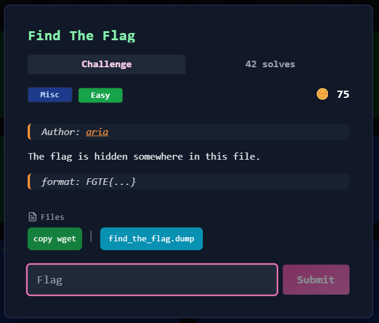

# Find The Flag



---

## Deskripsi Challenge
Challenge ini menyediakan sebuah file bernama `find_the_flag.dump`. Secara tampilan file terlihat seperti teks biasa, namun tidak ditemukan flag dengan pencarian langsung menggunakan `strings` maupun `grep`.

Tujuan challenge adalah menemukan flag yang tersembunyi di dalam file tersebut.

---

## Langkah Penyelesaian

### 1. Pengecekan Awal (Strings dan File Type)

Langkah awal adalah mencoba mencari flag secara langsung:

```bash
strings find_the_flag.dump | grep FGTE
```

Tidak ada output, artinya flag tidak tersimpan dalam bentuk plain text.

Selanjutnya dilakukan pengecekan tipe file:

```bash
file find_the_flag.dump
```

Output:

```
find_the_flag.dump: ASCII text
```

Ini menunjukkan file tampak seperti teks biasa, namun jelas bukan teks normal karena hasilnya tidak terbaca sebagai kalimat.

---

### 2. Analisis Struktur File

Untuk memastikan struktur data, dilakukan pengecekan awal file dengan `xxd`:

```bash
xxd find_the_flag.dump | head
```

Output:

```
00000000: 3159 4346 4748 674e 5862 6d43 5471 397a  1YCFGHgNXbmCTq9z
00000010: 574a 5347 4b50 4171 4243 3832 3246 6247  WJSGKPAqBC822FbG
00000020: 4d43 5363 7672 7070 6731 756c 4653 6974  MCScvrppg1ulFSit
00000030: 4662 7a4b 6e79 322f 7833 6936 3844 596c  FbzKny2/x3i68DYl
00000040: 4e4c 7364 7631 5956 576f 7a61 0a71 374d  NLsdv1YVWoza.q7M
00000050: 6a58 6c6c 3338 6642 6737 7351 532b 5736  jXll38fBg7sQS+W6
00000060: 3559 5557 456c 6f4b 4543 6863 7757 7547  5YUWEloKEChcwWuG
00000070: 3533 4a37 5a39 4b58 7353 4c77 4b39 4552  53J7Z9KXsSLwK9ER
00000080: 4365 6e4a 4c42 7544 5069 4d44 6445 7647  CenJLBuDPiMDdEvG
00000090: 6477 524a 6f62 414e 590a 3470 2b57 3035  dwRJobANY.4p+W05
```

Hasil hex menunjukkan bahwa isi file terdiri dari karakter yang umum pada Base64, seperti:

* Huruf A–Z, a–z
* Angka 0–9
* Simbol `+` dan `/`

Selain itu, isi file terlihat seperti blok panjang tanpa format teks normal, yang mengarah pada indikasi kuat bahwa file merupakan data **Base64 encoded**.

---

### 3. Decode Base64 Menjadi File Biner

Karena file sangat mirip format Base64, langkah berikutnya adalah mendekode seluruh isi file menjadi file biner.

```bash
cat find_the_flag.dump | base64 -d > output.bin
```

---

### 4. Cari Flag pada File Hasil Decode

Setelah decoding berhasil, dilakukan pencarian string flag pada file biner hasil decode.

```bash
strings output.bin | grep FGTE
```

Output:

```
FGTE{REDACTED}
```

---

## Flag

```
FGTE{REDACTED}
```
