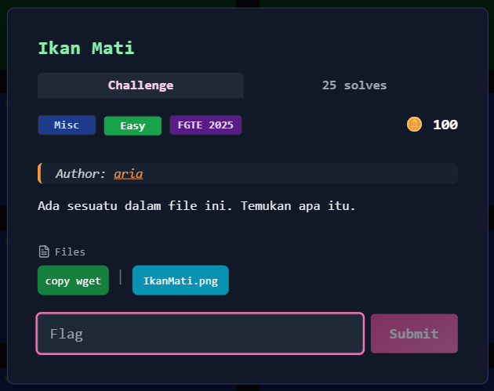
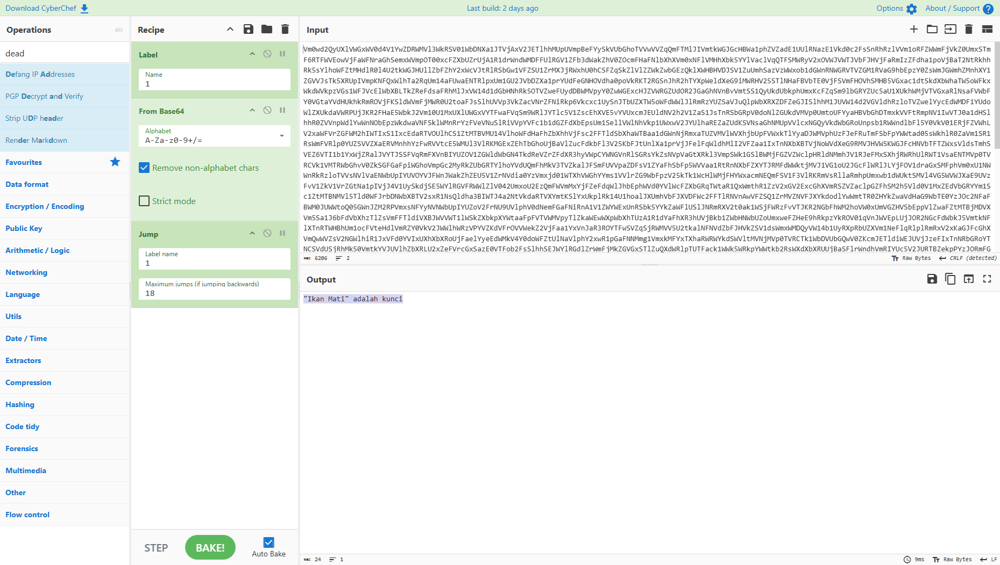
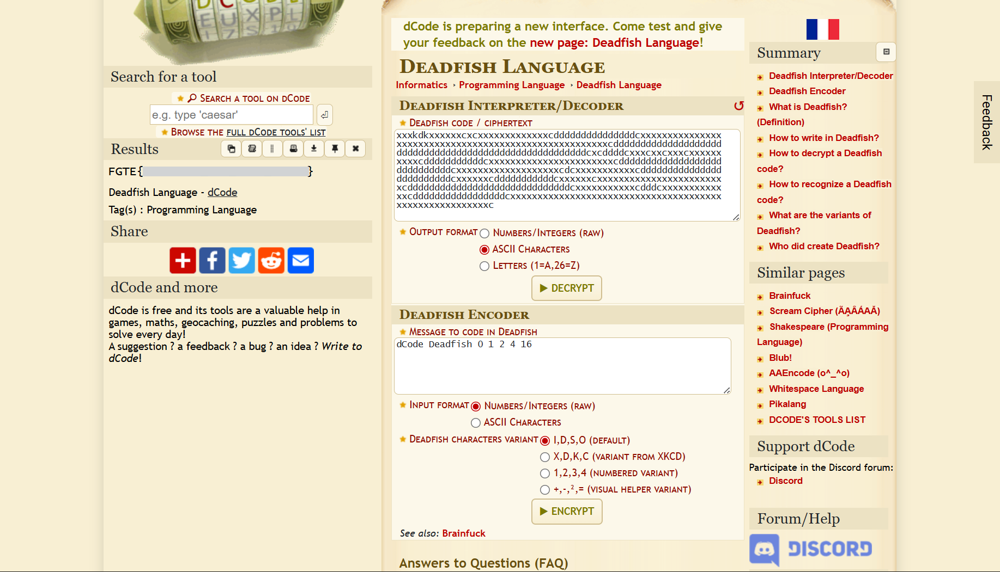

# Ikan Mati



## Deskripsi Challenge
Diberikan sebuah file gambar PNG bernama `IkanMati.png`. Tujuan challenge adalah menemukan flag yang tersembunyi di dalam file.

---

## Penyelesaian

### 1. Menemukan extra data tersembunyi 
Karena file berupa PNG, langkah pertama yang dilakukan adalah mengecek apakah ada data tersembunyi di dalam struktur file, terutama data yang disisipkan setelah chunk akhir (`IEND`). Untuk itu saya menggunakan `zsteg` karena tool ini dapat mendeteksi steganografi maupun extra data pada file PNG.
Saya menjalankan perintah berikut:

```bash
zsteg IkanMati.png
````

Dari output terlihat bahwa file memiliki data tambahan setelah akhir PNG:

```
[?] 7234 bytes of extra data after image end (IEND), offset = 0x15d3f
```

Artinya, setelah PNG selesai, masih ada payload yang ditempel di belakangnya.

---

### 2. Mengekstrak extradata

Karena offset sudah diberikan, saya mengekstrak bagian tersebut menggunakan `dd`:

```bash
dd if=IkanMati.png of=extradata.bin bs=1 skip=$((0x15d3f)) status=none
```

Ketika isi file hasil ekstraksi diperiksa, terlihat beberapa bagian: pola karakter seperti `x`, `d`, `c`, `k`, ASCII art bertuliskan `FISHKISS`, dan sebuah string Base64 yang panjang.

```
xxxkdkxxxxxxcxcxxxxxxxxxxxxxcdddddddddddddddcxxxxxxxxxxxxxxxxxxxxxxxxxxxxxxxxxxxxxxxxxxxxxxxxxxxxxxcdddddddddddddddddddddddddddddddddddddddddddddddddddddddcxcddddcxxxcxxcxxxcxxxxxxxxxxcdddddddddddcxxxxxxxxxxxxxxxxxxxxxxxcdddddddddddddddddddddddddddddcxxxxxxxxxxxxxxxxxxxcdcxxxxxxxxxxxcdddddddddddddddddddddddddcxxxxxxcdddddddddddcxxxxxxcxxxxxxxxxxxxxxxxxxxxxxxxcddddddddddddddddddddddddddddddcxxxxxxxxxxxcdddcxxxxxxxxxxxxxcdddddddddddddddddcxxxxxxxxxxxxxxxxxxxxxxxxxxxxxxxxxxxxxxxxxxxxxxxxxxxxxxxxc
           FISHKISSFISHKIS
       SFISHKISSFISHKISSFISH            F
    ISHK   ISSFISHKISSFISHKISS         FI
  SHKISS   FISHKISSFISHKISSFISS       FIS
HKISSFISHKISSFISHKISSFISHKISSFISH    KISS
  FISHKISSFISHKISSFISHKISSFISHKISS  FISHK
      SSFISHKISSFISHKISSFISHKISSFISHKISSF
  ISHKISSFISHKISSFISHKISSFISHKISSF  ISHKI
SSFISHKISSFISHKISSFISHKISSFISHKIS    SFIS
  HKISSFISHKISSFISHKISSFISHKISS       FIS
    HKISSFISHKISSFISHKISSFISHK         IS
       SFISHKISSFISHKISSFISH            K
         ISSFISHKISSFISHK
Vm0wd2QyUXlVWGxWV0d4V1YwZDRWMVl3WkRSV01WbDNXa1JTVjAxV2JETlhhMUpUVmpBeFYySkVUbGhoTVVwVVZqQmFTMlJIVmtkWGJGcHBWa1phZVZadE1UUlRNazE1Vkd0c2FsSnRhRzlVVm1oRFZWWmFjVkZ0UmxSTmF6RTFWVEowVjFaWFNraGhSemxWVmpOT00xcFZXbUZrUjA1R1drWndWMDFFUlRGV1ZFb3dWakZhV0ZOcmFHaFNlbXhXVm0xNFlVMHhXbk5YYlVaclVqQTFSMWRyV2xOVWJVWTJVbFJHVjFaRmIzZFdha1poVjBaT2NtRkhhRk5sYlhoWFZtMHdlR0l4U2tkWGJHUllZbFZhY2xWcVJtRlRSbGw1VFZSU1ZrMXJjRWxhU0hCSFZqSkZlVlZZWkZwbGEzQklXWHBHVDJSV1ZuUmhSazVzWWxob1dGWnRNWGRVTVZGM1RVaG9hbEpzY0ZsWmJGWmhZMnhXY1ZGVVJsTk5XRUpIVmpKNFQxWlhTa2RqUm14aFUwaENTRlpxUm1GU2JVbDZXa1prYUdFeGNHOVdha0poVkRKT2RGSnJhR2hTYXpWeldXeG9iMWRHV25STlNHaFBVbTE0VjFSVmFHOVhSMHB5VGxac1dtSkdXbWhaTW5oWFkxWkdWVkpzVGs1WFJVcElWbXBLTkZReFdsaFRhMlJxVW14d1dGbHNhRk5OTVZweFUydDBWMVpyY0ZwWGExcHJZVWRGZUdOR2JGaGhNVnBvVmtSS1QyUkdUbkphUmxKcFZqSm9lbGRYZUc5aU1XUkhWMjVTVGxaRlNsaFVWbFY0VGtaYVdHUkhkRmROVjFKSldWVmFjMWR0U2toaFJsSlhUVVp3VkZacVNrZFNiRkp6Vkcxc1UySnJTbUZXTW5oWFdWWlJlRmRzYUZSaVJuQlpWbXRXZDFZeGJISlhhM1JUVW14d2VGVldhRzloTVZwelYycEdWMDF1YUdoWlZXUkdaVWRPUjJKR2FHaE5WbkJ2Vm10U1MxUXlUWGxVYTFwaFVqSm9WRlJYTlc5V1ZscEhXVE5vYVUxcmJEUldNV2h2V1ZaS1JsTnRSbGRpV0doNlZGUkdVMVp0UmtoUFYyaHBVbGhDTmxkVVFtRmpNV1IwVTJ0a1dHSlhhR0ZVVnpWdlYwWnNObEpzWkdwaVNFSklWMnRrYzFVeVNuSlRiVVpYVFc1b1dGZFdXbEpsUm1SellVWlNhVkp1UWxwV2JYUlhaREZaZUdKSVNsaGhNMUpVVlcxNGQyVkdWbGRoUnpsb1RWWndlbFl5Y0VkV01ERjFZVWhLV2xaWFVrZGFWM2hIWTIxS1IxcEdaRTVOUlhCS1ZtMTBVMU14VlhoWFdHaFhZbXhhVjFsc2FFTldSbXhaWTBaa1dGWnNjRmxaTUZVMVlWVXhjbUpFVWxkTlYyaDJWMVphUzFJeFRuTmFSbFpYWWtad05sWkhlR0ZaVm1SR1RsWmFVRlp0YUZSVVZXaERVMnhhYzFwRVVtcE5WMUl3VlRKMGExZEhTbGhoUjBaVlZucFdkbFl3V25KbFJtUnlXa1prVjJFelFqWldhMlI2VFZaa1IxTnNXbXBTVjNoWVdXeG9RMVJHVW5KWGJFcHNVbTFTZWxsVldsTmhSVEZ6VTI1b1YxWjZRalJVYTJSSFVqRmFXVnBIYUZOV1ZGWldWbGN4TkdReVZrZFdXR3hyVWpCYWNGVnRlSGRsYkZsNVpVaGtXRkl3VmpSWk1GSlBWMjFGZVZWclpHRldNMmhJV1RJeFMxSXhjRWRhUlRWT1VsaENTMVp0TVRCVk1VMTRWbGhvV0ZkSGFGaFpiWGhoVmpGc2MyRkZUbGRTYlhoYVdUQmFhMkV3TVZkalJFSmFUVVpaZDFsV1ZYaFhSbFp5WVVaa1RtRnNXbFZXYTJRMFdWWktjMVJ1VG1oU2JGcFlWRlJLYjFOV1draGxSMFphVm0xU1NWWnRkRzloTVVsNVlVaENWbUpIYUVOYVJFWnJWakZhZEU5V1ZrNVdia0YzVmxjd01WTXhVWGhYYms1VVlrZG9WbFpzV25kTk1WcHlWMjFHYWxacmNEQmFSV1F3VlRKRmVsRllaRmhpUmxwb1dWUktSMVl4VG5WVWJXaE9UVzFvV1ZkV1VrZGtNa1pIVjJ4V1UySkdjSE5WYlRGVFRWWlZlV042UmxoU2EzQmFWVmMxYjFZeFdqWlJhbEphWVd0YVlWcFZXbGRqTWtaR1QxWmthR1ZzV2xGV2ExcGhXVmRSZVZaclpGZFhSM2h5Vld0V1MxZEdVbGRYYm1Sc1ZtMTBNMVl5Tld0WFJrbDNWbXBTV2sxR1NsQldha3BIWTJ4a2NtVkdaRTVXYmtKSlYxUkplRk14U1hoalJXUmhVbFJXVDFWc2FFTlRNVnAwVFZSQ1ZrMVZNVFJXYkdodlYwWmtTR0ZHYkZwaVdHaG9WbTE0YzJOc2NFaFBWM0JUWWtoQ05GWnJZM2RPVmxsNFYyNVNWbUpIYUZoV2FrNU9UVlphV0dNemFGaFNiRnA1V1ZWYWExUnRSbk5YYkZaWFlUSlJNRmRXV2t0ak1WSjFWRzFvVTJKR2NGbFhWM2hoVW0xUmVGZHVSbEppVlZwaFZtMTBjMDVXVm5Sa1J6bFdVbXhzTlZsVmFFTldiVXBJWVVWT1lWSkZXbkpXYWtaaFpFVTVWMVpyTlZkaWEwWXpWbXhTUzA1R1dYaFhXR3hUVjBkb1ZWbHNWbUZoUmxweFZHeE9hRkpzYkROV01qVnJWVEpLUjJOR2NGcFdWbkJ5VmtkNFlXTnRTWHBhUm1ocFVteHdlVmRZY0VkV2JWWlhWRzVPYVZKdVFrOVVWekZ2VjFaa1YxVnJaR3ROYTFwSVZqSjRWMVV5U2tkalNFNVdZbFJHVkZSV1dsWmxWMDQyVW14b1UyRXpRbUZXVm1NeFlqRlplRmRxV2xKaGJFcGhXVmQwWVZsV2NGWlhiR1JxVFd0YVIxUXhXbXRoUjFaelYyeEdWMkV4Y0doWFZtUlNaVlphY2xwR1pGaFNNMmg1VmxkMFYxTXhaRWRWYkdSWVltMVNjMVp0TVRCTk1WbDVUbGQwV0ZKcmJETldiWEJUVjJzeFIxTnNRbGRoYTNCSVdUSjRhMk50VmtkYVJUVlhZbXRLU2xZeFVrcGxSazE0VTFob2FsSlhhSEJWYlRGdlZrWmFjMkZGVGxSTlZuQXdWRlpTUTFack1WWk5WRkpYWWtkb2RsWXdXbXRUUjBaSFlrWndhVmRIYUc5V2JURTBZekpPYzJORmFGQldNMEpVV1d0b1EwNUdXbkpaTTJSUFZteHNORll5TlU5aGJFcFlZVVpzVjJFeFZYaGFSM2h6VmpGYVdXRkhjRTVXVkZWNFYxUkNZV0V4VW5SU2JrNVlZa1phV0ZsVVNsSk5SbXhWVW1zNVUwMVdjREZXUjNodllWWktjMk5HYkZoV00xSjJWVlJHYTFZeFpISmhSM2hUVFVad1dWWkdaRFJUTVU1WFYyeG9hMUo2Ykc5VVZsWjNUVVphV0U1VlRsZE5hM0JKV1ZWV1UxWnJNWFZoU0VwWFlXdGFhRnBGVlRWV01WcHlUbFprYVdFd1dYcFdiWGhxWkRBeFYxUllhRlpYUjJoWldXMXpNVlpXYkhKYVJ6bFhZa1p3ZWxZeU5XdFVhekZYWTBoc1YwMXFSa2haVjNoaFkyMU9SVkpzYUdoTldFSlJWbXRrTkZsWFRuUlVhMVpYWWtkU1ZGUlVTbTlpTVZweVZXdDBVMDFXYkRSV1J6VlhWbTFLUmxOc2FGWmlSa3BZVmpGYVlWSXhiRFpTYld4T1ZqRktTVll5ZEdGaE1XUklVMnRhYWxORk5WaFpiR2hUVFRGd1YxZHRkR3BpUjFJd1ZERmtiMVl3TVVkaE0yeFhZbFJCZUZscVJscGxSbVJ5VjJ4U2FXRXpRbGRYVmxKSFpESk9jMVp1UmxOaVIxSnhWRlpvUTFOR2JGWmFSemxWWVhwR1Yxa3dXbUZXTWtwSVZHcFNWV0V5VWxOYVZscGhZMnh3UjFwSGJGTk5WWEF5Vm14ak1XUXlUWGxUV0doV1lrZFNXVmx0TVZOak1XeHlWMjVPVDFadGRETldiVEV3VmpBeFJWSnJXbFppV0VKSVZqSjRZVmRIUmtabFJtUk9ZbTFvYjFacVFtRldNazV6WTBWb1UySkhVbGhVVmxaM1ZXeGFjMVZyWkdoTlZURTBWVEZvYjJGc1NsaFZiV2hXWWxoTmVGWXdXbHBrTVZweVpFVTFhVkp1UVhkV1JscFRVVEZhY2sxV1drNVdSa3BZVm0weGIyVnNXbk5YYlhSVVVqRmFTRll5ZUhkV01VcFhZak53V0Zac1dtaFdha3BUVTBaYWNtSkhSbE5OTUVwVlYxZDBiMUV3TlVkWGJrcGFUVEpTVUZadGVITk9SbGw1VGxVNWFHSkZjRmxaVlZwelZqSkZlRlpZYUdGU00yaDZWbXBHWVZkWFJrZGhSazVwVW0wNU5GWXhVa05aVjBWNFZXNU9XRmRIZUc5VmExWjNWMFpzV0dSRmRHcGlSbGt5VlcweE1GWXdNVmRqUkVaV1RXNW9SRlpxU2t0VFZrWjFXa1prYVZkR1NsbFdiVEI0VlcxV1IxcElWbE5pUlhCd1ZteGFkMkZHV25STldIQk9WbXMxV0ZZeWVHOWhNVW8yWWtjNVZWWnNXak5VVlZwaFYwVTFWbFJzWkU1aE0wSktWMVpXVjFVeFduSk5WbVJxVWpKb1lWUldXbmRWUm10NFYyeGthazFYVW5sVWJGcHJWR3hhV0dRemNGZGlXR2hVVlhwQmVGTkdTbGxoUjBaVFZqSm9WbGRYZEd0aU1rbDRWbTVTVGxaNmJHRldiWGgzWlZaYWRFMVZaRlZoZWtaWVdUQm9jMVl3TVhGU2EyaGFWak5vYUZreU1VOVNWa3B6WVVkb1RsZEZTbEpXYlhSclRrWnNXRlJ1VWxWaE1WcFlXV3RrVTFaR1VsVlRiVGxwVFZad2VWWlhkREJWTURGWVZXdG9WazF1YUhwWFZscEtaV3hHYzFWc1pHaGhlbFl5Vm1wR1lXRXhaRWhXYTJoUVZtdHdUMVp0ZEhkVFZscHpXWHBHVkUxWFVrbFZNblJoWVd4T1JrNVdaRnBpUmtwSVZtdGFkMWRIVmtsVWJHUnBVakZLTmxaclkzaGlNVmw1VWxod1VsZEhhRmhXYlRGT1pVWnNjVkpzY0d4U2JWSmFXVEJrYjFaR1NsbFJiR3hYWWxoU1dGZFdaRmRqTVdSMVVteE9hVkl4U25oV1JscHJWVEpXYzJKR1dtRlRSVFZZVkZaYWQwMVdWbGhqUjBaWFRVUkdXVlpXYUd0WFJscDBWV3hPWVZac2NHaFpNbmgzVWpGd1IyRkdUazVOYldjeFZtMTRhMDFHV1hoVVdHaGhVbGRTV0ZsdGVFdGpiRlYzV2taT2FrMVhlSGxXTW5oclZERmFkVkZzWkZwV1YxRjNWakJhU21ReVRrWmhSbkJPVW01Q01sWnFTbnBsUms1SVVtdGFiRkp0VWs5WmJURnZZakZhY1ZGdFJsZE5helY2V1RCV2IxVXlTa2hWYkdoVlZteGFNMVpYZUdGak1YQkpXa1pTVGxaVVJUQldWRVp2WXpGVmVWSlliRlppVkd4WFdXeG9iMVJHV25KWGJVWnFUV3RhUjFaSGVGTlViRnAxVVdwU1YxWjZRalJWYWtaaFkyc3hWMWRyTlZkU2EzQlpWbTB3ZUdJeVZuTlhiazVZWWxoU1ZWVnFRbUZUVm14V1YyMUdWV0pGY0RGVlZ6QTFWakpLVlZKVVFscGxhM0JRV1hwR2QxTldUblJrUms1T1RVVndWbFl4WkRCWlYxRjNUbFZrV0dKSGFFOVdhMVpMVkRGV2RHVklUazlTYkd3MVZHeFZOV0ZIU2taalJteGFWbFp3ZGxacVNrZGphelZYVld4a1UxWnVRalpXYlhoaFVqRmtXRkpyWkZWaVIxSnZWRlJDU2sxc1duUmtSM1JQVW0xNFdGWnNhSE5XUjBWNFkwWnNWMDFIYUVSV01GcGhZekZrZFZwR1RrNVdhMWt3Vm1wS01GUXhXblJUYTFwVVlrWndWbFpzV2tkTk1WWkhVbFJzVVZWVU1Eaz0=
```

---

### 3. Decode Base64

Bagian Base64 kemudian saya decode menggunakan CyberChef. Setelah berhasil didecode, output yang didapat adalah:  
  
  
  
```
"Ikan Mati" adalah kunci
```

Pesan ini adalah clue utama untuk tahap berikutnya.

---

### 4. Menghubungkan clue dengan Deadfish

Kalimat `"Ikan Mati" adalah kunci` mengarah ke istilah **Deadfish**, yaitu salah satu esoteric programming language. Ini cocok dengan bagian awal extradata yang berisi karakter seperti `x d c k`, karena variasi Deadfish memang menggunakan karakter tersebut.

---

### Menjalankan kode Deadfish

Selanjutnya saya menyalin payload deadfish tersebut dan menjalankannya menggunakan interpreter online (dCode Deadfish Interpreter/Decoder). Setelah dieksekusi, output menghasilkan flag.  
  
  

---

## Flag

```
FGTE{REDACTED}
```
