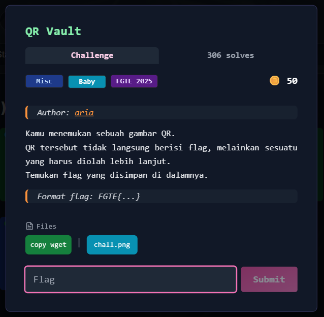

# QR Vault



---

## Langkah Penyelesaian

### 1. Scan QR Code dari Gambar
Langkah pertama adalah membaca isi QR Code menggunakan `zbarimg`.

```bash
zbarimg chall.png
````

Output menunjukkan bahwa QR Code berhasil terbaca dan menghasilkan sebuah string panjang:

```
QR-Code:UEsDBAoAAAAAANwRO1uub+7rIgAAACIAAAAIABwAZmxhZy50eHRVVAkAA6BI12igSNdodXgLAAEE
6AMAAAToAwAARkdURXtaaXBCYXNlNjRfUVJfQ2hhbGxlbmdlXzIwMjV9ClBLAQIeAwoAAAAAANwR
O1uub+7rIgAAACIAAAAIABgAAAAAAAEAAAD/gQAAAABmbGFnLnR4dFVUBQADoEjXaHV4CwABBOgD
AAAE6AMAAFBLBQYAAAAAAQABAE4AAABkAAAAAAA=
```

---

### 2. Decode String Base64 ke File Output

String hasil scan terlihat seperti Base64. Data tersebut kemudian di-decode dan disimpan ke sebuah file bernama `output`.

```bash
echo "UEsDBAoAAAAAANwRO1uub+7rIgAAACIAAAAIABwAZmxhZy50eHRVVAkAA6BI12igSNdodXgLAAEE
6AMAAAToAwAARkdURXtaaXBCYXNlNjRfUVJfQ2hhbGxlbmdlXzIwMjV9ClBLAQIeAwoAAAAAANwR
O1uub+7rIgAAACIAAAAIABgAAAAAAAEAAAD/gQAAAABmbGFnLnR4dFVUBQADoEjXaHV4CwABBOgD
AAAE6AMAAFBLBQYAAAAAAQABAE4AAABkAAAAAAA=" | base64 -d > output
```

---

### 3. Identifikasi Format File Hasil Decode

Untuk mengetahui format sebenarnya dari file `output`, dilakukan pengecekan menggunakan `file`.

```bash
file output
```

Hasilnya:

```
output: Zip archive data, made by v3.0 UNIX, extract using at least v1.0, last modified Sep 27 2025 02:14:56, uncompressed size 34, method=store
```

Hal ini membuktikan bahwa data Base64 tersebut adalah **arsip ZIP** yang dibungkus dalam QR Code.

---

### 4. Ekstrak Arsip ZIP

Karena file adalah ZIP, langkah berikutnya adalah mengekstraknya menggunakan `unzip`.

```bash
unzip output
```

Output:

```
Archive:  output
 extracting: flag.txt
```

---

### 5. Membaca Flag

Setelah diekstrak, didapatkan file `flag.txt`. Isi file tersebut dibaca menggunakan `cat`.

```bash
cat flag.txt
```

Hasil:

```
FGTE{Redacted}
```

---

## Flag

```
FGTE{Redacted}
```
