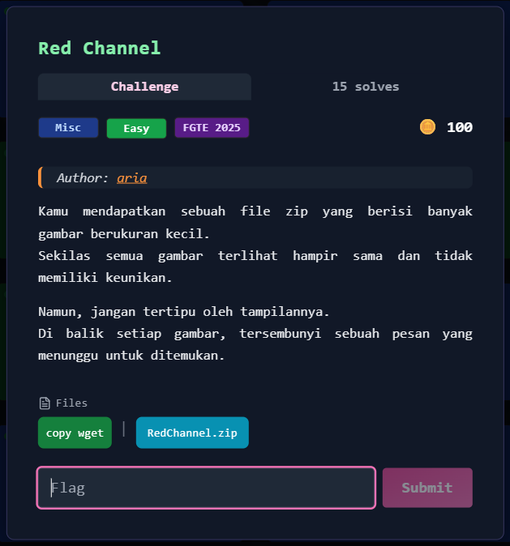
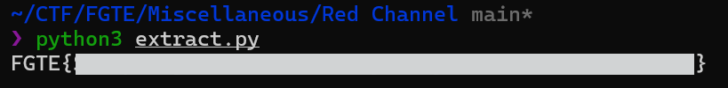

# Red Channel



## Deskripsi Challenge
Challenge menyediakan sebuah file ZIP yang berisi banyak gambar PNG berurutan (`img_000.png` sampai `img_055.png`).  
Judul challenge mengarah pada teknik steganografi dengan memanfaatkan **channel merah (Red channel)**.

---

## Files
- `RedChannel.zip`
- `img_000.png` … `img_055.png`

---

## Langkah Penyelesaian

### 1. Ekstrak ZIP
Pertama, ekstrak arsip untuk melihat seluruh file yang tersedia.

```bash
unzip RedChannel.zip
ls
````

Hasilnya terdapat puluhan file PNG dengan pola penamaan `img_XXX.png`.

---

### 2. Analisis Awal Pola File

Banyaknya gambar yang tersusun berurutan biasanya mengindikasikan:

* setiap gambar menyimpan sebagian pesan (misalnya 1 karakter), atau
* pesan tersebar pada channel tertentu (RGB).

Karena judul challenge adalah **Red Channel**, maka fokus analisis diarahkan ke channel **Red (R)**.

---

### 3. Verifikasi dengan StegSolve

Untuk memastikan bahwa data memang disisipkan pada channel merah, salah satu gambar dibuka menggunakan StegSolve:

```bash
java -jar stegsolve.jar img_000.png
```

Kemudian digunakan fitur:

* **Data Extract**
* centang **Red bit-plane 0 sampai 7**
* Extract By: **Row**
* Bit Order: **MSB First**

Hasil preview menunjukkan byte hex `46` berulang.

---

### 4. Konversi Nilai Hex ke ASCII

Nilai hex `0x46` merupakan ASCII untuk karakter:

* `0x46` → `F`

Saat dicek pada gambar berikutnya, karakter berubah secara berurutan:

* `img_001.png` → `G`
* `img_002.png` → `T`
* `img_003.png` → `E`
* `img_004.png` → `{`

Sehingga dapat disimpulkan bahwa:

* setiap gambar menyimpan **1 karakter**
* karakter disimpan pada **Red channel**

---

### 5. Otomatisasi Ekstraksi dengan Python

Agar tidak perlu membuka semua gambar secara manual, ekstraksi dilakukan menggunakan Python.

Karena seluruh bit-plane 0..7 pada channel merah digunakan, maka karakter dapat diambil langsung dari nilai byte Red pada pixel tertentu (misalnya `(0,0)`).

```python
from PIL import Image
import glob

files = sorted(glob.glob("img_*.png"))

flag = ""
for f in files:
    im = Image.open(f).convert("RGB")
    r, _, _ = im.getpixel((0, 0))
    flag += chr(r)

print(flag)
```

---

## Hasil

Setelah script dijalankan, didapatkan output flag lengkap:  
  
  
  
