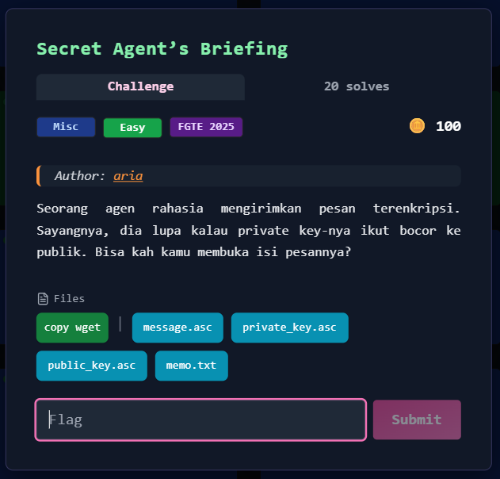
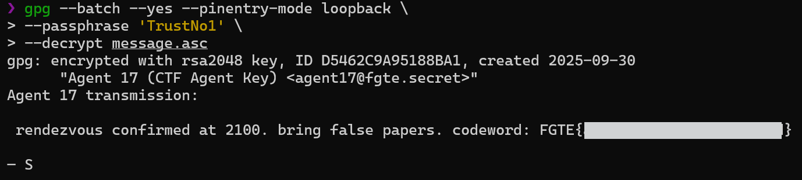

# Secret Agent’s Briefing 



## Deskripsi Challenge
Challenge menyediakan sebuah pesan terenkripsi PGP beserta keypair (`public_key.asc` dan `private_key.asc`).  
Targetnya adalah mendekripsi `message.asc` untuk mendapatkan flag.

---

## Provided Files
- `memo.txt`
- `private_key.asc`
- `public_key.asc`
- `message.asc`

---

## Initial Analysis
File `message.asc` merupakan ciphertext PGP (ASCII-armored).  
Karena private key disediakan, proses dekripsi seharusnya bisa dilakukan langsung, namun private key diproteksi dengan passphrase.

Sehingga langkah utama challenge ini adalah menemukan passphrase dari `private_key.asc`.

Hint ada di `memo.txt`:

> motto ini sering muncul di akhir laporan agen yang menyelidiki misteri-misteri tak terpecahkan.

Motto yang sangat identik dengan serial **The X-Files** adalah:

> **“Trust No One”**

Dalam konteks password/passphrase, variasi yang paling umum dipakai adalah:
- `TrustNo1`
- `trustno1`
- `TrustNoOne`

Agar brute force cepat, wordlist bisa dipersempit dengan mengambil kandidat yang relevan dari `rockyou.txt`.

---

## Exploitation / Solution

### 1. Membuat Wordlist Kandidat
Daripada menjalankan brute force full `rockyou.txt`, dibuat wordlist kecil berisi variasi yang mengandung kata kunci `trustno`.

```bash
grep -i "trustno" /usr/share/wordlists/rockyou.txt > wordlist.txt
````

---

### 2. Extract Hash Passphrase Private Key

John the Ripper membutuhkan hash yang diextract dari private key.
Tool yang digunakan adalah `gpg2john`.

```bash
gpg2john private_key.asc > hash.txt
```

---

### 3. Crack Passphrase dengan John

Setelah hash tersedia, passphrase dapat dicari menggunakan wordlist yang sudah dipersempit.

```bash
john --wordlist=wordlist.txt hash.txt
```

Output John menunjukkan passphrase yang benar:

```
TrustNo1 (Agent 17)
```

---

### 4. Dekripsi Pesan PGP

Dengan passphrase ditemukan, pesan bisa didekripsi menggunakan `gpg`.

```bash
gpg --batch --yes --pinentry-mode loopback \
  --passphrase 'TrustNo1' \
  --decrypt message.asc
```

Output:



---

## Flag

```
FGTE{REDACTED}
```
