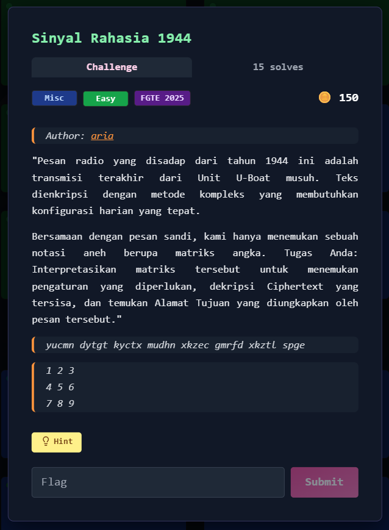
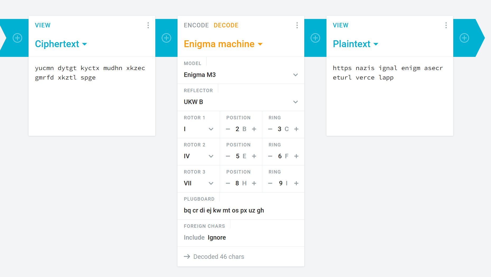
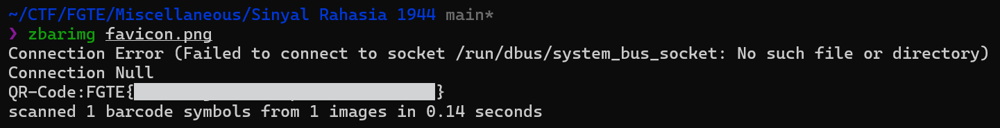

# Sinyal Rahasia 1944



## Deskripsi Challenge
Challenge memberikan sebuah ciphertext pendek yang diklaim sebagai pesan radio tahun 1944 dari unit U-Boat musuh.  
Diberikan juga sebuah matriks angka 3×3 yang menjadi petunjuk konfigurasi harian untuk mendekripsi pesan.

Tujuan akhir adalah menemukan alamat tujuan (URL) yang tersembunyi di dalam pesan.

---

## Langkah Penyelesaian

### 1. Identifikasi Cipher dari Hint
Hint yang diberikan adalah emoji:

```
🥨
```

Emoji tersebut sangat identik dengan **Jerman**, sehingga konteks “radio tahun 1944”, “konfigurasi harian”, dan “U-Boat” langsung mengarah ke cipher klasik:

**Enigma Machine**

Matriks 3×3 yang disediakan diduga berfungsi sebagai petunjuk konfigurasi.

---

### 2. Interpretasi Matriks Angka
Matriks yang diberikan:

```
1 2 3
4 5 6
7 8 9
```

Setelah konfigurasi tersebut diterapkan ke proses decoding Enigma (sesuai challenge), ciphertext:

```
yucmn dytgt kyctx mudhn xkzec gmrfd xkztl spge
```

berhasil didekode menjadi potongan string:  
  
  
  

```
https nazis ignal enigm asecr eturl verce lapp
```

---

### 3. Rekonstruksi Menjadi URL Valid
Hasil plaintext masih terpecah per 5 karakter, sehingga perlu digabungkan kembali.

Jika disusun menjadi URL yang valid:

[https://nazisignalenigmasecreturl.vercel.app/](https://nazisignalenigmasecreturl.vercel.app/)

---

### 4. Investigasi Website
Setelah URL dibuka, halaman tidak langsung menampilkan flag, namun terdapat sesuatu yang mencurigakan pada favicon.

Favicon tersebut ternyata bukan ikon biasa, melainkan gambar **QR Code**.

---

### 5. Download QR dari Website
QR dapat diambil langsung menggunakan `wget` dari asset yang digunakan website:

```bash
wget 'https://nazisignalenigmasecreturl.vercel.app/assets/qr-DXX1lDA7.png' -O favicon.png
````

---

### 6. Decode QR Code

QR kemudian didekode menggunakan `zbarimg`:

```bash
zbarimg favicon.png
```

Output:  
  
  
  
