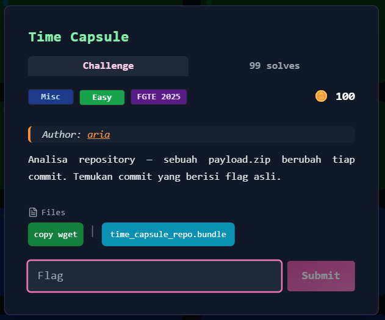
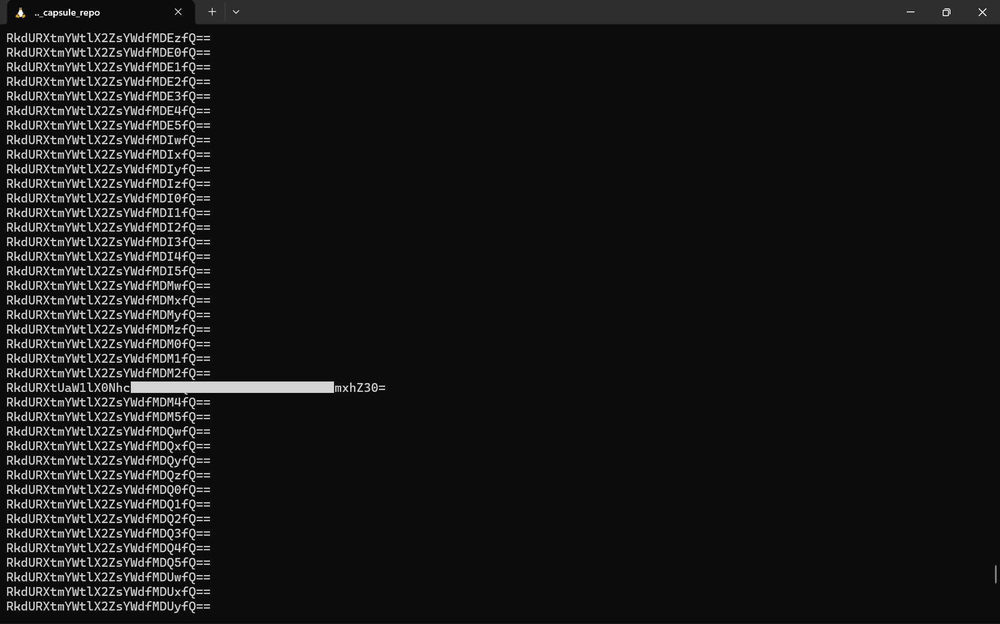

# Time Capsule



---

## Deskripsi Challenge
Challenge ini menyediakan sebuah file bernama `time_capsule_repo.bundle`.  
Dari namanya, file tersebut mengindikasikan sebuah repository Git yang dibungkus dalam format **Git bundle**.

Tujuan challenge adalah mengekstrak repository tersebut, menganalisis riwayat commit, dan menemukan flag yang tersembunyi.

---

## Langkah Penyelesaian

### 1. Identifikasi File Bundle
Langkah pertama adalah mengecek tipe file:

```bash
file time_capsule_repo.bundle
````

Output:

```
time_capsule_repo.bundle: Git bundle
```

Ini memastikan bahwa file merupakan Git bundle yang dapat diverifikasi dan dikloning.

---

### 2. Verifikasi Bundle

Untuk memastikan bundle valid dan berisi riwayat lengkap, dilakukan verifikasi:

```bash
git bundle verify time_capsule_repo.bundle
```

Output menunjukkan bundle valid dan memiliki history lengkap:

```
The bundle contains these 2 refs:
0fbca187d349b2f47850c548e649c7afdf9d8b8d refs/heads/master
0fbca187d349b2f47850c548e649c7afdf9d8b8d HEAD
The bundle records a complete history.
...
time_capsule_repo.bundle is okay
```

---

### 3. Melihat Referensi Branch

Selanjutnya dicek head yang tersedia:

```bash
git bundle list-heads time_capsule_repo.bundle
```

Hasil:

```
0fbca187d349b2f47850c548e649c7afdf9d8b8d refs/heads/master
0fbca187d349b2f47850c548e649c7afdf9d8b8d HEAD
```

---

### 4. Clone Git Bundle

Bundle kemudian diekstrak menjadi repository Git menggunakan `git clone`:

```bash
git clone time_capsule_repo.bundle
```

Repository berhasil dikloning ke folder `time_capsule_repo/`.

---

### 5. Ekstraksi Payload

Di dalam repository ditemukan file `payload.zip` dan `README.md`.

```bash
ls
```

Output:

```
payload.zip  README.md
```

Ekstraksi ZIP dilakukan:

```bash
unzip payload.zip
```

Hasilnya:

* `commit_info.txt`
* `filler.bin`
* `flag.txt`

---

### 6. Analisis Awal Isi Payload

Isi `commit_info.txt` menunjukkan informasi jumlah commit:

```bash
cat commit_info.txt
```

Output:

```
commit_number: 100
generated_at: 2025-09-26T17:35:21Z
```

Sementara itu, `flag.txt` berisi string yang terlihat seperti Base64, namun ternyata hanya berisi **fake flag**.

---

### 7. Enumerasi Seluruh Commit untuk Mencari Flag Asli

Karena repository memiliki banyak commit (100 commit), langkah berikutnya adalah melakukan iterasi seluruh commit.

Strategi yang digunakan:

1. Checkout commit satu per satu
2. Jika `payload.zip` ada, extract
3. Jika `flag.txt` ada, tampilkan isinya

Perintah yang digunakan:

```bash
for c in $(git rev-list --all --reverse); do
    git checkout $c --quiet 2>/dev/null
    if [ -f payload.zip ]; then
        unzip -o payload.zip >/dev/null 2>&1
        if [ -f flag.txt ]; then
            cat flag.txt
            echo
        fi
    fi
done
```

Output menunjukkan hampir seluruh commit berisi pola:

```
RkdURXtmYWtlX2ZsYWdfMDAxfQ==
RkdURXtmYWtlX2ZsYWdfMDAyfQ==
...
```

yang jika didecode merupakan fake flag.

Namun pada salah satu commit ditemukan string berbeda:  
  
  

---

### 8. Decode Base64 untuk Mendapatkan Flag

String tersebut kemudian didecode menggunakan `base64`, dan mendapatkan flag:

Hasil decoding:

```
FGTE{REDACTED}
```

---

## Flag

```
FGTE{REDACTED}
```
