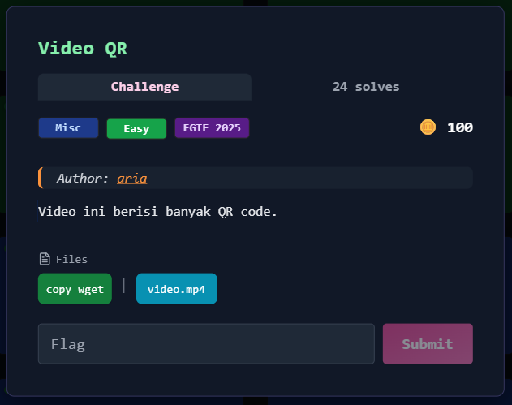
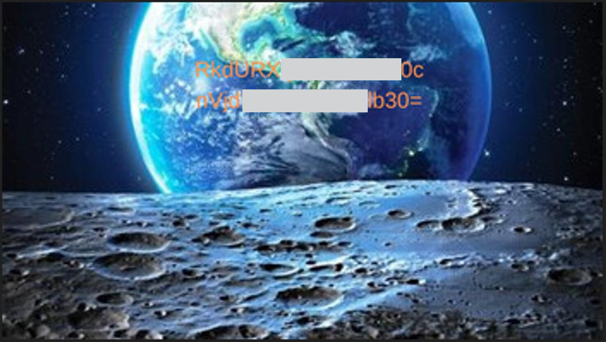

# Video QR



## Deskripsi Challenge
Challenge memberikan sebuah file video (`video.mp4`) yang berisi banyak QR code.  
Setiap QR code tidak berisi flag langsung, tetapi potongan data yang harus dikumpulkan dan disusun kembali.

Format output QR terlihat seperti:

```
IDX:000/67|<base64>
IDX:001/67|<base64>
...
````

Artinya setiap QR membawa 1 chunk data base64, dengan indeks `IDX` dan total chunk `/67`.

---

## Solusi

### 1) Extract frame dari video
Langkah pertama adalah memecah video menjadi kumpulan gambar agar setiap QR code bisa diproses per frame.

```bash
ffmpeg -i video.mp4 frames/frame_%05d.png
````

---

### 2) Decode QR dari setiap frame

Setelah frame berhasil diekstrak, setiap gambar dibaca menggunakan OpenCV lalu didecode dengan `pyzbar`.

Agar QR lebih mudah terbaca, frame di-upscale lalu diubah menjadi grayscale dan threshold sebelum diproses.

Script:

```python
import cv2
import glob
from pyzbar.pyzbar import decode

frames = sorted(glob.glob("frames/*.png"))

seen = set()
results = []

for f in frames:
    img = cv2.imread(f)
    if img is None:
        continue

    img = cv2.resize(img, None, fx=3, fy=3, interpolation=cv2.INTER_CUBIC)

    gray = cv2.cvtColor(img, cv2.COLOR_BGR2GRAY)
    _, th = cv2.threshold(gray, 0, 255, cv2.THRESH_BINARY + cv2.THRESH_OTSU)

    qr = decode(th)
    if not qr:
        continue

    data = qr[0].data.decode(errors="ignore")

    if data not in seen:
        seen.add(data)
        results.append(data)
        print(data)

print("\nTOTAL UNIQUE:", len(results))
```

Outputnya disimpan:

```bash
python3 decode_qr.py > output.txt
```

---

### 3) Rebuild data base64 dari semua chunk

Isi `output.txt` berisi potongan QR dengan format:

```
IDX:000/67|...
```

Langkah berikutnya adalah:

* parsing semua chunk
* mapping `IDX -> chunk`
* menyusun ulang dari `0..66`
* menggabungkan base64
* decode base64 menjadi file gambar (`recovered.jpg`)

Script:

```python
import re
import base64

data = open("output.txt", "r", encoding="utf-8", errors="ignore").read()
parts = re.findall(r"IDX:(\d{1,3})/(\d+)\|([A-Za-z0-9+/=]+)", data)

total_expected = int(parts[0][1])

mp = {}
for idx, total, chunk in parts:
    mp[int(idx)] = chunk

missing = [i for i in range(total_expected) if i not in mp]

print("Expected:", total_expected)
print("Got:", len(mp))
print("Missing:", missing)

b64 = "".join(mp[i] for i in range(total_expected))
b64 += "=" * ((4 - len(b64) % 4) % 4)

raw = base64.b64decode(b64)
open("recovered.jpg", "wb").write(raw)

print("Saved -> recovered.jpg")
```

Saat dijalankan, seluruh chunk berhasil terkumpul:

```
Expected: 67
Got: 67
Missing: []
Saved -> recovered.jpg
```

---

### 4) Decode flag dari base64 terakhir

Saat membuka file `recovered.jpg` terdapat ciphertext hasil enkoding base64 yang jika di dekode akan menghasilkan flag  
  
  

---

## Flag

```
FGTE{REDACTED}
```
