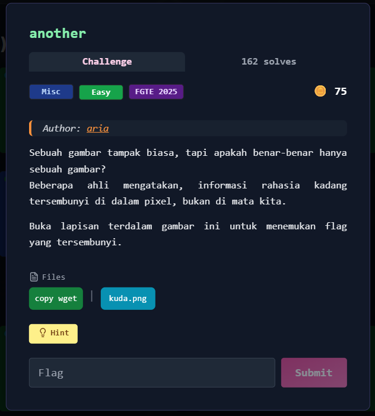

# another



---

## Deskripsi Challenge
Challenge ini memberikan sebuah file gambar `chall.png` yang tampak normal. Namun sesuai deskripsi soal, terdapat informasi rahasia yang disisipkan di dalam pixel menggunakan teknik steganografi.

Hint yang diberikan adalah `zsteg`, sehingga pendekatan utama adalah melakukan analisis [bit-plane](https://en.wikipedia.org/wiki/Bit_plane?_x_tr_sl=en) pada gambar untuk mencari data tersembunyi.

---

## Langkah Penyelesaian

### 1. Analisis Gambar Menggunakan zsteg
Sesuai hint, langkah pertama adalah menjalankan `zsteg` terhadap file gambar.

```bash
zsteg chall.png
````

Tool `zsteg` melakukan scanning terhadap berbagai kombinasi channel (RGB), bit-order (LSB/MSB), dan metode pembacaan (xy).

Hasil output menunjukkan adanya string yang jelas mengandung flag:

```
b1,r,lsb,xy         .. text: "FGTE{Redacted}"
```

---

## Flag

```
FGTE{Redacted}
```
