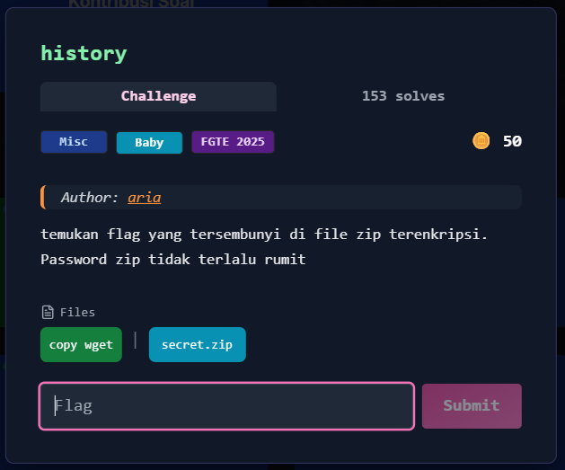

# history



---

## Deskripsi Challenge
Challenge ini memberikan sebuah file arsip bernama `secret.zip`. Setelah berhasil diekstrak, ditemukan bahwa isi arsip mengandung repository Git (`.git`) dan sebuah `flag.txt` yang ternyata merupakan **decoy flag**. Flag asli dapat diperoleh dengan melakukan analisis riwayat commit Git.

---

## Langkah Penyelesaian

### 1. Ekstraksi `secret.zip`
Langkah pertama adalah mencoba mengekstrak file ZIP.

```bash
unzip secret.zip
````

Namun output menunjukkan bahwa arsip tersebut **terproteksi password**, sehingga proses ekstraksi tidak dapat dilanjutkan tanpa password yang benar.

---

### 2. Bruteforce Password ZIP Menggunakan John

Untuk mendapatkan password, hash ZIP diekstrak menggunakan `zip2john`, lalu dilakukan cracking dengan wordlist `rockyou.txt`.

```bash
zip2john secret.zip > hash.txt
john --wordlist=/usr/share/wordlists/rockyou.txt hash.txt
```

Hasil cracking menunjukkan password berhasil ditemukan:

```
iloveyou         (secret.zip)
```

---

### 3. Ekstraksi ZIP Menggunakan Password yang Valid

Setelah password diketahui, arsip diekstrak kembali. Hasil ekstraksi menghasilkan folder `secret/` yang berisi struktur `.git`.

```bash
unzip secret.zip
```

Di dalam folder tersebut ditemukan beberapa file penting:

* `secret/flag.txt`
* `secret/.hint.txt`
* `secret/.git/` 

---

### 4. Identifikasi Decoy Flag

Saat membuka file `flag.txt`, ternyata flag yang muncul bukan flag asli (decoy).
Karena terdapat repository Git, langkah berikutnya adalah memeriksa riwayat commit.

---

### 5. Analisis Riwayat Commit Git

Masuk ke folder `secret/`, lalu lihat commit history menggunakan `git log`.

```bash
cd secret
git log
```

Output menunjukkan ada 2 commit:

```
commit 745debc7dc41c49f1f7df024fd77e97132554e47 (HEAD -> main)
    update

commit d6158ab833a564ec3aca8552b295dd6958ff8f2c
    init
```

Commit terbaru (`update`) diduga melakukan perubahan yang menghilangkan flag asli.

---

### 6. Mengambil Flag dari Commit Lama

Untuk melihat perubahan pada commit awal, digunakan perintah:

```bash
git show d6158ab833a564ec3aca8552b295dd6958ff8f2c
```

Pada output diff terlihat bahwa file `flag.txt` pada commit `init` berisi flag asli:

```diff
+FGTE{Redacted}
```

---

## Flag

```
FGTE{Redacted}
```
