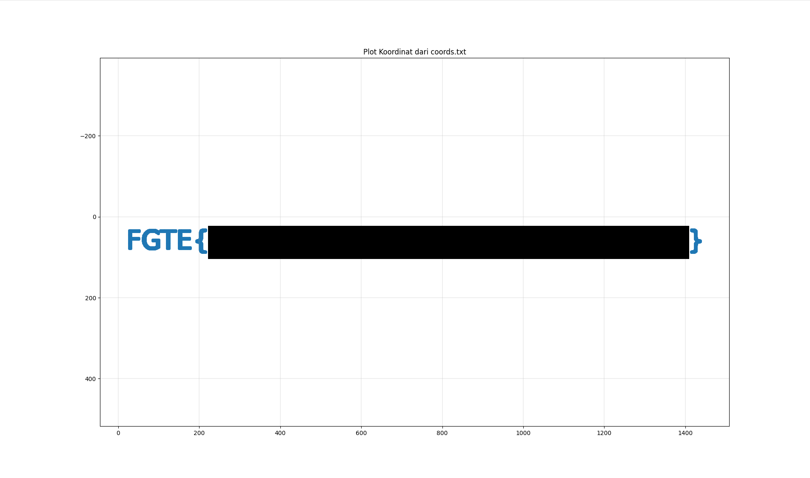

# Info Lokasi


---

## Deskripsi Challenge
Challenge ini memberikan sebuah file `coords.txt` yang berisi kumpulan koordinat `(x, y)`. Tujuan challenge adalah memvisualisasikan koordinat tersebut sehingga membentuk sebuah pola/teks yang dapat dibaca sebagai flag.

---

## Langkah Penyelesaian

### 1. Membaca dan Mem-Plot Koordinat dengan Python
Karena file berisi pasangan koordinat, pendekatan yang digunakan adalah:
1. Membaca setiap baris `x,y`
2. Menyimpan nilai ke dalam list
3. Mem-plot menggunakan `scatter()`

Kode yang digunakan:

```python
import matplotlib.pyplot as plt

def load_coords(filename):
    xs, ys = [], []
    with open(filename, "r") as f:
        for line in f:
            line = line.strip()
            if not line or "," not in line:
                continue
            x, y = line.split(",")
            xs.append(int(x))
            ys.append(int(y))
    return xs, ys

xs, ys = load_coords("coords.txt")

plt.figure(figsize=(12, 6))
plt.scatter(xs, ys, s=5)

plt.gca().invert_yaxis()

plt.axis("equal")
plt.grid(True, linewidth=0.3)
plt.title("Plot Koordinat dari coords.txt")
plt.show()
````

---

### 2. Menjalankan Script

Setelah script dijalankan, titik-titik koordinat membentuk teks yang dapat dibaca secara jelas.

Hasil visualisasi menunjukkan flag:



---

## Flag

```
FGTE{REDACTED}
```
