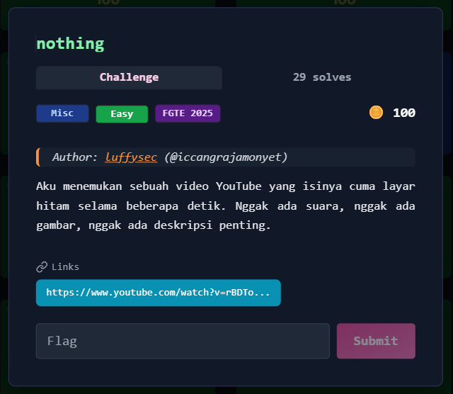
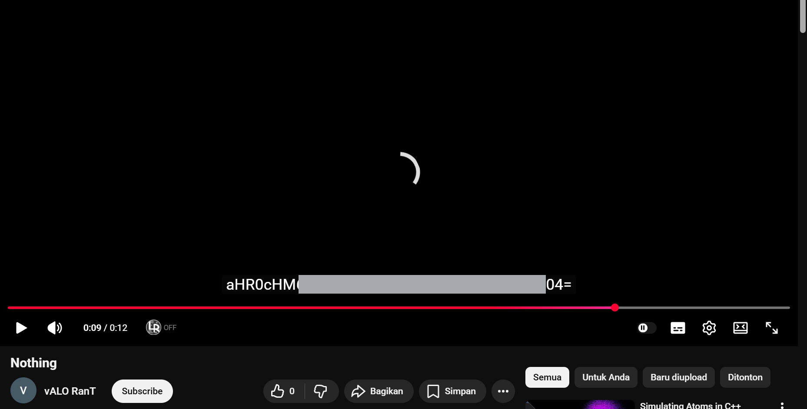
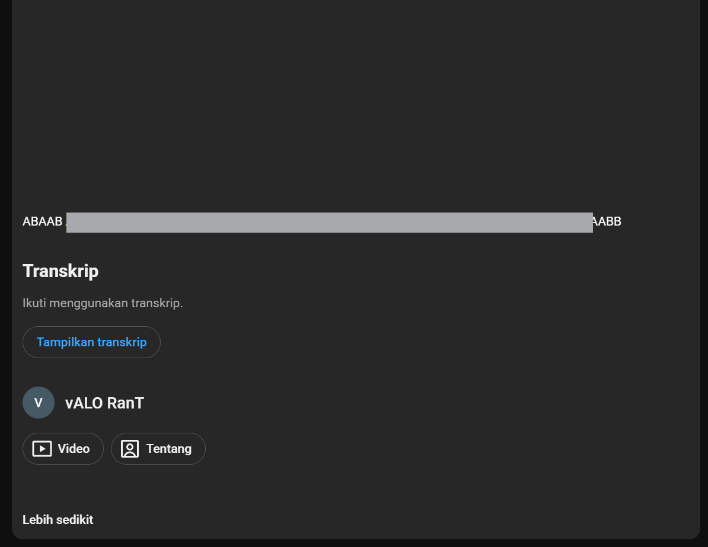
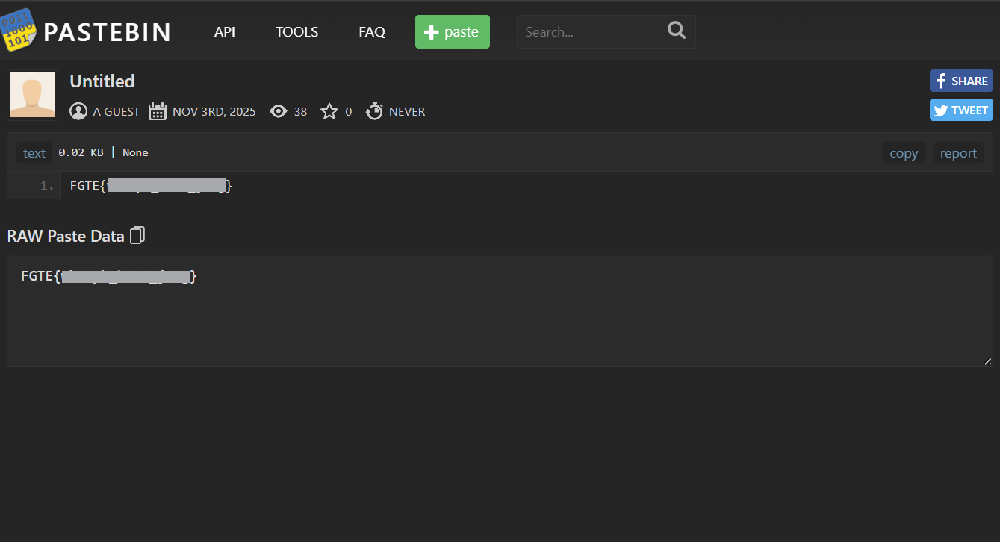

# nothing



---

## Deskripsi Challenge

Challenge memberikan sebuah link video YouTube yang terlihat “kosong”:

- layar hitam beberapa detik
- tidak ada audio
- tidak ada informasi visual yang jelas

Link:
- `https://www.youtube.com/watch?v=rBDToOhEr6c`

---

## Langkah Penyelesaian

### 1. Memeriksa Subtitle Video

Langkah pertama adalah membuka video dan mengecek apakah video memiliki subtitle.  
  
  
  
Ternyata video memiliki subtitle, dan saat subtitle diubah ke **bahasa Rusia** , muncul sebuah string yang bukan teks biasa, melainkan terlihat seperti **Base64**.

---

### 2. Decode Base64

String Base64 tersebut kemudian didecode.

Hasil decode menghasilkan sebuah link menuju **Pastebin**, namun Pastebin tersebut terkunci dan membutuhkan password.

---

### 3. Mencari Password pada Deskripsi Video

Karena Pastebin membutuhkan password, langkah berikutnya adalah memeriksa bagian lain dari video.
Pada deskripsi video ditemukan sebuah ciphertext lain yang terlihat seperti hasil dari **Bacon Cipher** (Baconian cipher), yaitu cipher yang meng-encode teks menggunakan pola A/B.  
  
  

---

### 4. Decode Bacon Cipher

Ciphertext pada deskripsi didecode menggunakan teknik Bacon cipher.

Hasil plaintext dari decoding ini menghasilkan sebuah kata/kalimat yang diduga kuat merupakan password untuk Pastebin.

---

### 5. Membuka Pastebin dengan Password

Password hasil decode Bacon cipher dimasukkan ke halaman Pastebin.
Setelah password benar, isi Pastebin terbuka dan berisi flag challenge.  
  
  

---

## Flag

```
FGTE{REDACTED}
```
