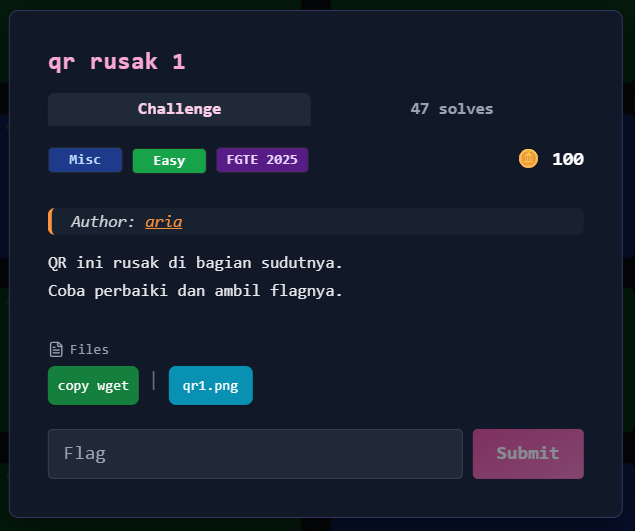
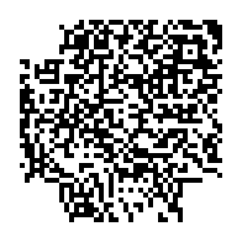
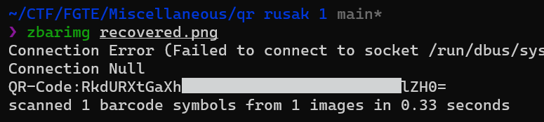

# qr rusak 1



---

## Deskripsi Challenge
Challenge memberikan sebuah QR Code yang rusak pada bagian sudutnya, sehingga **finder pattern** tidak lengkap dan QR tidak dapat terbaca oleh scanner biasa.

Tugasnya adalah memperbaiki bagian yang hilang, lalu mendekode QR untuk mendapatkan flag.



---

## Langkah Penyelesaian

### 1. Identifikasi Kerusakan QR
Dari hasil observasi, kerusakan berada pada bagian sudut QR (finder pattern).  
Finder pattern merupakan komponen penting QR Code, sehingga jika hilang maka QR tidak dapat dikenali.

---

### 2. Menambahkan Finder Pattern
Langkah utama adalah menambahkan kembali finder pattern yang hilang agar struktur QR kembali valid.
Digunakan Tools online yaitu [photopea.com](https://www.photopea.com/)
Finder pattern yang ditambahkan mengikuti pola standar QR:

- kotak hitam besar
- kotak putih di dalamnya
- kotak hitam kecil di tengah


---

### 3. Mendekode QR
Setelah finder pattern dipulihkan, QR kembali valid dan dapat dibaca menggunakan QR decoder (misalnya zbarimg / scanner biasa).

Hasil decode:



---

## Flag
```
FGTE{REDACTED}
```
