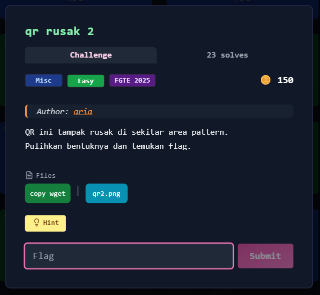
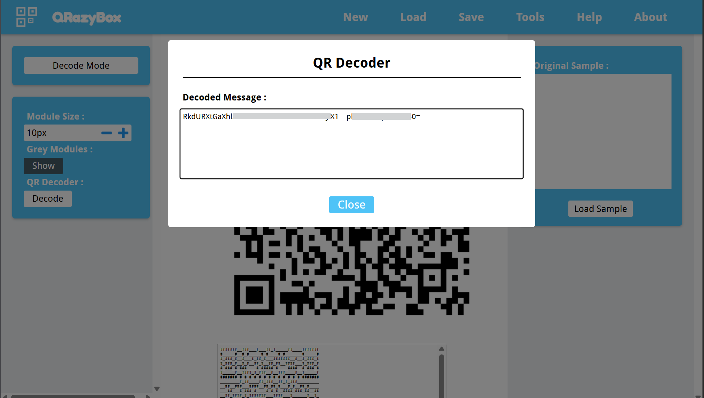

# qr rusak 2



## Deskripsi Challenge
Challenge memberikan sebuah QR Code yang terlihat rusak, terutama di area **format information / finder pattern**.  
QR tidak bisa langsung discan menggunakan tools biasa, sehingga perlu dipulihkan terlebih dahulu.

Hint yang diberikan mengarah ke tool online:

- https://merri.cx/qrazybox/

Tujuan akhirnya adalah memulihkan QR dan mendapatkan flag.

---

## Langkah Penyelesaian

### 1. Load QR ke QrazyBox
Buka website QrazyBox, lalu:

1. Klik **New Project**
2. Pilih **Load Existing Image**
3. Upload gambar QR dari challenge

---

### 2. Bruteforce Format Information Pattern
Karena QR rusak di area pattern, QrazyBox menyediakan fitur bruteforce untuk menebak ulang format info yang hilang.

Langkahnya:

1. Klik menu **Tools**
2. Pilih fitur **Bruteforce Format Info Pattern**

---

### 3. Decode QR Setelah Bruteforce
Setelah bruteforce dilakukan, masuk ke mode decode:

1. Klik tombol **Editor Mode** di bagian kiri  
   (ini akan memindahkan tampilan dari editor ke decode mode)
2. Klik **Decode**

Karena sebelumnya sudah menjalankan bruteforce, QrazyBox akan otomatis mencoba semua kemungkinan format pattern yang sesuai.

---

### 4. Hasil Decode (Base64 Corrupt)
Dari hasil decode, didapatkan sebuah string Base64 namun masih sedikit corrupt:
Terlihat ada karakter tidak valid yang bukan bagian dari alfabet Base64, artinya ada 1 byte yang rusak pada hasil decoding QR.  
  
  

---

### 5. Perbaiki Base64 yang Rusak
Solusi terakhir adalah mengganti bagian corrupt tersebut dengan karakter Base64 yang valid.

Caranya:

- Ganti karakter rusak dengan salah satu karakter Base64 (`A–Z`, `a–z`, `0–9`, `+`, `/`)
- Decode ulang sampai menghasilkan plaintext yang masuk akal sesuai format flag

Setelah diperbaiki dan didecode, plaintext yang didapatkan berbentuk flag FGTE.

---

## Flag

```
FGTE{REDACTED}
```
