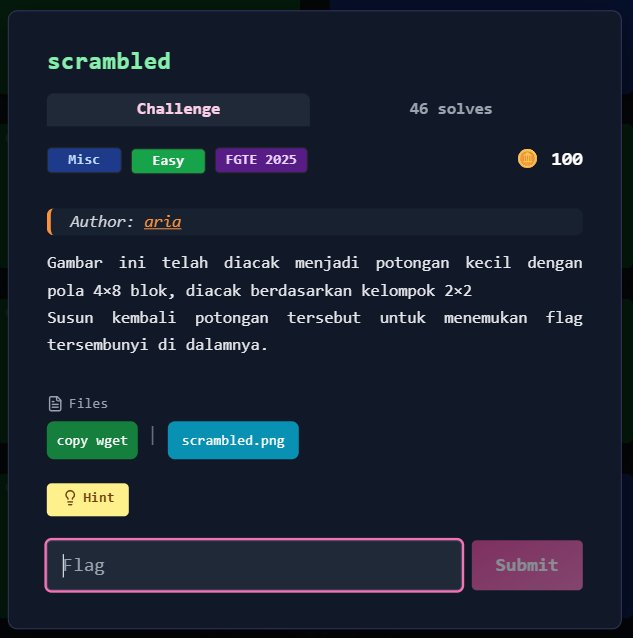
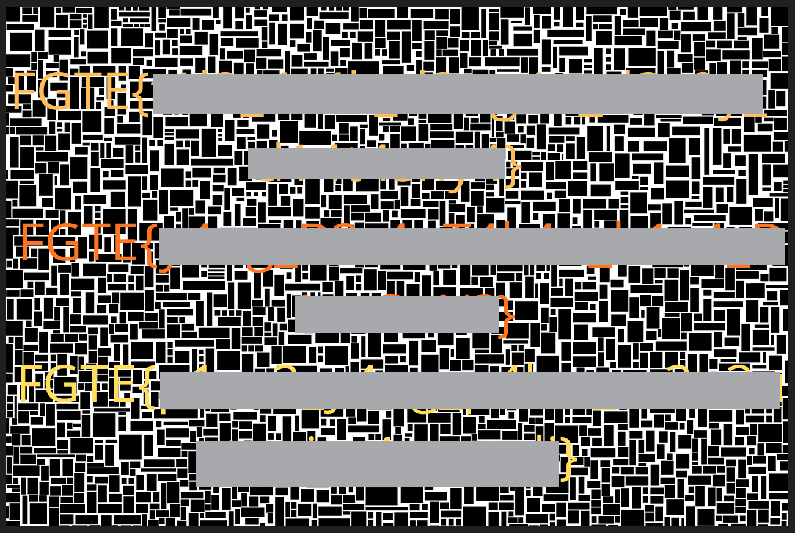

# scrambled



---

## Deskripsi Challenge
Challenge memberikan sebuah gambar yang terlihat rusak/acak (*scrambled*). Pola pada gambar menunjukkan bahwa file tersebut bukan corrupt, melainkan hasil dari proses **pemotongan gambar menjadi beberapa tile** lalu tile-tile tersebut disusun ulang dengan urutan tertentu (*permutation*).

Tujuan challenge adalah mengembalikan susunan tile ke posisi semula sehingga gambar kembali terbaca.

---

## Langkah Penyelesaian

### 1. Identifikasi ukuran gambar dan pola grid
Dari properti file gambar didapatkan ukuran:

- Width  : **1280**
- Height : **854**

Challenge menggunakan total **16 tile**, sehingga grid yang paling umum adalah **4×4**:

```
01 02 03 04
05 06 07 08
09 10 11 12
13 14 15 16
````

Dengan grid tersebut, ukuran tile dihitung menggunakan pembagian integer agar konsisten dengan proses scramble:

```python
tw = w // 4
th = h // 4
````

---

### 2. Crop gambar menjadi 16 tile

Gambar kemudian dipotong menjadi 16 bagian berdasarkan urutan pembacaan baris (kiri ke kanan, atas ke bawah).
Tile disimpan di memori agar tidak perlu membuat file output tile satu per satu.

---

### 3. Menentukan mapping permutasi

Setelah dilakukan observasi pada hasil susunan gambar, didapatkan mapping berikut:

> **posisi_output → tile_asal**

```
01 -> 13
02 -> 15
03 -> 09
04 -> 01
05 -> 14
06 -> 16
07 -> 10
08 -> 02
09 -> 03
10 -> 11
11 -> 05
12 -> 07
13 -> 04
14 -> 12
15 -> 06
16 -> 08
```

Jika divisualisasikan dalam bentuk grid:

```
13 15  9  1
14 16 10  2
 3 11  5  7
 4 12  6  8
```

Artinya, misalnya pada posisi output `01` kita harus menempelkan tile nomor `13`, pada posisi output `02` menempelkan tile nomor `15`, dan seterusnya.

---

### 4. Rekonstruksi gambar berdasarkan mapping

Setelah tile tersedia, buat canvas baru lalu tempelkan tile sesuai mapping ke posisi yang benar, kemudian simpan sebagai `recovered.png`.

---

## Script Solver (Python)

```python
from PIL import Image
import sys

pos_to_tile = {
    1: 13,  2: 15,  3: 9,   4: 1,
    5: 14,  6: 16,  7: 10,  8: 2,
    9: 3,   10: 11, 11: 5,  12: 7,
    13: 4,  14: 12, 15: 6,  16: 8
}

img = Image.open(sys.argv[1])
w, h = img.size

tw, th = w // 4, h // 4

tiles = {}
idx = 1
for r in range(4):
    for c in range(4):
        tiles[idx] = img.crop((c * tw, r * th, (c + 1) * tw, (r + 1) * th))
        idx += 1

out = Image.new("RGB", (tw * 4, th * 4))

for pos in range(1, 17):
    r, c = divmod(pos - 1, 4)
    out.paste(tiles[pos_to_tile[pos]], (c * tw, r * th))

out.save("recovered.png")
print("[+] saved recovered.png")
```

---

## Cara Menjalankan

Install dependency:

```bash
pip install pillow
```

Jalankan solver:

```bash
python3 solve.py scrambled.png
```

Output akan tersimpan sebagai:

```
recovered.png
```

---

## Hasil

Setelah gambar direkonstruksi, terlihat beberapa kandidat flag pada hasil akhir.
Sesuai format challenge, hanya satu flag yang valid dan dapat dipilih sebagai jawaban.  
  

