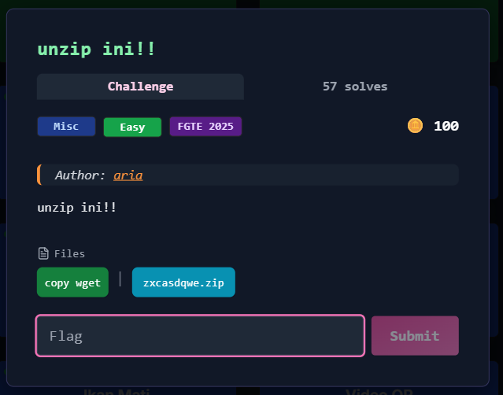

# Unzip Ini!!



## Deskripsi Challenge
Diberikan sebuah file ZIP bernama `zxcasdqwe.zip`.
Namun saat diekstrak menggunakan `unzip`, file selalu gagal karena struktur ZIP rusak.

Tugas kita adalah memperbaiki file ZIP tersebut, mengekstrak isinya, lalu mendapatkan flag.

---

## Analisis
Saat dilakukan ekstraksi:

```bash
unzip zxcasdqwe.zip
````

muncul error:

```
bad zipfile offset (local header sig):  0
```

Error ini biasanya terjadi karena signature ZIP pada bagian awal file tidak valid.

ZIP yang normal selalu diawali dengan magic bytes:

```
50 4B 03 04
```

Namun setelah dicek dengan `xxd`:

```bash
xxd zxcasdqwe.zip | head
```

didapatkan:

```
00000000: aabb ccaa bbcc ...
```

Artinya header ZIP sudah sengaja dirusak (corrupted).

---

## Penyelesaian

### 1. Memperbaiki ZIP Header

Karena hanya signature awal yang rusak, kita bisa menimpa 4 byte pertama file dengan signature ZIP yang benar.

```bash
printf '\x50\x4B\x03\x04' | dd of=zxcasdqwe.zip bs=1 seek=0 count=4 conv=notrunc
```

Setelah itu file bisa dibuka kembali.

---

### 2. Ekstraksi File ZIP

Setelah header diperbaiki, jalankan:

```bash
unzip zxcasdqwe.zip
```

ZIP ternyata diproteksi password dan memberikan hint melalui nama file di dalamnya:

```
pass_nya_ada_di_metadata_zip_nya!
```

Dari clue tersebut, password dicari dari metadata ZIP.
Setelah dicoba beberapa kemungkinan, password yang benar ternyata adalah nama file ZIP itu sendiri:

```
zxcasdqwe
```

---

### 3. Decode File Hasil Ekstraksi

ZIP menghasilkan sebuah file:

```
pass_nya_ada_di_metadata_zip_nya!
```

Isi file berupa teks Base64 yang jika dilihat diawali dengan:

```
iVBORw0KGgo...
```

Prefix ini menunjukkan bahwa data tersebut adalah PNG dalam bentuk Base64.

Decode ke file PNG:

```bash
cat pass_nya_ada_di_metadata_zip_nya\! | base64 -d > output.png
```

---

### 4. Scan QR Code

Setelah gambar berhasil dibuat, QR code di dalamnya dibaca menggunakan `zbarimg`:

```bash
zbarimg output.png
```

Output:

```
QR-Code:FGTE{REDACTED}
```

---

## Flag

```
FGTE{REDACTED}
```
