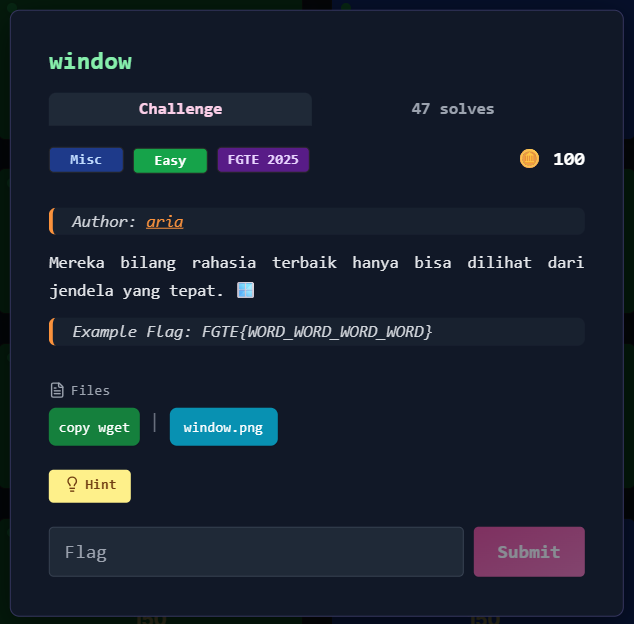

# window



---

## Deskripsi Challenge

Diberikan sebuah gambar berisi pola kotak hitam/putih yang terlihat seperti *cipher grid*.  
  
  
  
Challenge memberi hint:

- 🪟 (window)
- **friderici cipher**
- Format flag: `FGTE{WORD_WORD_WORD_WORD}`

Targetnya adalah mendekode isi pesan dari grid tersebut hingga mendapatkan flag.

---

## Langkah Penyelesaian

### 1. Identifikasi Jenis Cipher

Berdasarkan hint **Friderici cipher** , gambar tersebut cocok dengan bentuk *Friderici cipher grid*

---

### 3. Hasil Dekode

Membaca hasil decode didapatkan output, yang berupa flag yang masih tidak valid.  
Mengambil kalimat setelah munculnya string `FGTE`.  
Terlihat bahwa:

- `FGTE` muncul jelas
- banyak huruf `X` muncul sebagai pemisah antar kata

---

### 4. Normalisasi Output ke Format Flag

Pada Friderici cipher, karakter `X` umum dipakai sebagai separator/filler.
Sehingga string tersebut dinormalisasi dengan aturan:

- `X` → `_`
- susun menjadi format `FGTE{...}`

Hasil akhirnya menjadi:

```
FGTE{REDACTED}
```

---

## Flag

```
FGTE{REDACTED}
```
