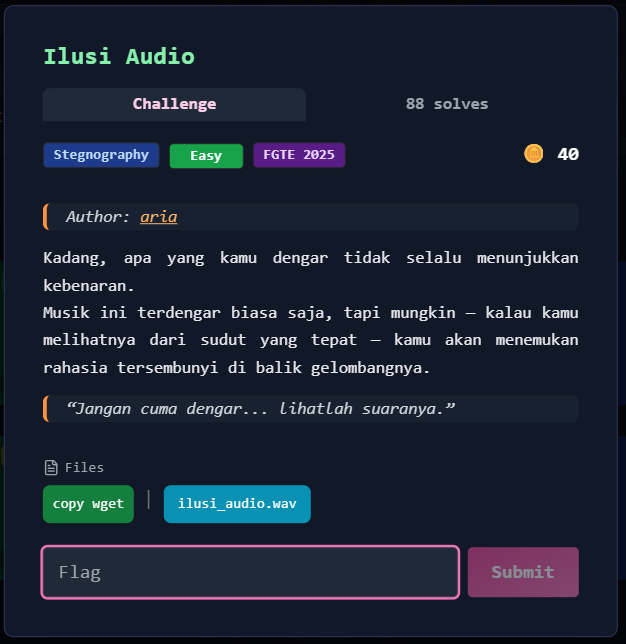
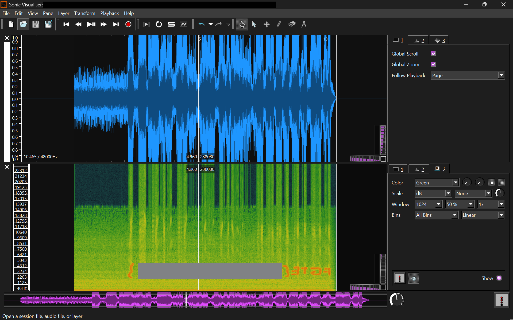

# Ilusi Audio



---

## Deskripsi Challenge

Diberikan sebuah file audio bernama `ilusi_audio.wav` yang ketika diputar hanya menghasilkan suara aneh dan tidak bermakna.

Deskripsi soal memberikan petunjuk:

> “Jangan cuma dengar... lihatlah suaranya.”

Petunjuk tersebut mengarah pada teknik analisis **spectrogram**, yaitu representasi visual dari spektrum frekuensi sinyal terhadap waktu. Dalam banyak challenge CTF kategori steganografi, pesan sering kali disembunyikan dalam domain frekuensi dan hanya dapat terlihat melalui visualisasi spektral.

---

## Langkah Penyelesaian

### 1. Analisis Awal

File `ilusi_audio.wav` diputar menggunakan media player biasa. Audio terdengar seperti noise atau kombinasi frekuensi tinggi yang tidak membentuk kata-kata jelas. Hal ini mengindikasikan kemungkinan adanya penyisipan data dalam domain frekuensi.

### 2. Visualisasi Spectrogram

Untuk melihat representasi visualnya, digunakan aplikasi **Sonic Visualiser**.

Langkah-langkah:

1. Buka Sonic Visualiser.
2. Import file `ilusi_audio.wav`.
3. Tambahkan layer spectrogram melalui:
   * `Layer` → `Add Spectrogram`

### 3. Identifikasi Pesan

Setelah divisualisasikan dalam bentuk spectrogram, terlihat pola tertentu pada rentang frekuensi menengah hingga tinggi. Pola tersebut membentuk teks yang terbaca dengan jelas sebagai flag challenge. Pesan tersebut tidak dapat didengar secara langsung, namun dapat terlihat jelas pada tampilan spectrogram.



---

## Flag

```FGTE{Redacted}```
