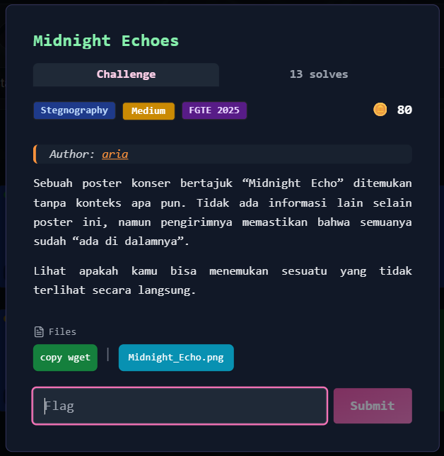
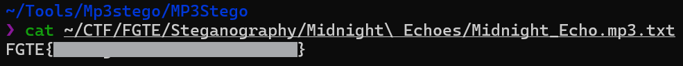

# Midnight Echoes



---

## Deskripsi Challenge

Diberikan sebuah file gambar bernama `Midnight_Echo.png`.
Diketahui bahwa di dalam gambar tersebut tersembunyi sebuah file **ZIP**, yang setelah diekstrak berisi file audio `mp3`.

Tugas kita adalah mengekstrak informasi tersembunyi dari file MP3 tersebut menggunakan tool [MP3Stego](https://www.petitcolas.net/fabien/software/MP3Stego_1_1_19.zip).

---

## Analisis dan Penyelesaian

### 1. Identifikasi Data Tersembunyi pada Gambar

Langkah pertama adalah memeriksa apakah terdapat data tambahan pada file PNG menggunakan `zsteg`.

```bash
zsteg Midnight_Echo.png
```

Ditemukan indikasi adanya data tambahan setelah marker akhir PNG (`IEND`):

```
243606 bytes of extra data after image end (IEND)
```

Ini merupakan indikasi kuat adanya file yang disisipkan (file appended).

Selain itu ditemukan metadata mencurigakan:

```
meta Comment text: "neonwaves"
```

String `neonwaves` diduga sebagai petunjuk penting, kemungkinan password.

---

### 2. Ekstraksi File ZIP

Untuk mengekstrak file tersembunyi, digunakan tool `foremost`:

```bash
foremost Midnight_Echo.png
```

Diperoleh file:

```
00005522.zip
```

Ketika mencoba mengekstrak file ZIP tersebut, diminta password.
Dengan memanfaatkan petunjuk sebelumnya, digunakan password:

```
neonwaves
```

Password tersebut benar, dan berhasil diekstrak file:

```
Midnight_Echo.mp3
```

---

### 3. Ekstraksi Data Tersembunyi pada MP3

Langkah berikutnya adalah menganalisis file MP3 menggunakan **Mp3Stego**.

Perintah yang digunakan:

```bash
./Decode.exe -X -P neonwaves ~/CTF/FGTE/Steganography/Midnight\ Echoes/Midnight_Echo.mp3
```

Parameter yang digunakan:

* `-X` → Extract hidden message
* `-P neonwaves` → Password

Proses decoding berjalan dengan sukses, menghasilkan file output:

```
Midnight_Echo.mp3.txt
```

---

### 4. Mendapatkan Flag

Setelah membuka file `Midnight_Echo.mp3.txt`, ditemukan flag di dalamnya.



---

## Flag

```
FGTE{Redacted}
```
