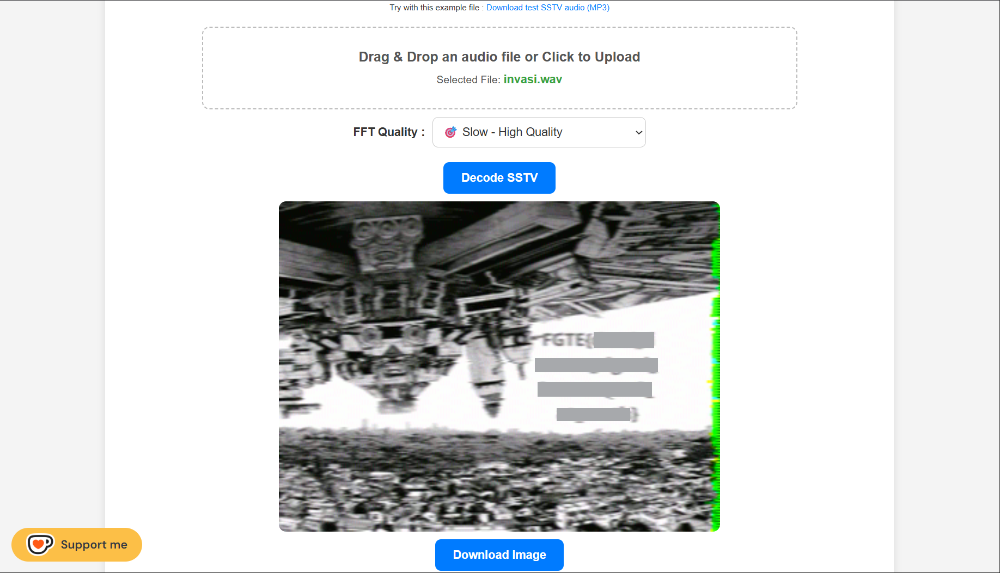

# invasi

## Deskripsi Challenge

Pada challenge ini diberikan sebuah file audio bernama `invasi.wav`. Setelah dianalisis lebih lanjut, diketahui bahwa audio tersebut merupakan sinyal SSTV (Slow-Scan Television) yang perlu didekode untuk memperoleh gambar yang berisi flag.

---

## Analisis Awal

### 1. Identifikasi Karakteristik File

Langkah pertama adalah melakukan analisis awal terhadap file `invasi.wav`.

Beberapa pendekatan yang dilakukan:

* Memutar file audio secara langsung. Audio terdengar seperti rangkaian nada dengan variasi frekuensi, bukan suara manusia atau musik biasa.
* Membuka file menggunakan Sonic Visualiser untuk melihat spektrum frekuensi.

Pada Sonic Visualiser, pola frekuensi terlihat stabil dan terstruktur. Namun, tidak ditemukan metadata tersembunyi ataupun data aneh pada header file ketika dilakukan pengecekan dengan tools standar seperti `file` atau `strings`.

Dari karakteristik suara yang menyerupai transmisi radio serta pola spektrum yang khas, dapat diasumsikan bahwa file tersebut adalah sinyal SSTV.

---

## Konsep Singkat SSTV

SSTV (Slow-Scan Television) adalah metode transmisi gambar melalui gelombang audio, biasanya digunakan dalam komunikasi radio amatir. Data gambar dikonversi menjadi variasi frekuensi yang kemudian dapat direkonstruksi kembali menjadi gambar menggunakan decoder yang sesuai.

Karena file berbentuk `.wav` dan memiliki pola nada yang konsisten, besar kemungkinan audio tersebut memang dimaksudkan untuk didekode sebagai SSTV.

---

## Proses Decoding

Setelah mengidentifikasi bahwa file merupakan sinyal SSTV, langkah selanjutnya adalah melakukan decoding.

Pada penyelesaian ini digunakan decoder online:
[https://sstv-decoder.mathieurenaud.fr/](https://sstv-decoder.mathieurenaud.fr/)

Langkah-langkah:

1. Unggah file `invasi.wav` ke situs tersebut.
2. Biarkan sistem mendeteksi mode SSTV secara otomatis.
3. Hasil decoding menampilkan sebuah gambar.

Gambar yang dihasilkan berisi flag challenge.



---

## Flag:

```
FGTE{Redacted}
```
