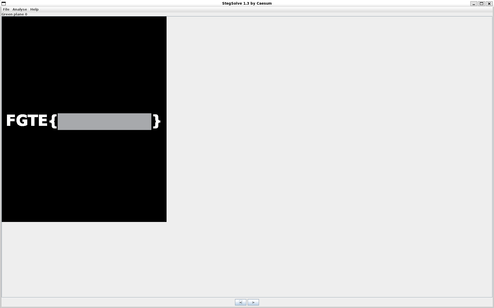

# layer tersembunyi


---

## Deskripsi Challenge

Diberikan sebuah file gambar bernama `cat.png`.

Secara visual, ketika gambar dibuka menggunakan image viewer biasa, tidak terlihat adanya kejanggalan atau informasi tersembunyi.


Tidak ada teks, distorsi mencurigakan, ataupun artefak visual yang mengindikasikan keberadaan flag.

---

## Analisis dan Penyelesaian

Karena tidak ditemukan keanehan secara kasat mata, kemungkinan besar flag disembunyikan menggunakan teknik **steganografi berbasis channel warna**.

### 1. Analisis Menggunakan Stegsolve

Gambar kemudian dianalisis menggunakan tool [Stegsolve](http://www.caesum.com/handbook/Stegsolve.jar), yang memungkinkan eksplorasi:

* Bit plane
* Channel warna (Red, Green, Blue)
* Kombinasi layer

```
java -jar ~/bin/stegsolve.jar cat.png
```

Setelah melakukan pemeriksaan pada berbagai channel dan bit plane, ditemukan bahwa pada:

```
Green Plane 0
```

terdapat teks flag yang terlihat jelas.



Layer ini menampilkan informasi tersembunyi yang tidak terlihat pada tampilan normal gambar.

---

## Flag

```
FGTE{Redacted}
```
