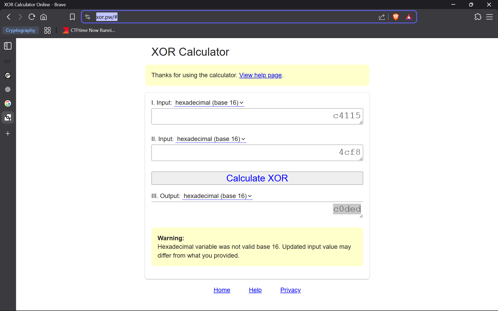

# Hextroadinary

## Deskripsi

Meet ROXy, a coder obsessed with being exclusively the worlds best hacker. She specializes in short cryptic hard to decipher secret codes. The below hex values for example, she did something with them to generate a secret code, can you figure out what? Your answer should start with 0x.

0xc4115 0x4cf8

---

## Analisis

Diberikan dua bilangan dalam format heksadesimal. Pada deskripsi challenge terdapat kata **"ROX"** , yang jika dibalik membentuk kata **"XOR"** . Hal ini menjadi indikasi kuat bahwa operasi yang digunakan adalah **bitwise XOR**.

---

## Proses Decode

Dengan asumsi bahwa kedua nilai heksadesimal tersebut di-XOR-kan satu sama lain, dilakukan perhitungan menggunakan web [xor.pw](https://xor.pw/#):

Karena pada soal kita disuruh menambahkan `0x` pada awal flag jafi flag final yaitu `0xc0ded`.

---

## Flag

```0xc0ded```
