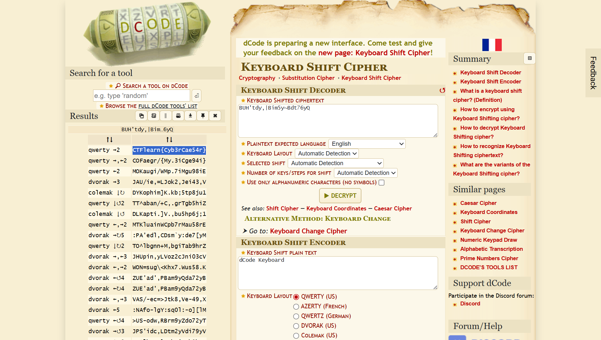

# Modern Gaius Julius Caesar

---

## Challenge

One of the easiest and earliest known ciphers but with XXI century twist! Nobody uses Alphabet nowadays right? Why should you when you have your keyboard?  
  
BUH'tdy,|Bim5y~Bdt76yQ

---

## Analisis

Diberikan sebuah encrypted string yang dilihat dari deskripsi soal saya asumsikan hasil encrypt dari keyboard shift cipher

---

## Decrypt

Untuk mendekripsi ciphertext, digunakan tool Keyboard Shift Cipher Decoder di [dcode.fr](https://www.dcode.fr/keyboard-shift-cipher), Menghasilkan:  
  
  
  
Dengan mencoba beberapa arah pergeseran, plaintext berhasil diperoleh.

---

## Flag

```CTFlearn{Cyb3r_Cae54r}```
