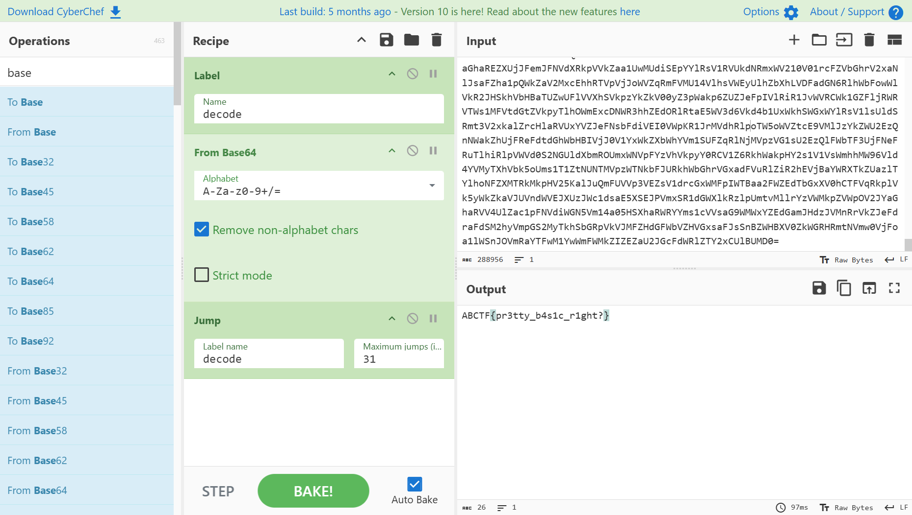

# So Many 64s

## Challenge

Help! My friend stole my flashdrive that had the flag on it. When he gave it back the flag was changed! Can you help me decrypt it?  
[flag.txt](https://mega.nz/#!OHhUyIqA!H9WxSdG1O7eVcCm0dffggNB0-dBemSpBAXiZ0OXJnLk)

---

## Analisis

### 1. Identifikasi Encoding

Isi file `flag.txt` berupa string panjang dengan karakter khas **Base64** (`A–Z`, `a–z`, `0–9`, `+`, `/`, `=`).
Berdasarkan judul challenge *“So many 64s”*, dapat diasumsikan bahwa string tersebut mengalami **multiple Base64 encoding**.

---

### 2. Proses Decoding

Untuk mempercepat proses decoding berulang, digunakan **CyberChef** dengan langkah berikut:

* Operasi: **From Base64**
* Opsi: *Remove non-alphabet characters* diaktifkan
* Proses decoding dilakukan **berulang (loop)** hingga output berubah menjadi plaintext yang dapat dibaca

Pada CyberChef, digunakan fitur **Label + Jump** untuk melakukan decoding otomatis berulang kali.

Hasilnya, flag berhasil diperoleh setelah dilakukan **31 kali Base64 decoding**.  
  
  
  
---

## Flag

```text
ABCTF{pr3tty_b4s1c_r1ght?}
```
