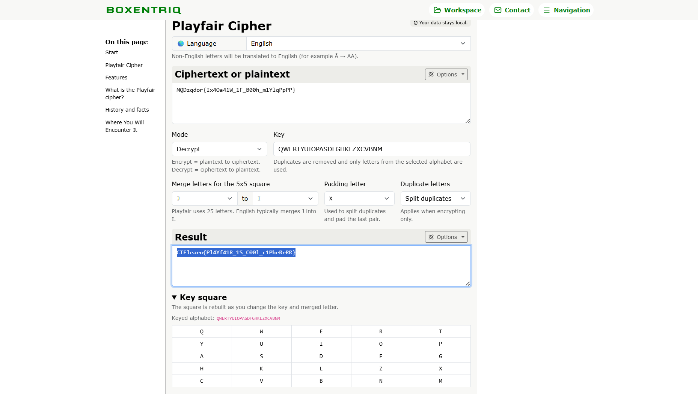

# Suspicious Message

## Challenge Overview

Hello! My friend Fari send me this suspecious message: `MQDzqdor{Ix4Oa41W_1F_B00h_m1YlqPpPP}` and `photo.png`.  
Help me decrypt this!

---

## Analisis

Diberikan dua artefak utama:

1. Sebuah **ciphertext**
2. Sebuah gambar `photo.png`

Saat membuka `photo.png`, terlihat susunan alfabet dalam bentuk **matriks 5x5**. Pola ini sangat khas dan langsung mengarah ke **Playfair Cipher**, sebuah cipher klasik yang:

* Menggunakan matriks 5x5
* Menggabungkan huruf tertentu (umumnya I/J)
* Mengenkripsi teks per pasangan huruf (digraph)  
  
  
  
Berdasarkan petunjuk visual dari gambar, dapat disimpulkan bahwa:

* `photo.png` berfungsi sebagai **key square**
* Ciphertext kemungkinan besar dienkripsi menggunakan **Playfair Cipher**

---

## Proses Dekripsi

Untuk mendekripsi pesan, digunakan tool online [**Boxentriq – Playfair Cipher**](https://www.boxentriq.com/code-breaking/playfair-cipher):  
  
  
  
Hasil dekripsi yang diperoleh:

```
CTFlearn{Pl4Yf41R_1S_C00l_c1PheRrRR}
```

---

## Flag

```text
CTFlearn{Pl4Yf41R_1S_C00l_c1PheRrRR}
```
