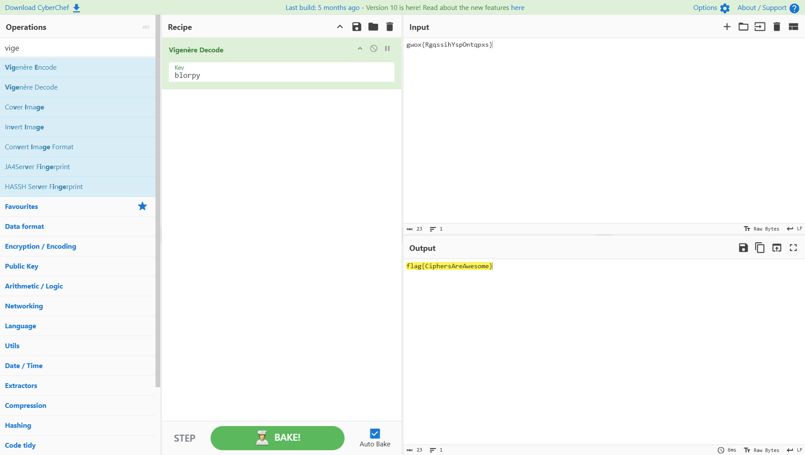

# Vigenere Cipher

## Deskripsi

The vignere cipher is a method of encrypting alphabetic text by using a series of interwoven Caesar ciphers based on the letters of a keyword.
I’m not sure what this means, but it was left lying around: blorpy

gwox{RgqssihYspOntqpxs}

---

## Analisis

Ciphertext yang diberikan mengindikasikan penggunaan **Vigenère cipher**, dengan _keyword_ yang telah disediakan, yaitu `blorpy`.
Dengan asumsi enkripsi dilakukan pada alfabet standar (A–Z), proses dekripsi dapat dilakukan menggunakan metode Vigenère decryption.

---

## Proses Dekripsi

_Mendecrypt_ di [CyberChef](https://gchq.github.io/CyberChef/), mendapatkan hasil:



---

## Flag

```flag{CiphersAreAwesome}```
