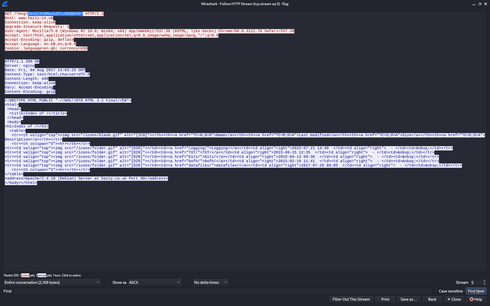

# A CAPture of a Flag

---

## Challenge

This isn't what I had in mind, when I asked someone to capture a flag... can you help? You should check out WireShark.  
[flag](https://mega.nz/#!3WhAWKwR!1T9cw2srN2CeOQWeuCm0ZVXgwk-E2v-TrPsZ4HUQ_f4)

---

## Analisis Awal

Langkah pertama adalah mengidentifikasi jenis file yang diberikan. Pemeriksaan dilakukan menggunakan perintah `file`:

```bash
file flag
```

Output:

```
flag: pcapng capture file - version 1.0
```

Dari hasil tersebut dapat disimpulkan bahwa file merupakan **PCAP/PCAPNG** yang berisi rekaman lalu lintas jaringan.

---

## Analisis Traffic dengan Wireshark

File PCAP kemudian dibuka menggunakan **Wireshark**.
Untuk menyederhanakan analisis, dilakukan **Follow -> HTTP Stream** pada trafik HTTP.

Pada **stream TCP ke-5**, ditemukan request HTTP yang mencurigakan, khususnya pada parameter `msg`:  
  

  
```
GET /?msg=ZmxhZ3tBRmxhZ0luUENBUH0= HTTP/1.1
Host: www.hazzy.co.uk
```

Parameter `msg` berisi string yang terlihat seperti **Base64 encoding**.

---

## Decode Payload

String Base64 tersebut kemudian didekode menggunakan perintah berikut:

```bash
echo "ZmxhZ3tBRmxhZ0luUENBUH0=" | base64 -d
```

Hasil decoding:

```
flag{AFlagInPCAP}
```

---

## Flag

```text
flag{AFlagInPCAP}
```
