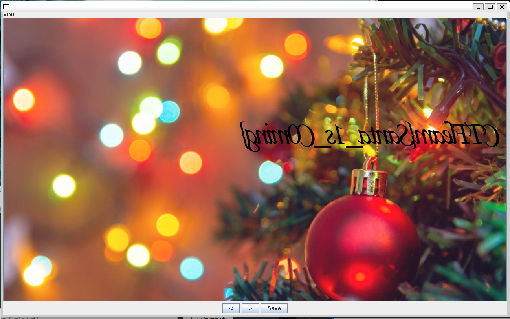

# Exclusive Santa

## Challenge

> *“Dear Santa,
> There are so many toys that I want, but I just don't have the money.
> I don't care which toy I get as long as it's one or the other, but not both!”*
> — CTFlearn  
  
[Exclusive_Santa.rar](https://ctflearn.com/challenge/download/851)

---

## Analisis Awal

Langkah pertama adalah mengekstrak arsip RAR:

```bash
unrar x Exclusive_Santa.rar
```

Hasil ekstraksi:

```
Extracting  3.png   OK
Extracting  1.png   OK
All OK
```

Terdapat dua file gambar: **`1.png`** dan **`3.png`**.

---

## Analisis Gambar

### 1️ Analisis `1.png`

Saat dibuka, gambar `1.png` menampilkan pola warna RGB yang tampak acak dan tidak membentuk objek yang jelas. Pola seperti ini sering mengindikasikan data yang telah dimanipulasi secara bitwise.  
  
  
  

### 2️ Analisis `3.png`

Berbeda dengan `1.png`, gambar `3.png` terlihat normal secara visual dan mengandung petunjuk. Gambar ini mengarahkan bahwa warna atau channel tertentu perlu digabungkan.  
  
  
  
Untuk analisis lebih lanjut, digunakan **zsteg**:

```bash
zsteg 3.png
```

Output penting:

```
[?] 1169169 bytes of extra data after image end (IEND)
extradata:0 .. file: PNG image data, 1280 x 720, 8-bit/color RGBA
```

Hal ini menunjukkan bahwa terdapat **file PNG lain yang di-embed** di dalam `3.png`.

---

## Ekstraksi Data Tersembunyi

Untuk mengekstrak file tersembunyi tersebut, digunakan **foremost**:

```bash
foremost 3.png
```

Hasilnya diperoleh sebuah file PNG tambahan:  
  
  
  
Namun, saat dibuka, gambar ini juga tidak menunjukkan informasi yang langsung terbaca secara visual.

---

## Penyelesaian dengan Steganografi (XOR)

Mengacu pada petunjuk di gambar `3.png`

Maka pendekatan yang paling masuk akal adalah **operasi bitwise antar gambar**.

Langkah yang dilakukan:

1. Membuka **StegSolve**
2. Memuat `1.png` dan `00000102.png`
3. Mencoba berbagai operasi image

Pada operasi **XOR**, flag berhasil ditampilkan dengan jelas:  
  
  
  

---

## Flag

```text
CTFlearn{Santa_1s_C0ming}
```
