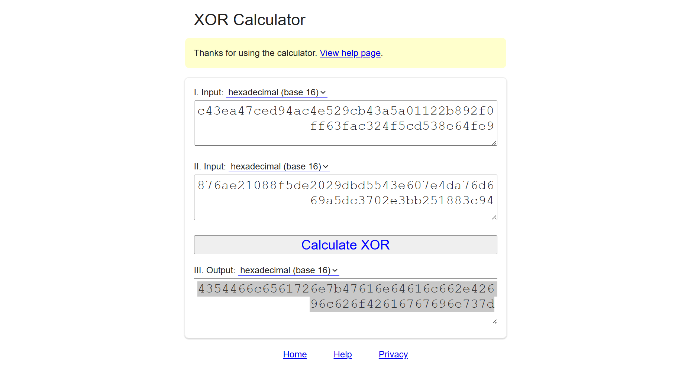

# GandalfTheWise

## Challenge

Extract the flag from the Gandalf.jpg file. You may need to write a quick script to solve this.  
[Gandalf.jpg](https://ctflearn.com/challenge/download/936)

---

## Analisis

### 1. Analisis Visual

File `Gandalf.jpg` dibuka secara normal menggunakan image viewer.
Tidak ditemukan indikasi visual seperti teks tersembunyi, watermark, atau distorsi mencurigakan.


Karena tidak ada petunjuk secara visual, analisis dilanjutkan ke level **byte**.

---

### 2. Analisis Struktur File (Hex)

Dilakukan inspeksi awal menggunakan `xxd` untuk melihat isi byte file:

```bash
xxd Gandalf.jpg | head -10
```

Output:

```
00000000: ffd8 ffe0 0010 4a46 4946 0001 0100 0001  ......JFIF......
00000010: 0001 0000 fffe 002b 5131 5247 6247 5668  .......+Q1RGbGVh
00000020: 636d 3537 6547 3979 5832 6c7a 5833 6c76  cm57eG9yX2lzX3lv
00000030: 6458 4a66 5a6e 4a70 5a57 356b 6651 6f3d  dXJfZnJpZW5kfQo=
00000040: 0aff fe00 2b78 4436 6b66 4f32 5572 4535  ....+xD6kfO2UrE5
00000050: 536e 4c51 3657 6745 534b 346b 7644 2f59  SnLQ6WgESK4kvD/Y
00000060: 2f72 444a 5058 4e55 3435 6b2f 700a fffe  /rDJPXNU45k/p...
00000070: 002b 6832 7269 4549 6a31 3369 4170 3239  .+h2riEIj13iAp29
00000080: 5655 506d 422b 5461 6474 5a70 7064 7733  VUPmB+TadtZppdw3
```

Terlihat adanya beberapa **JPEG Comment Marker (`0xFFFE`)** yang berisi string Base64.

Ditemukan tiga komentar:

```
Q1RGbGVhcm57eG9yX2lzX3lvdXJfZnJpZW5kfQo=
xD6kfO2UrE5SnLQ6WgESK4kvD/Y/rDJPXNU45k/p
h2riEIj13iAp29VUPmB+TadtZppdw3AuO7JRiDyU
```

---

### 3. Dekode Komentar Pertama

Komentar pertama didekode menggunakan Base64:

```bash
echo "Q1RGbGVhcm57eG9yX2lzX3lvdXJfZnJpZW5kfQo=" | base64 -d
```

Output:

```
CTFlearn{xor_is_your_friend}
```

Namun, flag ini **tidak valid** ketika disubmit.
Pesan tersebut lebih tepat dianggap sebagai **hint**, bukan flag final, yang mengarahkan ke penggunaan **XOR**.

---

### 4. XOR Dua Komentar Tersisa

Dua komentar Base64 lainnya kemudian didekode dan dikonversi ke representasi heksadesimal.

Komentar kedua:

```bash
echo "xD6kfO2UrE5SnLQ6WgESK4kvD/Y/rDJPXNU45k/p" | base64 -d | xxd -p
```

Output:

```
c43ea47ced94ac4e529cb43a5a01122b892f0ff63fac324f5cd538e64fe9
```

Komentar ketiga:

```bash
echo "h2riEIj13iAp29VUPmB+TadtZppdw3AuO7JRiDyU" | base64 -d | xxd -p
```

Output:

```
876ae21088f5de2029dbd5543e607e4da76d669a5dc3702e3bb251883c94
```

Kedua nilai heksadesimal tersebut kemudian di-*XOR* byte-per-byte menggunakan alat bantu seperti [**xor.pw**](https://xor.pw/).  
  
  
  
Hasil XOR:

```
4354466c6561726e7b47616e64616c662e42696c626f42616767696e737d
```

---

### 5. Konversi Hasil XOR ke ASCII

Nilai heksadesimal hasil XOR dikonversi kembali ke ASCII:

```bash
echo "4354466c6561726e7b47616e64616c662e42696c626f42616767696e737d" | xxd -r -p
```

Output:

```
CTFlearn{Gandalf.BilboBaggins}
```

---

## Flag

```text
CTFlearn{Gandalf.BilboBaggins}
```
