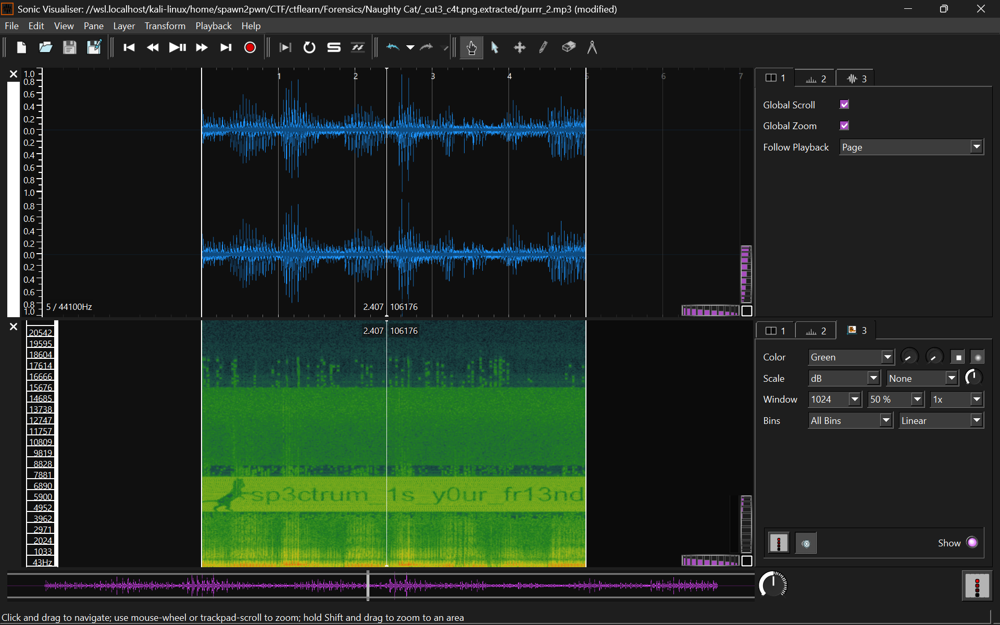

# Naughty Cat — Writeup Forensik (CTF)

## Deskripsi Challenge

I think my cat is hiding something...  
[cut3_c4t.png](https://ctflearn.com/challenge/download/890)

---

## Analisis Awal

File `cut3_c4t.png` ketika dibuka secara normal tidak menunjukkan kejanggalan visual apa pun. Tidak terlihat artefak, pesan tersembunyi, maupun indikasi steganografi secara kasat mata.


Karena secara visual bersih, langkah selanjutnya adalah melakukan analisis struktur file.

---

## Deteksi Data Tersembunyi

Untuk memeriksa kemungkinan data tersembunyi, digunakan tool **zsteg**:

```bash
zsteg cut3_c4t.png
```

Hasil analisis menunjukkan adanya **data tambahan setelah chunk IEND**, yang mengindikasikan file disusupi data lain:

```
[?] 75618 bytes of extra data after image end (IEND)
extradata:0 .. file: RAR archive data, v5
```

Kesimpulan awal:
**Terdapat arsip RAR yang di-embed di dalam file PNG.**

---

## Ekstraksi Embedded File

Untuk mengekstrak data tersebut digunakan **binwalk**:

```bash
binwalk -e cut3_c4t.png
```

Hasil ekstraksi menghasilkan dua file penting:

```
purrr_2.mp3
y0u_4r3_cl0s3.rar
```

---

## Analisis File RAR

Saat mencoba mengekstrak arsip RAR, muncul error:

```
y0u_4r3_cl0s3.rar is not RAR archive
```

Hal ini mencurigakan, sehingga dilakukan pemeriksaan signature file menggunakan `xxd`:

```bash
xxd y0u_4r3_cl0s3.rar
```

Byte awal file menunjukkan:

```
43 61 74 21  -> "Cat!"
```

Padahal signature file RAR seharusnya:

```
52 61 72 21  -> "Rar!"
```

**Signature file sengaja dimodifikasi untuk mengelabui deteksi.**

---

## Perbaikan Signature File

Signature diperbaiki dengan menimpa 4 byte pertama file:

```bash
printf '\x52\x61\x72\x21' | dd of=y0u_4r3_cl0s3.rar bs=1 seek=0 count=4 conv=notrunc
```

Verifikasi ulang:

```bash
file y0u_4r3_cl0s3.rar
```

Hasil:

```
RAR archive data, v5
```

File kini valid.

---

## Ekstraksi Arsip RAR

Saat diekstrak, arsip meminta password:

```bash
unrar x y0u_4r3_cl0s3.rar
```

```
Enter password for f1n4lly.txt:
```

Password belum diketahui, sehingga analisis dilanjutkan ke file audio.

---

## Analisis Audio (Spectrogram)

File `purrr_2.mp3` dianalisis menggunakan **Sonic Visualiser** dengan mode **spectrogram**.



Pada representasi frekuensi, terlihat jelas sebuah string tersembunyi:

```
sp3ctrum_1s_y0ur_fr13nd
```

Teknik ini memanfaatkan penyisipan pesan pada domain frekuensi audio.

---

## Dekripsi Arsip RAR

String hasil analisis spectrogram digunakan sebagai password:

```bash
unrar x y0u_4r3_cl0s3.rar
```

Ekstraksi berhasil dan menghasilkan file:

```
f1n4lly.txt
```

---

## Analisis File Akhir

Isi file `f1n4lly.txt`:

```
            __/|
            \o.O|
       _____(___)______
      |       U        |________    __
      |ZjByM241MWNzX21h|        |__|  |_________
      |________________|NXQzcg==|::|  |        /
      |                \._______|::|__|       <
      |                         \::/  \._______\
      |
      |
```

String tersebut teridentifikasi sebagai **Base64**.

Dekode dilakukan dengan:

```bash
echo 'ZjByM241MWNzX21hNXQzcg==' | base64 -d
```

Hasil decoding:

```
f0r3n51cs_ma5t3r
```

---

## Flag

```
f0r3n51cs_ma5t3r
```
