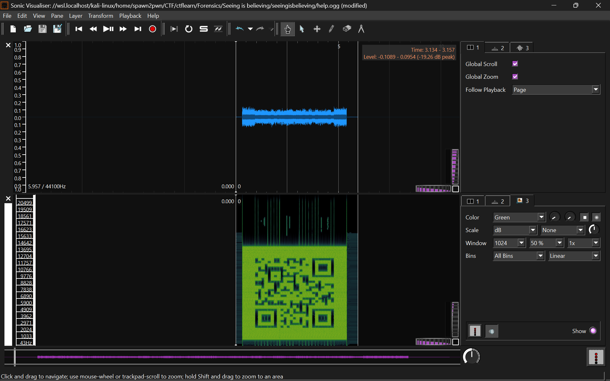

# Seeing is believing

My colleague's an astronaut who's currently on a mission orbiting in space. Just a few hours ago, unfortunately, his communication device caught fire so he's unable to report back to base. I did, however, receive a strange file that I can't seem to open. I think it may shed some light on his situation.
Can you help me save poor boy Johnny? File: [help.me](https://mega.nz/#!LTRUTaZb!9Nh0NwDONJQiOThif3G62evP8H_W9eIJSu0PdBQWKyg)

---

## Analisis

Diberikan file arsip `message.zip` mencoba mengekstraknya mendapatkan :

```
Archive:  message.zip
  Length      Date    Time    Name
---------  ---------- -----   ----
    68172  2018-01-06 22:25   seeingisbelieving/help.me
---------                     -------
    68172                     1 file
```

Mencoba melihat tipe file `help.me` mengecek nya dengan command :

```file help.me```

Output :

```
Ogg data, Vorbis audio, mono, 44100 Hz, ~110000 bps, created by: Xiph.Org libVorbis I (1.3.3)
```

Diketahui bahwa itu adalah file audio `.ogg`, mencoba mengganti format nya dengan command `cp` :

```
cp help.me help.ogg
```

Mencoba membuka dan mendengarkan isi file nya, suaranya seperti rusak.
Mencoba melihat spectogram pada aplikasi `Sonic Visualiser`, mendapati sebuah qr :



Mencoba mendecode qr tersebut mengarahkan kita ke sebuah link pastebin :

```
https://pastebin.com/zhEhyp3G
```

Membuka link diatas didapatkan sebuah flag

---

## Flag

```the_flag_is{A_sP3c7r0grAm?!}```
